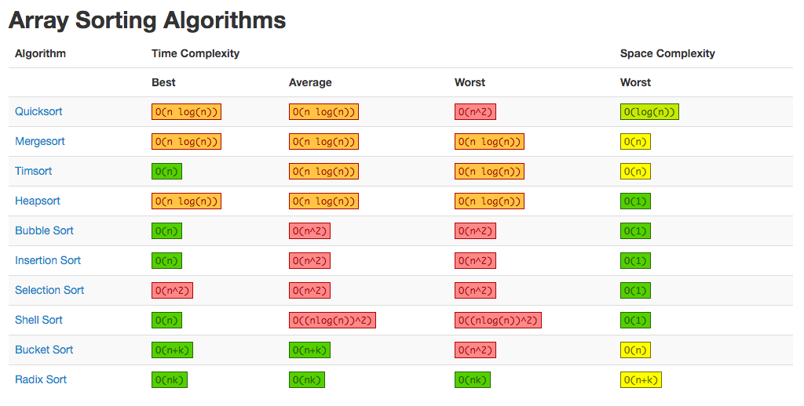
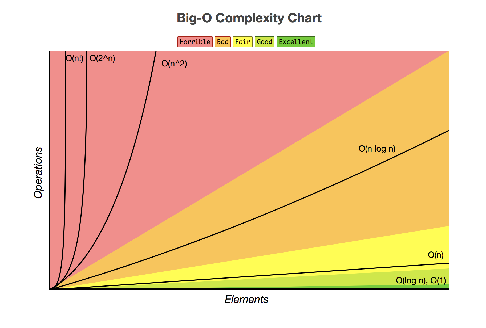
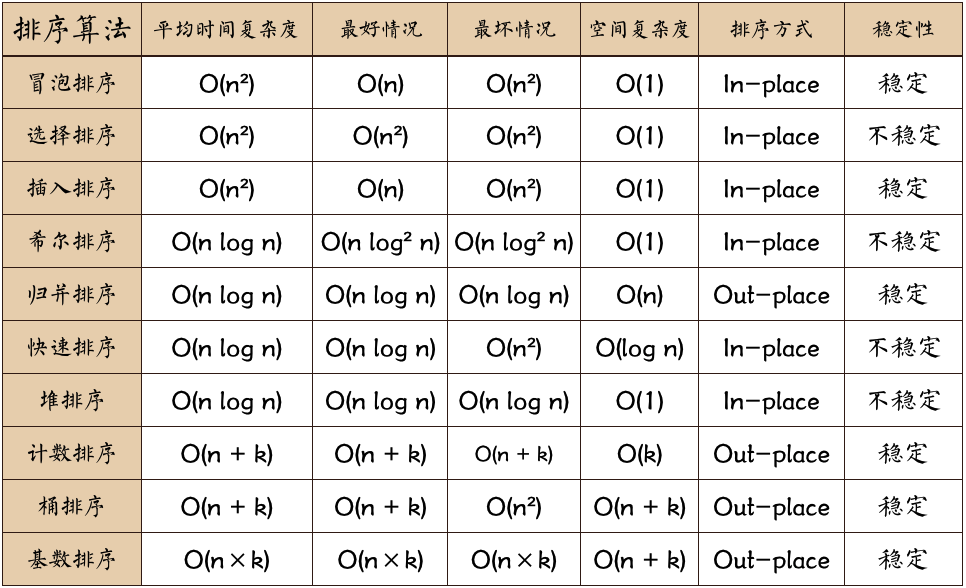
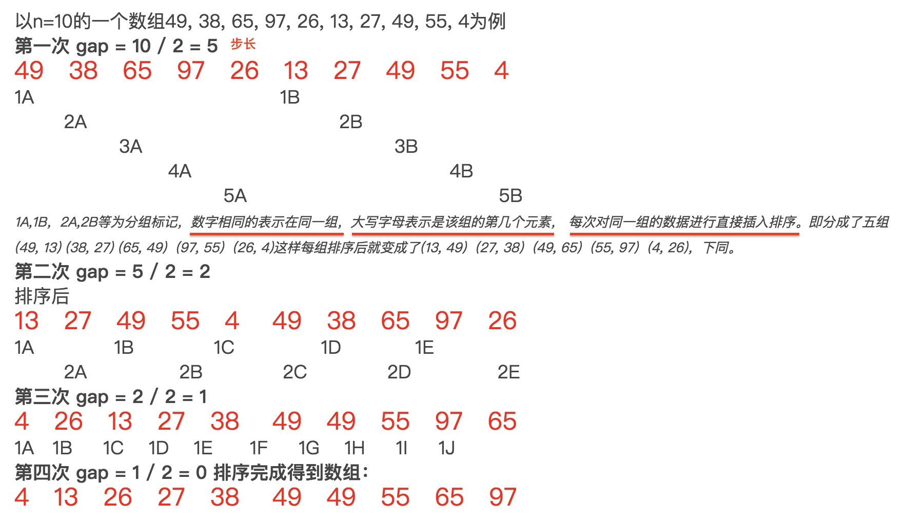
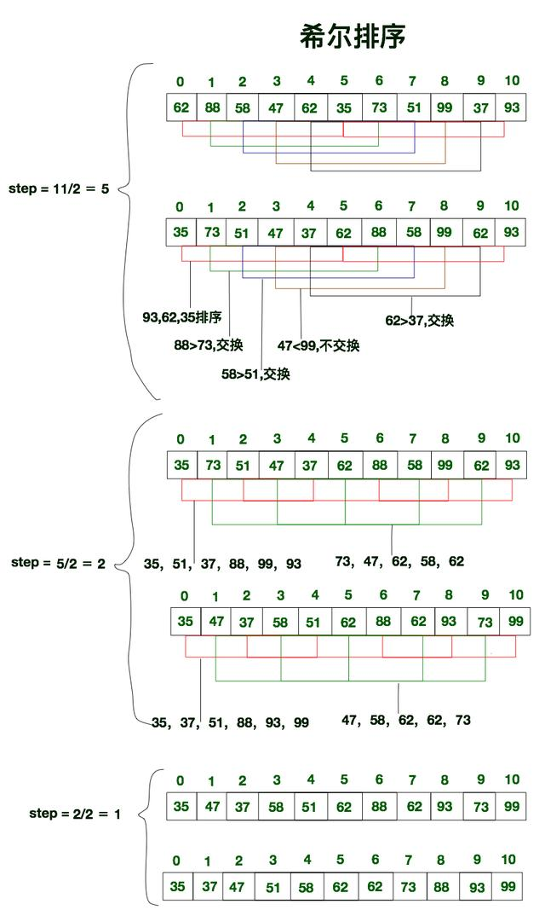

# **JS中排序算法**

- Bubble sort
- Selection sort
- Insertion sort
- Merge sort
- Quicksort
- Shellsort

# 算法优劣术语

### **稳定性**
- 稳定：如果a原本在b前面，而a=b，排序之后a仍然在b的前面 
- 不稳定：如果a原本在b的前面，而a=b，排序之后a可能会出现在b的后面

### **排序方法**
- 内排序：所有排序操作都在内存中完成 
- 外排序（External sorting）：由于数据太大，因此把数据放在磁盘中，而排序通过磁盘和内存的数据传输才能进行

## 复杂度（Complexity）

分为时间复杂度和空间复杂度，一般使用`Big-O`来表示复杂程度。

### **时间复杂度（Time Complexity）**
- 时间复杂度: 一个算法执行所耗费的时间。
    - 平均时间复杂度（average：The average-case complexity: when the data looks average）
    - 最好情况下的时间复杂度（best：The best-case complexity: when the data looks the best）
    - 最坏情况下的时间复杂度（worst：The worst-case complexity: when the data looks the worst）

### **空间复杂度（Space Complexity）**
- 空间复杂度: 运行完一个程序所需内存的大小。


**10种算法的比较图**





图片名词解释： n: 数据规模 k:“桶”的个数 

In-place: 占用常数内存，不占用额外内存 Out-place: 占用额外内存

[What is a plain English explanation of “Big O” notation?](https://stackoverflow.com/questions/487258/what-is-a-plain-english-explanation-of-big-o-notation)

[The big O notation: The complexity is usually expressed with the Big O notation.](https://stackoverflow.com/questions/487258/what-is-a-plain-english-explanation-of-big-o-notation)

[Big-O CheatSheet](http://bigocheatsheet.com/)


----


# 插入排序（Insertion Sort）


插入排序的设计初衷是往有序的数组中快速插入一个新的元素。

它的算法思想是: 把要排序的数组分为了两个部分, 一部分是数组的全部元素(除去待插入的元素), 另一部分是待插入的元素; 先将第一部分排序完成, 然后再插入这个元素。

## 直接插入排序
它的基本思想是: 将待排序的元素按照大小顺序, 依次插入到之前已经排好序的一个数组之中, 直到所有的元素都插入进去。

```js
var arr = [9, 2, 5, 6, 4, 3, 7, 10, 1, 8];

function insertionSort(array) {
    for(var i = 0; i < array.length; i++) {
        var temp = array[i];
        var j = i - 1;
        while (j >= 0 && array[j] > temp) {
            array[j + 1] = array[j];
            j--;
        }
        array[j + 1] = temp;
    }
    return array;
}

insertionSort(arr);
```

Tips: 由于直接插入排序每次只移动一个元素的位置, 并不会改变值相同的元素之间的排序, 因此它是一种稳定排序.

## 折半插入排序

折半插入排序是直接插入排序的升级版. 鉴于插入排序第一部分为已排好序的数组, 我们不必按顺序依次寻找插入点, 只需比较它们(已排序好部分)的中间值与待插入元素的大小即可。

Tips: 同直接插入排序类似, 折半插入排序每次交换的是相邻的且值为不同的元素, 它并不会改变值相同的元素之间的顺序. 因此它是稳定的。

### 折半插入排序算法基本思想是:
1. 取数组索引 0 与（i-1）的**中间点 m** ( `m = (i-1)>>1` )，array[i] 与 array[m] 进行比较：
    - 若array[i] < array[m] , 则说明待插入的元素array[i]应该处于数组的 0 ~ m 索引之间(low区);

    - 反之, 则说明它应该处于数组的 m 与 （i-1）索引之间（high区）。

2. 重复上述步骤, 每次缩小一半的查找范围, 直至找到插入的位置

3. 将数组中插入位置之后的元素全部后移一位

4. 在指定位置插入第 i 个元素

> **注: x>>1 是位运算中的右移运算, 表示右移一位, 等同于x除以2再取整, 即 x>>1 == Math.floor(x/2)** 

```js
var arr = [9, 2, 5, 6, 4, 3, 7, 10, 1, 8];

function binaryInsertionSort(array) {
    var temp, i, j, low, high, m;
    for(i = 1; i < array.length; i++) {
        low = 0;
        high = i - 1;
        temp = array[i];
        while(low <= high) {    //步骤1&2：折半查找
            m = (low + high) >> 1;
            if(array[i] >= array[m]) {  //值相同时，切换到高半区，保存稳定性
                low = m + 1;    //插入点在高半区   ？？为什么要m+1
            } else {
                high = m - 1;   //插入点在低半区   ？？
            }
        }
        for(j = i; j > low; j--) {  //步骤3：插入位置之后的元素们全部后移一位
            array[j] = array[j - 1];
        }
        array[low]  =   temp;       //步骤4：插入该元素
    }
    return array;
}

binaryInsertionSort(arr); 
```

虽然折半插入排序明显减少了查询的次数, 但是数组元素移动的次数却没有改变. 它们的时间复杂度都是O(n²)。

----

# 希尔排序




1A,1B，2A,2B等为分组标记，数字相同的表示在同一组，大写字母表示是该组的第几个元素， 每次对同一组的数据进行直接插入排序。

步長的選擇是希爾排序的重要部分。只要最終步長為1任何步長序列都可以工作。算法最開始以一定的步長進行排序。然後會繼續以一定步長進行排序，最終算法以步長為1進行排序。當步長為1時，算法變為插入排序，這就保證了數據一定會被排序。

例子2：



上面希尔排序的步长选择都是从n/2开始，每次再减半，直到最后为1。

该方法的基本思想是：先将整个待排元素序列分割成若干个子序列（由相隔某个“增量”的元素组成的）分别进行直接插入排序，然后依次缩减增量再进行排序，待整个序列中的元素基本有序（增量足够小）时，再对全体元素进行一次直接插入排序。因为直接插入排序在元素基本有序的情况下（接近最好情况），效率是很高的，因此希尔排序在时间效率上比前两种方法有较大提高。

可见, 希尔排序实际上就是不断的进行直接插入排序, 分组是为了先将局部元素有序化。

因为直接插入排序在元素基本有序的状态下, 效率非常高. 而希尔排序呢, 通过先分组后排序的方式, 制造了直接插入排序高效运行的场景. 因此希尔排序效率更高。

```js


```

Tips: 我们知道, 单次直接插入排序是稳定的, 它不会改变相同元素之间的相对顺序, 但在多次不同的插入排序过程中, 相同的元素可能在各自的插入排序中移动, 可能导致相同元素相对顺序发生变化. 因此, 希尔排序并不稳定.


		
