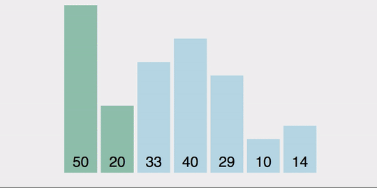

# 冒泡排序（Bubble Sort）

有一组数要使用冒泡排序： 3 7 4 2 6 1

这表示第一趟排序（红色框括起来的），而用`[]`包住的两个数字比较大小，属于一趟中其中 1 步。


为什么是 i < arr.length-1 呢?


看图，由于有 i+1 存在的缘故，  arr[i] 要与 arr[i+1] 比较大小，为了能保证 arr[i+1] 存在，因此 i 最大不能大于 arr.length-1。不然arr[i+1]就不存在了。

## 1. 冒泡排序的解析

什么是**一趟**冒泡:

```js
function bubble(arr, n) {
    // n 表示数组长度~
    for (var i = 0; i < n - 1; i++) {
        var temp;
        if (arr[i] > arr[i + 1]) {
            temp = arr[i];
            arr[i] = arr[i + 1];
            arr[i + 1] = temp;
        }
    }
}
```

**下面的代码是理解冒泡排序的关键**

进行一趟又一趟的冒泡，每一趟冒泡结束，下一次冒泡的数字个数减少1个。（进行冒泡的排序）

```js


function bubbleSort_Baby(arr, n) {
    // n 为数组长度

    // 对前面 n 个数进行一次冒泡，最大值找到，放到最末尾
    bubble(arr, n);

    // 对前面 n-1 个数进行一次冒泡，第二大值找到，放到倒数第二位
    bubble(arr, n - 1);

    // 对前面 n-2 个数进行一次冒泡，...
    bubble(arr, n - 2);

    //...
    //...  不断执行冒泡这个步骤
    //...

    // 对前面 2 个数进行一次冒泡
    bubble(arr, 2);

    // 对前面 1 个数进行一次冒泡
    bubble(arr, 1);

    //返回数组
    return arr;
}

var array = [14,3,8,1,23,6];

bubbleSort_Baby(array, 6);  //[1, 3, 6, 8, 14, 23]
```



上面的冒泡重复执行这么多次，可以用一个循环来表示:

```js
function bubbleSort(arr) {
    for(var i = n; i > 0; i--) {
        if(arr[i] > arr[i+1]) {
            bubble(arr, n);
        }
    }
}
```

最后将 `bubble()` 和 `bubbleSort()` 融合在一起：

## 2. 冒泡理排序理论：

- 冒泡排序需要两个嵌套的循环。（外层和内层）

- `内层循环`：比较相邻两个数之间的大小，数值较大的放置在数组较小的后面，然后移动到下一位数，继续进行比较。直至比较完数组中所有数以后（遍历），这一趟内层循环结束。

    - 一趟排序的作用：确保内层中最大的值被放到数组最末尾

- 一趟内层循环结束后， 交由`外层循环`往后(或前)移动游标, 随即开始下一轮`内层循环`, 以此类推, 直至循环结束。


由于冒泡排序只在相邻元素大小不符合要求时才调换他们的位置, 它并不改变相同元素之间的相对顺序, 因此冒泡排序是**稳定的排序算法**。

## 3. 优化后的冒泡排序

基础的冒泡排序
```js
var arr = [9, 2, 5, 6, 4, 3, 7, 10, 1, 8];

//swap function helper 相当于上面的bubble()
function swap(array, i, j) {
    var temp = array[i];
    array[i] = array[j];
    array[j] = temp;
}

function bubbleSortBasic(array) {
    //外层循环
    for(var i=0; i < array.length; i++) {
        //内层循环
        for(var j = 0; j < array.length; j++) {
            if(array[j] > array[j+1]) {
                swap(array, j, j+1);
            }
        }
    }
    return array;
}

console.log(bubbleSortBasic(arr.slice()));
```

经过优化的冒泡排序

```js
var arr = [9, 2, 5, 6, 4, 3, 7, 10, 1, 8];

//swap function helper
function swap(array, i, j) {
    var temp = array[i];
    array[i] = array[j];
    array[j] = temp;
}

//bubbleSort()
function bubbleSort(array) {
    var swapped;
    do {
        swapped = false;
        for(var i = 0; i < array.length; i++) {
            //内循环
            if(array[i] && array[i + 1] && array[i] > array[i + 1]){    //漏了这句导致死循环，Devtool都给我弄崩溃了
                swap(array, i, i+1);
                swapped = true;
            }
        }
    } while(swapped);
    return array;
}

console.log(bubbleSort(arr.slice()));
```