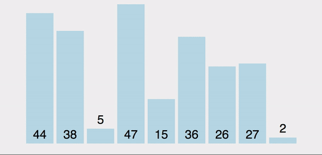

# 选择排序（Selection Sort）


选择排序(Selection-sort)是一种简单直观的排序算法。

选择排序的工作原理：

- 首先在未排序序列中找到最小（大）元素，存放到排序序列的起始位置。（一般从第一位开始）

- 然后，再从剩余未排序元素中继续寻找最小（大）元素，然后放到已排序序列的末尾。

- 以此类推，直到所有元素均排序完毕。

选择排序每次交换的元素都有可能不是相邻的, 因此它有可能打破原来值为相同的元素之间的顺序。

比如数组[2,2,1,3], 正向排序时, 第一个数字2将与数字1交换, 那么两个数字2之间的顺序将和原来的顺序不一致, 虽然它们的值相同, 但它们相对的顺序却发生了变化. 我们将这种现象称作**不稳定性**。

## 1. 基础的选择排序

```js
// 在一趟排序中找到最大的值及其最大值的位置
// 并返回最大值原来的位置（索引）
function findMaxPos(arr, len) {
    var max = arr[0];
    var pos = 0;
    for (var i = 0; i < len; i++) {
        if (arr[i] > max) {
            max = arr[i];
            pos = i;
        }        
    }
    return pos;
}

// 选择排序
function selectionSort(arr) {  
    var len = arr.length;    
    var temp;
    while(len > 1) {
        // 找到一趟排序中最大值的位置
        var pos = findMaxPos(arr, len);

        // 然后将数组中最大值与数组末尾进行交换位置
        temp = arr[pos];
        arr[pos] = arr[len - 1];
        arr[len - 1] = temp;

        // 缩小下一轮排序的范围
        len--;
    }
    return arr;
}

var array = [2,9,8,1,4];

selectionSort(array);       // [1, 2, 4, 8, 9]

```



## 2. 优化后的选择排序：
```js

var arr = [9, 2, 5, 6, 4, 3, 7, 10, 1, 8];

// swap function helper
function swap(array, i, j) {
    var temp = array[i];
    array[i] = array[j];
    array[j] = temp;
}

function selectionSort(array) {
    for(var i = 0; i < array.length; i++) {
        // 假设数组最小值的位置在数组中的第 i 位置。（目的：为了缩小每一轮的查询范围）
        // 注意，第 i 位置其实就是一趟排序的最开始那个位置。比如：
        // 第一趟排序，i = 0；就是从数组的第一个数的位置开始，向后查找最小值
        // 第二趟排序，i = 1；这是从数组的第二个数的位置开始，向后查找最小值
        // ....
        var min = i;

        // 查找这一趟排序中找到最小的值的位置
        for(var j = i + 1; j < array.length; j++) { 
            if(array[j] < array[min]) {
                min = j;
            }
        }

        // 数组最小值的位置（min）不是在当前这趟排序的元素的第一位（即 i），那么，当前排在第一位的数要与当前最小值交换位置。
        if(i !== min) {
            swap(array, i, min);
        }
        // 继续下一轮循环
    }
    return array;
}

selectionSort(arr);
```

----