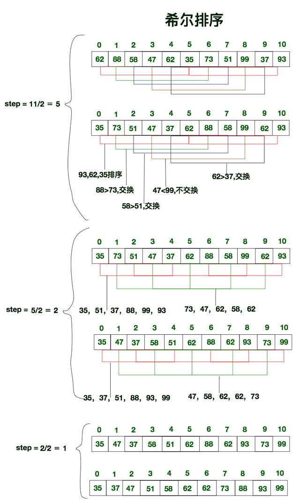

# 希尔排序


1A,1B，2A,2B等为分组标记，数字相同的表示在同一组，大写字母表示是该组的第几个元素， 每次对同一组的数据进行直接插入排序。

步長的選擇是希爾排序的重要部分。只要最終步長為1任何步長序列都可以工作。算法最開始以一定的步長進行排序。然後會繼續以一定步長進行排序，最終算法以步長為1進行排序。當步長為1時，算法變為插入排序，這就保證了數據一定會被排序。

例子2：



上面希尔排序的步长选择都是从n/2开始，每次再减半，直到最后为1。

该方法的基本思想是：先将整个待排元素序列分割成若干个子序列（由相隔某个“增量”的元素组成的）分别进行直接插入排序，然后依次缩减增量再进行排序，待整个序列中的元素基本有序（增量足够小）时，再对全体元素进行一次直接插入排序。因为直接插入排序在元素基本有序的情况下（接近最好情况），效率是很高的，因此希尔排序在时间效率上比前两种方法有较大提高。

可见, 希尔排序实际上就是不断的进行直接插入排序, 分组是为了先将局部元素有序化。

因为直接插入排序在元素基本有序的状态下, 效率非常高. 而希尔排序呢, 通过先分组后排序的方式, 制造了直接插入排序高效运行的场景. 因此希尔排序效率更高。

```js
// array to sort
var array = [9, 2, 5, 6, 4, 3, 7, 10, 1, 8];

// gaps
var gaps = [701, 301, 132, 57, 23, 10, 4, 1];

function shellsort(array) {
  for(var g = 0; g < gaps.length; g++) {
    var gap = gaps[g];
    for(var i = gap; i < array.length; i++) {
      var temp = array[i];
      for(var j = i; j >= gap && array[j - gap] > temp; j -= gap) {
        array[j] = array[j - gap];
      }
      array[j] = temp;
    }
  }
  return array;
}

console.log(shellsort(array)); // => [ 1, 2, 3, 4, 5, 6, 7, 8, 9, 10 ]

/**
 * 希尔排序，也称递减增量排序算法，是插入排序的一种更高效的改进版本。希尔排序是非稳定排序算法。
 *
 * 希尔排序是基于插入排序的以下两点性质而提出改进方法的：
 *
 * 插入排序在对几乎已经排好序的数据操作时， 效率高， 即可以达到线性排序的效率
 * 但插入排序一般来说是低效的， 因为插入排序每次只能将数据移动一位
 *
 */
 
function shellSort( list ) {
    var gap = Math.floor( list.length / 2 );
 
    while( gap > 0 ) {
 
        for( i = gap; i < list.length; i++ ) {
            temp = list[i];
 
            for( j = i; j >= gap && list[j - gap] > temp; j -= gap ) {
                list[j] = list[j - gap];
            }
            list[j] = temp;
        }
 
        gap = Math.floor( gap / 2 );
    }
 
    return list;
};
 
// test
var arr = [2, 1, 3, 12, 5, 66, 23, 87, 15, 32];
 
shellSort(arr);


//希尔排序
function shellSort(array) {
    var len = array.length;
    var gap = len;
    do {
        gap = Math.floor(gap/3)+1; // 减小增量
        // 把距离为gap的元素编为一个组，扫描所有组
        for (var i = gap; i < len; i++) {
           var  temp = array[i],
                j = i - gap;
           while(j>=0 && temp < array[j]){
               array[j + gap] = array[j];
               j -= gap;
           }
           array[j+gap] = temp; 
        }
    }while(gap > 1)
    return array
}

```

Tips: 我们知道, 单次直接插入排序是稳定的, 它不会改变相同元素之间的相对顺序, 但在多次不同的插入排序过程中, 相同的元素可能在各自的插入排序中移动, 可能导致相同元素相对顺序发生变化. 因此, 希尔排序并不稳定.