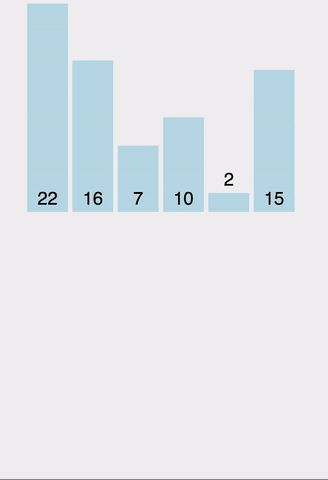
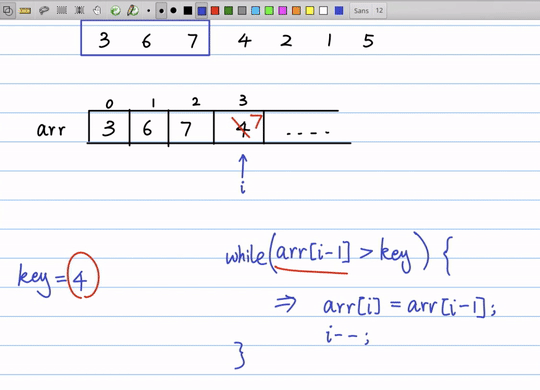

# 插入排序（Insertion Sort）



插入排序的设计初衷是往有序的数组中快速插入一个新的元素。

它的算法思想是: 把要排序的数组分为了两个部分, 一部分是数组的全部元素(除去待插入的元素), 另一部分是待插入的元素; 先将第一部分排序完成, 然后再插入这个元素。

## 直接插入排序
它的基本思想是: 将待排序的元素按照大小顺序, 依次插入到之前已经排好序的一个数组之中, 直到所有的元素都插入进去。




```js
var arr = [9, 2, 5, 6, 4, 3, 7, 10, 1, 8];

function insertionSort(array) {
    for(var i = 0; i < array.length; i++) {
        var temp = array[i];
        var j = i - 1;
        while (j >= 0 && array[j] > temp) {
            array[j + 1] = array[j];
            j--;
        }
        array[j + 1] = temp;
    }
    return array;
}

insertionSort(arr);
```

Tips: 由于直接插入排序每次只移动一个元素的位置, 并不会改变值相同的元素之间的排序, 因此它是一种稳定排序.