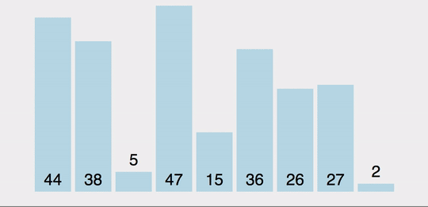

# 选择排序（Selection Sort）



选择排序(Selection-sort)是一种简单直观的排序算法。

选择排序的工作原理：

- 首先在未排序序列中找到最小（大）元素，存放到排序序列的起始位置。（一般从第一位开始）

- 然后，再从剩余未排序元素中继续寻找最小（大）元素，然后放到已排序序列的末尾。

- 以此类推，直到所有元素均排序完毕。

选择排序每次交换的元素都有可能不是相邻的, 因此它有可能打破原来值为相同的元素之间的顺序。

比如数组[2,2,1,3], 正向排序时, 第一个数字2将与数字1交换, 那么两个数字2之间的顺序将和原来的顺序不一致, 虽然它们的值相同, 但它们相对的顺序却发生了变化. 我们将这种现象称作**不稳定性**。

```js
var arr = [9, 2, 5, 6, 4, 3, 7, 10, 1, 8];

// swap function helper
function swap(array, i, j) {
    var temp = array[i];
    array[i] = array[j];
    array[j] = temp;
}

function selectionSort(array) {
    for(var i = 0; i < array.length; i++) {
        var min = i;
        //下面部分是内层循环，就是在未排序序列中找到最小的元素
        for(var j = i + 1; j < array.length; j++) { //小心别写错了~
            if(array[j] < array[min]) {
                min = j;
            }
        }
        if(i !== min) {
            swap(array, i, min);
        }
    }
    return array;
}

selectionSort(arr);
```

---