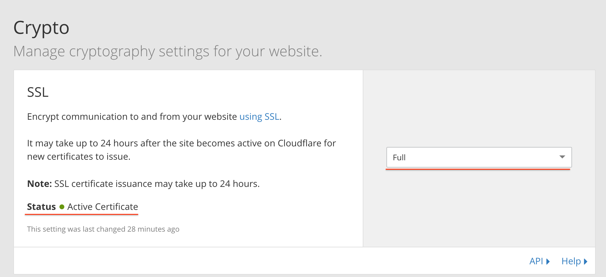
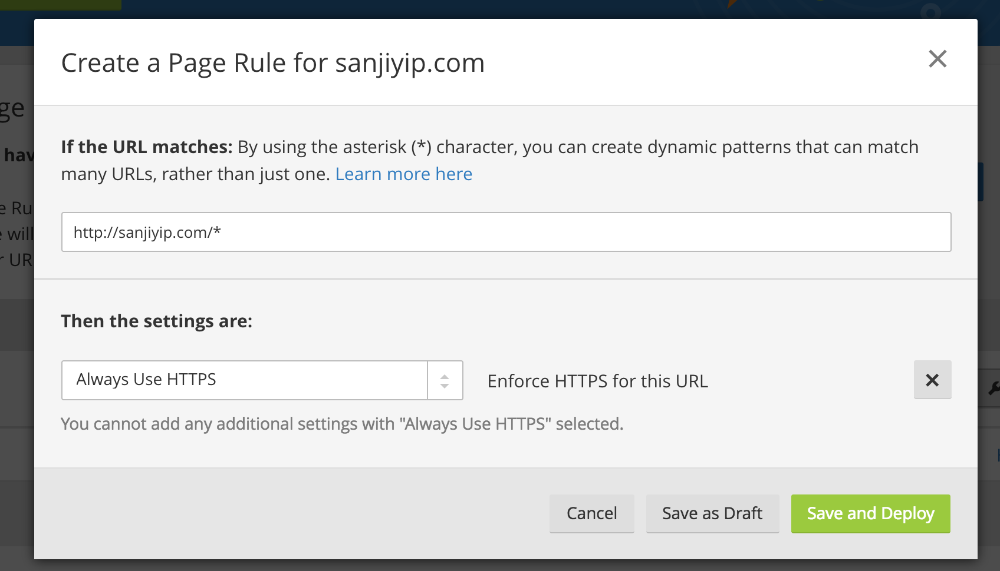

# 开启 Github Pages 自定义域名 HTTPS 和 HTTP/2 支持​

## 使用Cloudflare的DNS解析服务

[在 Cloudflare 上开启 DNS 解析](https://www.cloudflare.com/a/add-site)

按照它上面的指示逐步完成，注册——分析你的 DNS...

然后 cloudflare 会提供两个域名服务器地址，并添加到你购买域名的网站上。

最后就 ok 了~ 你自己的域名就支持 https 访问了。

### HTTPS 跳转

不过可能在页面上不显示 https 的小绿锁，所以通过 cloudflare 来添加规则。

让 http 自动跳转为 https

在 Pages Rules 标签页，新建一个 Page Rules 具体操作如下图：

输入你的自己的域名，要以 `http://` 开头

#### 然后添加规则：Always Use HTTPS

就 ok 了~

参考：[开启 Github Pages 自定义域名 HTTPS 和 HTTP/2 支持​](https://zhuanlan.zhihu.com/p/22667528)