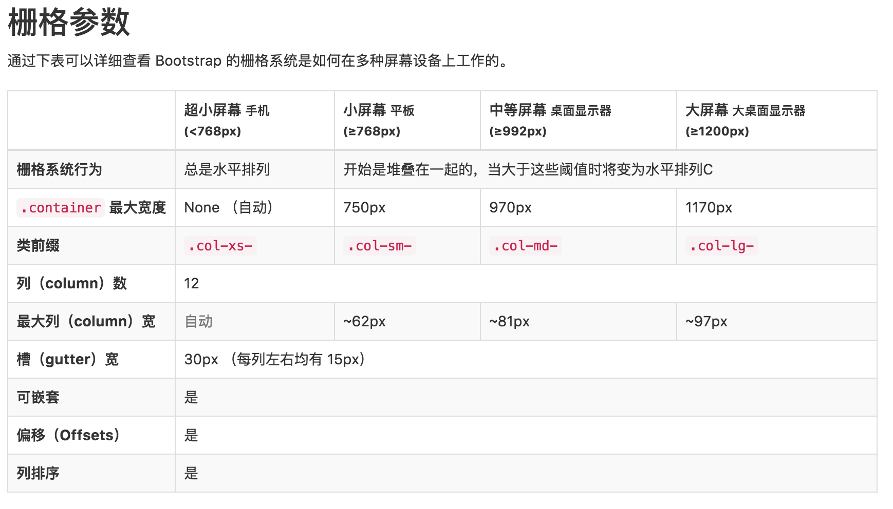

# 栅栏系统
---
Bootstrap 提供了一套响应式、移动设备优先的流式栅格系统，随着屏幕或视口（viewport）尺寸的增加，系统会自动分为最多12列。

发现一个规律，就是bootstrap-grid.css文件中，都是关于媒体查询的代码@media。

## 简介
栅格系统用于通过一系列的行（`row`）与列（`column`）的组合来创建页面布局，你的内容就可以放入这些创建好的布局中。

### **Bootstrap栅格系统的工作原理**：

- “行（row）”必须包含在 `.container` （固定宽度）或 `.container-fluid` （100% 宽度）中，以便为其赋予合适的排列（aligment）和内补（padding）。**row在container内**。


- 通过“行（row）”在水平方向创建一组“列（column）”。**col在row内**。


- 你的内容应当放置于“列（column）”内，并且，只有“列（column）”可以作为行（row）”的直接子元素。(简单来说：每一行row都是一个弹性盒子，row表示弹性容器，col表示弹性项目flex item)


- 类似 `.row `和 .`col-xs-4` 这种预定义的类，可以用来快速创建栅格布局。(预定义就是提前定义好的css类)


- 通过为“列（column）”设置 padding 属性，从而创建列与列之间的间隔（gutter）。（注意，只是元素内容之间间隔，实际上真正间隔还是靠margin）

    
- 通过为 `.row` 元素设置负值 `margin` 从而抵消掉为 `.container` 元素设置的 `padding`，也就间接为“行（row）”所包含的“列（column）”抵消掉了`padding`。后半句不太懂??


- 负值的margin就是下面的示例为什么是向外突出的原因。在栅格列中的内容排成一行。


- 栅格系统中的列是通过指定1到12的值来表示其跨越的范围。例如，三个等宽的列可以使用三个 `.col-xs-4` 来创建。


- 如果一“行（row）”中包含了的“列（column）”大于 12，多余的“列（column）”所在的元素将被作为一个整体另起一行排列。


- 栅格类适用于与屏幕宽度大于或等于分界点大小的设备 ， 并且针对小屏幕设备覆盖栅格类。 因此，在元素上应用任何 `.col-md-*` 栅格类适用于与屏幕宽度大于或等于分界点大小的设备 ， 并且针对小屏幕设备覆盖栅格类。 因此，在元素上应用任何 `.col-lg-*` 不存在， 也影响大屏幕设备。


[box-sizing教程](https://css-tricks.com/box-sizing/)

```css
    /*技巧：将所有元素设置box-sizing: border-box*/
    html {
        box-sizing: border-box;
    }
    /* box-sizing是关键！还有使用::before和::after伪类设置box-sizing */
    *,
    *::before,
    *::after {
        box-sizing: inherit;/* 这句意思就是页面所有元素都继承了box-sizing: border-box */
}
```
这样做的好处，能够让盒子模型下的width和height更容易去设定值。更加直白。

---

## 媒体查询 media query（响应式就靠它！）
在栅格系统中，使用媒体查询（media query）来创建关键的分界点阈值。媒体查询可以用来实现“响应式设计（Responsive Design）是一种让网站针对不同的浏览器和设备“呈现”不同显示效果的策略。


图为Bootstrap下的栅格(col)阈值

举例：`col-md-4`含义：

其中 `col` 是“列” column 的缩写；`md` 是 medium 的缩写，适用于应屏幕宽度**大于** 768px 的场景；`4` 是占四栏的意思。因此，`col-md-4` 的意思是，**在屏幕宽度大于 768px 时，该元素占四栏**。小于768px时，则按默认的来。

----

