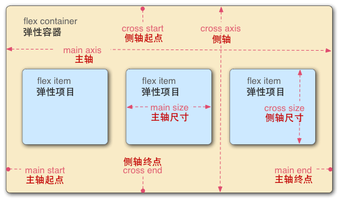

# **CSS 弹性盒子Flexbox**
---
弹性盒子布局主要适用于应用程序的组件及小规模的布局，而（新兴的）栅格布局则针对大规模的布局。

在定义方面来说，弹性布局是指通过调整其内元素的宽高，从而在任何显示设备上实现对可用显示空间最佳填充的能力。弹性容器扩展其内元素来填充可用空间，或将其收缩来避免溢出。

# 弹性盒布局相关词汇


图中是一个 `flex-direction` 属性为 `row` 的 `flex container`，意味着其内的 `flex item` 将根据既定的模式沿主轴水平排列，其方向为元素的文本流方向，在这个例子里，为从左到右。

## **1. 弹性容器(Flex container)**

包含着 `flex item` 的父元素。通过设置 display 属性的值为 flex 或 inline-flex 来定义弹性容器。
```css
.flex-container {
    display: flex;
}
```

## **2. 弹性项目(Flex item)**

弹性容器内部的每个子元素都称为弹性项目 `flex item` 。弹性容器直接包含的文本将被包覆成匿名弹性单元。

## 3. 轴(Axis)

每个弹性框布局包含两个轴。弹性项目沿其依次排列的那根轴称为主轴(main axis)。垂直于主轴的那根轴称为侧轴(cross axis)。

- `flex-direction` 确立主轴。（**父元素上使用**）

- `justify-content` 定义了在当前行上， 所有的`flex item` 沿主轴如何排布。（**父元素容器上使用**）
- `align-items` 定义了在当前行上， 所有的`flex item` 沿**侧轴**默认如何排布。（**父元素容器上使用**）
- `align-self` 定义了单个 `flex item` 在**侧轴**上应当如何**对齐**，这个定义会覆盖由 align-items 所确立的默认值。（当然覆盖，因为专门来定义单个flex item，所以**子元素上使用**）

## 4. 方向(Direction)

弹性容器的主轴起点(main start)/主轴终点(main end)和侧轴起点(cross start)/侧轴终点(cross end)描述了 `flex item` 排布的起点与终点。它们具体取决于弹性容器的主轴与侧轴中，由 writing-mode 确立的方向（从左到右、从右到左，等等）。

- `order` 属性将元素与序号关联起来，以此决定哪些元素先出现。
- `flex-flow` 属性是 `flex-direction` 和 `flex-wrap` 属性的简写，决定 `flex item` 如何排布。

## 5. 行(Line)

根据 `flex-wrap` 属性， `flex-wrap` 可以排布在单个行或者多个行中。此属性控制侧轴的方向和新行排列的方向。（父元素上使用）

## 6. 尺寸(Dimension)
根据弹性容器的主轴与侧轴，对应主轴的称为主轴尺寸(main size) ，对应侧轴的称为侧轴尺寸(cross size)。
- min-height 与 min-width 属性初始值将为 0。

`flex item` 的宽和高
- `flex` 属性是 `flex-grow`、`flex-shrink` 和 `flex-basis` 属性的简写，**描述弹性项目`flex item`的整体的伸缩性**。重要！（子元素上使用）

## 规律：
在flexbox里面，只要是有align开头的，就是与侧轴有关的。（因为align表示垂直，而垂直于主轴的就是侧轴。）

