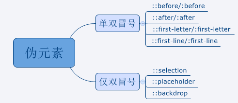

# 伪类与伪元素

css引入伪类和伪元素概念是为了格式化文档树以外的信息

## 伪类（pseudo-classes）

**伪类用于当已有元素处于的某个状态时**，为其添加对应的样式，这个状态是根据用户行为而动态变化的。（使用单冒号：）

比如说，当用户悬停在指定的元素时，我们可以通过:hover来描述这个元素的状态。虽然它和普通的css类相似，可以为已有的元素添加样式，但是它只有处于dom树无法描述的状态下才能为元素添加样式，所以将其称为伪类。

## 伪元素（pseudo-elements）

伪元素用于创建一些**不在文档树中的元素**，并为其添加样式。（使用双冒号::）

比如说，我们可以通过:before来在一个元素前增加一些文本，并为这些文本添加样式。虽然用户可以看到这些文本，但是这些文本实际上不在文档树中。

相当于文档中创建了一个 HTML 元素一样~ 所以才叫伪元素。

[伪类与伪元素的区别](http://www.alloyteam.com/2016/05/summary-of-pseudo-classes-and-pseudo-elements/#)

