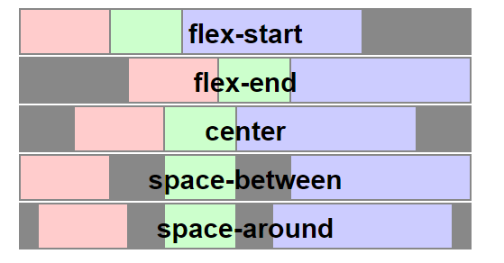
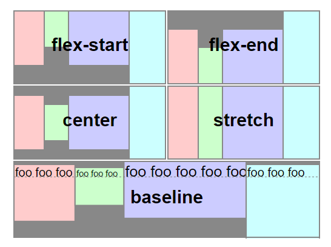
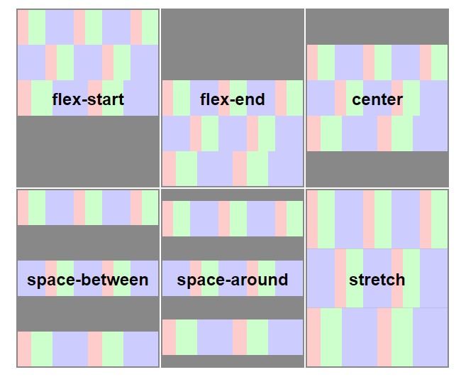
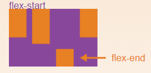
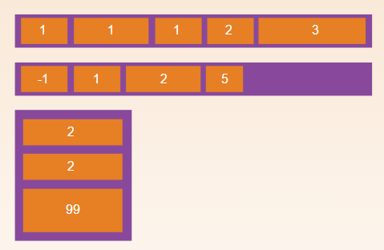
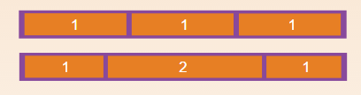
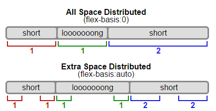

# **CSS 弹性盒子Flexbox**

弹性盒子布局主要适用于应用程序的组件及小规模的布局，而（新兴的）栅格布局则针对大规模的布局。

在定义方面来说，弹性布局是指通过调整其内元素的宽高，从而在任何显示设备上实现对可用显示空间最佳填充的能力。弹性容器扩展其内元素来填充可用空间，或将其收缩来避免溢出。

# 弹性盒布局相关词汇


图中是一个 `flex-direction` 属性为 `row` 的 `flex container`，意味着其内的 `flex item` 将根据既定的模式沿主轴水平排列，其方向为元素的文本流方向，在这个例子里，为从左到右。

## 1. 弹性容器（flex container）/伸缩容器

包含着 `flex item` 的父元素。通过设置 display 属性的值为 flex 或 inline-flex 来定义弹性容器。
```css
.flex-container {
    display: flex;
}
```

## 2. 弹性项目（flex item）/伸缩项目

弹性容器内部的每个子元素都称为弹性项目 `flex item` 。弹性容器直接包含的文本将被包覆成匿名弹性单元。

## 3. 主轴(Main Axis)和侧轴(Cross Axis)属性

每个弹性框布局包含两个轴。弹性项目沿其依次排列的那根轴称为**主轴(main axis)**。垂直于主轴的那根轴称为**侧轴(cross axis)**。

---

## `display:flex` | `inline-flex` （容器上使用）

(适用于弹性容器，也就是弹性项目的父元素)

请注意：

CSS的columns在弹性容器上没有效果。
float、clear和vertical-align在弹性项目上没有效果。

---

## `flex-direction` （容器上使用）

`flex-direction`主要用来创建主轴，从而定义了弹性项目放置在弹性容器的方向。（**父元素上使用**）

- `row`(默认值)：在“ltr”排版方式下从左向右排列；在“rtl”排版方式下从右向左排列。

- `row-reverse`：与row排列方向相反，在“ltr”排版方式下从右向左排列；在“rtl”排版方式下从左向右排列。

- `column`：类似 于row，不过是从上到下排列。

- `column-reverse`：类似于row-reverse，不过是从下到上排列。

---

## `flex-wrap` （容器上使用）

`flex-wrap`主要用来定义弹性容器里是单行还是多行显示，侧轴的方向决定了新行堆放的方向。


```css
flex-wrap: nowrap | wrap | wrap-reverse	
```

- `nowrap`(默认值)：弹性容器单行显示，“ltr”排版下，弹性项目从左到右排列；“rtl”排版上弹性项目从右向左排列。

- `wrap`：弹性容器多行显示，“ltr”排版下，弹性项目从左到右排列；“rtl”排版上弹性项目从右向左排列。

- `wrap-reverse`：弹性容器多行显示，“ltr”排版下，弹性项目从右向左排列；“rtl”排版下，弹性项目从左到右排列。（和wrap相反）

---

## `flex-flow` （容器上使用）

这个是`flex-direction1`和`flex-wrap`属性的缩写版本。同时定义了弹性容器的主轴和侧轴。其默认值为“row nowrap”。

```css
flex-flow: <‘flex-direction’> || <‘flex-wrap’>	
```

---
# 弹性项目的对齐方式 

## `justify-content` （容器上使用）

这个是用来定义弹性项目沿着主轴线的对齐方式。当一行上的所有弹性项目都不能弹性或可弹性但是已经达到其最大长度时，这一属性才会对多余的空间进行分配。当项目溢出某一行时，这一属性也会在项目的对齐上施加一些控制。（弹性容器上使用）

```css
justify-content: flex-start | flex-end | center | space-between | space-around
```

`justify-content`定义了在当前行上， 所有的`flex item` 沿 **主轴（main axis）** 如何排布。（**父元素容器上使用**），属性值包括：

- `flex-start`: 弹性项目向一行的起始位置靠齐。

- `flex-end`：弹性项目向一行的结束位置靠齐。

- `center`：弹性项目向一行的中间位置靠齐。

- `space-between`：弹性项目会平均地分布在行里。第一个弹性项目一行中的最开始位置，最后一个弹性项目在一行中最终点位置。

- `space-around`：弹性项目会平均地分布在行里，两端保留一半的空间。

 

---

## `align-items` （容器上使用）

定义了在当前行上， 所有的`flex item` 沿 **侧轴（cross axis）** 默认如何排布。（弹性容器上使用）,属性值包括：

- `flex-start` : 弹性项目在侧轴起点边的外边距紧靠住该行在侧轴起始的边。

- `flex-end` : 弹性项目在侧轴终点边的外边距靠住该行在侧轴终点的边 。

- `center` : 弹性项目的外边距盒在该行的侧轴上居中放置。

- `stretch`(默认值) : 弹性项目拉伸填充整个弹性容器。此值会使项目的外边距盒的尺寸在遵照「min/max-width/height」属性的限制下尽可能接近所在行的尺寸。

- `baseline` : 弹性项目根据他们的基线对齐。



---

## `align-content`（只有在多行容器上才生效）

这个属性主要用来调准弹性行在弹性容器里的对齐方式。类似于弹性项目在主轴上使用`justify-content`一样。（弹性容器上使用）

```css
align-content: flex-start | flex-end | center | space-between | space-around | stretch	
```

注：请注意本属性在**只有一行的弹性容器上没有效果**。

- `flex-start`：各行向弹性容器的起点位置堆叠。

- `flex-end`：各行向弹性容器的结束位置堆叠。

- `center`：各行向弹性容器的中间位置堆叠。

- `space-between`：各行在弹性容器中平均分布。

- `space-around`：各行在弹性容器中平均分布，在两边各有一半的空间。

- `stretch`（默认值）：各行将会伸展以占用剩余的空间。



---

## `align-self` (只在单个弹性项目上使用)

定义了**单个** `flex item` 在**侧轴**上应当如何**对齐**，这个定义会覆盖由 align-items 所确立的默认值。（当然覆盖，因为专门来定义单个flex item，所以**子元素上使用**）

```css
align-self: auto | flex-start | flex-end | center | baseline | stretch;
```

用来在单独的弹性项目上覆写默认的对齐方式。




---

## `order` （弹性项目上使用）

默认情况下，弹性项目是按照文档流出现先后顺序排列。然而，“order”属性可以控制弹性项目在他们的弹性容器出现的顺序。

```css
order: <integer>    /* 填整数 */
```



----
# 描述弹性项目`flex item`的整体的弹性性

## 1. `flex-grow`（弹性项目使用）

根据需要用来定义**弹性项目的扩展**能力。它接受一个不带单位的值做为一个比例。主要用来决定弹性容器剩余空间按比例应扩展多少空间。

```css
flex-grow: <number>; /* default 0 */
```

如果所有弹性项目的“flex-grow”设置了“1”，那么每个弹性项目将设置为一个大小相等的剩余空间。如果你给其中一个弹性项目设置了“flex-grow”值为“2”，那么这个弹性项目所占的剩余空间是其他弹性项目所占剩余空间的两倍。如下图：



---

## 2. `flex-shrink` （弹性项目上使用）

根据需要用来定义**弹性项目收缩**的能力。

```css
flex-shrink: <number> (默认值为： 1)	
```
负值同样生效。

---

## 3. `flex-basis`  （弹性项目上使用）

这个用来设置弹性基准值，剩余的空间按比率进行弹性。

```css
flex-basis: <length> | auto (默认值为： auto)
```
负值不合法。

如果设置为“0”，不考虑剩余空白空间。

如果设置为自动，则按照flex-grow值分配剩余空白空间。



---

## 4. `flex` （弹性项目上使用）

这是`flex-grow`、`flex-shrink`和`flex-basis`三个属性的缩写。

其中第二个和第三个参数（flex-shrink、flex-basis）是可选参数。默认值为“0 1 auto”。

```css
flex: none | [ <'flex-grow'> <'flex-shrink'>? || <'flex-basis'> ]	
```

---

## 规律：
在flexbox里面，只要是有align开头的，就是与侧轴有关的。（因为align表示垂直，而垂直于主轴的就是侧轴。）

