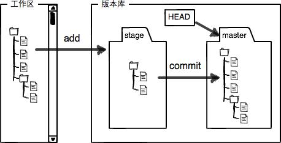
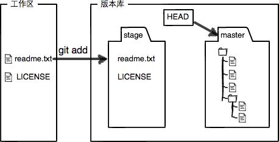
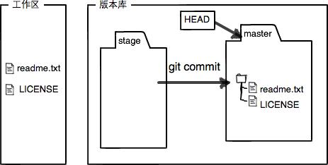

# **git 简单教程**

## 版本库（Repository）

工作区有一个隐藏目录`.git`，这个不算工作区，而是Git的版本库。

Git的版本库里存了很多东西，其中最重要的就是称为`stage`（或者叫index）的**暂存区**，还有Git为我们自动创建的第一个分支`master`，以及指向`master`的一个指针叫`HEAD`。



前面讲了我们把文件往Git版本库里添加的时候，是分两步执行的：

- 第一步是用`git add`把文件添加进去，实际上就是把文件修改添加到暂存区；

- 第二步是用`git commit`提交更改，实际上就是把暂存区的所有内容提交到当前分支。

因为我们创建Git版本库时，Git自动为我们创建了唯一一个`master`分支，所以，现在，`git commit`就是往`master`分支上提交更改。

你可以简单理解为，需要提交的文件修改通通放到暂存区，然后，一次性提交暂存区的所有修改。




所以，`git add`命令实际上就是把要提交的所有修改放到**暂存区**（`Stage`），然后，执行`git commit`就可以一次性**把暂存区的所有修改提交到分支**。

当执行了git commit以后，stage区就会如下图一样（清空了，修改的转到分支上了）。



常用指令：

-  **`git init`——创建本地版本库**

-  **`git add .` —— 把工作区的文件添加到本地版本库（的暂存区）**

-  **`git commit -m "details"` —— 把暂存区的文件提交到本地仓库的分支上**

-  **`git branch` —— 查看分支**

- **`git checkout <name>` —— 切换分支**

- **`git checkout -b <name>` —— 创建并切换分支**

- **`git merge <name>` —— 合并分支**

- **`git status` —— 查看当前仓库的状态（查看哪些文件被修改）**

-  `git diff` —— 查看difference（查看被修改的文件内容）

- `git log` —— 查看 commit 的日志

-  `git reset HEAD file` ——将暂存区修改的文件退回工作区

- `git remote -v` —— 查看远程库的信息

---

## 远程仓库 Github
**关联远程库和推送到远程库**

**关联一个远程库**

`git remote add origin git@sanjiyip:path/repo-name.git`

（关联一个远程库——前提远程库也有同名的文件夹）

**第一次推送master分支的所有内容**

第一次推送建议：

- 先 **`git pull origin master`**
    - 如果提示出错，请看：
        
        > "git merge" used to allow merging two branches that have no common base by default, which led to a brand new history of an existing project created and then get pulled by an unsuspecting maintainer, which allowed an unnecessary parallel history merged into the existing project. The command has been taught not to allow this by default, with an escape hatch `--allow-unrelated-histories` option to **be used in a rare event** that merges histories of two projects that started their lives independently.

        > You can use `git pull origin master --allow-unrelated-histories` to **force** the merge to happen.

    - `git pull origin master --allow-unrelated-histories` 强制合并两个项目（一般不建议）
    
    - 此时会进入emacs界面，要你写明合并的原因，然后退出emacs就可以了。

    - 退出Emacs
        - 如果想结束一次Emacs会话，可以按下“Ctrl +x Ctrl +c”如果回答“y”则存盘退出，如果输入“n”，Emacs会再次询问是否真的想放弃所做的修改并退出这次必须输入完整的“yes”或“no”。如果回答“no”则会话会持续下去，如果回答是“yes”则退出Emacs，所做的修改也不会保存下来。

- 再 **`git push -u origin master`** 目的是避免冲突

- 以后就直接使用 **`git push origin master`** 进行推送

----

## 克隆远程库

先创建远程库，然后，从远程库克隆。

要克隆一个仓库，首先必须知道仓库的地址，然后使用`git clone`命令克隆。

```
$ git clone git@github.com:sanjiyip/MarkdownNote.git
```

---

## 设置git的ssh步骤

1. `git config --global user.name "sanjiyip"`
2. `git config --global user.email "sanjiyip@hotmail.com"`
3. `ssh-keygen -t rsa -C "sanjiyip@hotmail.com"`
4. **`cat ~/.ssh/id_rsa.pub`**
5. 查看文件id_rsa.pub的内容，复制内容到github上的ssh key
6. `ssh -T git@github.com`（后面输入yes）

参考资料：
[关于git的ssh问题](http://blog.csdn.net/jingtingfengguo/article/details/51892864)

`git remote set-url origin git@github.com:sanjiyip/TinyProject.git`


---

## .gitignore 文件（忽略特殊文件）

在git中如果想忽略掉某个文件，不让这个文件提交到版本库中，可以使用修改根目录中 .gitignore 文件的方法（如无，则需自己手工建立此文件）。

这个文件每一行保存了一个匹配的规则例如：
```bash
# 此为注释 – 将被 Git 忽略

*.cs       # 忽略所有 .cs 结尾的文件
!ABC.cs    # 但 ABC.cs 除外
/BLL       # 仅仅忽略项目根目录下的 BLL 文件，不包括 subdir/BLL
build/     # 忽略 build/ 目录下的所有文件
doc/*.txt  # 会忽略 doc/notes.txt 但不包括 doc/server/arch.txt
```

规则很简单，不做过多解释，但是有时候在项目开发过程中，突然心血来潮想把某些目录或文件加入忽略规则，按照上述方法定义后发现并未生效，原因是.gitignore只能忽略那些原来没有被track的文件，如果某些文件已经被纳入了版本管理中，则修改.gitignore是无效的。

那么解决方法就是先把本地缓存删除（改变成未track状态），然后再提交：

```bash
git rm -r --cached .
git add .
git commit -m 'update .gitignore'
```

### 如果觉得要忽略的内容太多懒得管理, 可以采取全部忽略逐一排除的策略

先*忽略全部, 之后再!设定不被忽略的内容，比如：
```bash
*          # 忽略全部

!/ch01/    # 不忽略的文件夹
!/ch02/

!*.c       # 不忽略的文件
!*.h
!*.cpp
!*.md
!*.txt
```


[.gitignore 自动生成网址](https://www.gitignore.io/)

---


## 常见问题

**1. Changing a remote's URL （可以ssh或者https）**

比如：
`git remote set-url origin git@github.com:sanjiyip/TinyProject.git` （url不正确的情况下，使用该命令行修改url）

**2. 使用git push origin master出问题**

原因：可能远程库的比本地库的要新，所以要先git pull 再 git push


--

## 相关资料：

[GitBook](https://git-scm.com/book/zh/v2)

[Learn Git Branching](https://learngitbranching.js.org/?demo)

[廖雪峰Git教程](https://www.liaoxuefeng.com/wiki/0013739516305929606dd18361248578c67b8067c8c017b000)

[Mac 终端命令大全](http://www.jianshu.com/p/3291de46f3ff)

