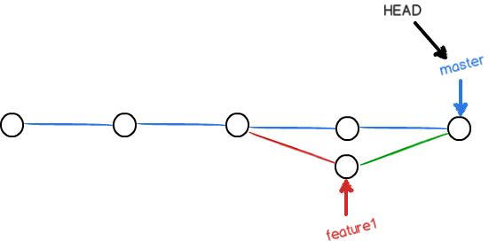

# git解决冲突


### 假设：现在这个库中两个分支，分别是 master 和 feature1

master 分支和 feature1 分支**各自都分别有新的提交**(commit)，变成了这样：


这种情况下，Git无法执行“快速合并”，只能试图把各自的修改合并起来，但这种合并就可能会有冲突。

### 假设两个分支发生冲突的部分如下：
```
<<<<<<< HEAD
Creating a new branch is quick & simple.
=======
Creating a new branch is quick AND simple.
>>>>>>> feature1
```

Git用`<<<<<<<`，`=======`，`>>>>>>>`标记出不同分支的内容，

### 1. 将上面的内容手动修改如下后保存：（这是**手动解决冲突**）

```
Creating a new branch is quick and simple.
```

### 2. 再提交（git add + git commit）内容：

```
$ git add readme.txt 
$ git commit -m "conflict fixed"
```

冲突就解决了！！！！

现在，master 分支和 feature1 分支变成了下图所示：



用`git log --graph --pretty=oneline --abbrev-commit`命令可以看到分支合并图

```
$ git log --graph --pretty=oneline --abbrev-commit
*   59bc1cb conflict fixed
|\
| * 75a857c AND simple
* | 400b400 & simple
|/
* fec145a branch test
...
```

### 4. 最后，删除feature1分支：


## 小结

1. 当Git无法自动合并分支时，就必须首先解决冲突。（**自己手动解决冲突**）

2. 解决冲突：手动解决冲突，看哪些内容要，哪些不要，要的就保留，不要的就删掉。

3. 解决冲突后，再提交（git add + git commit）、合并（git merge）完成。
