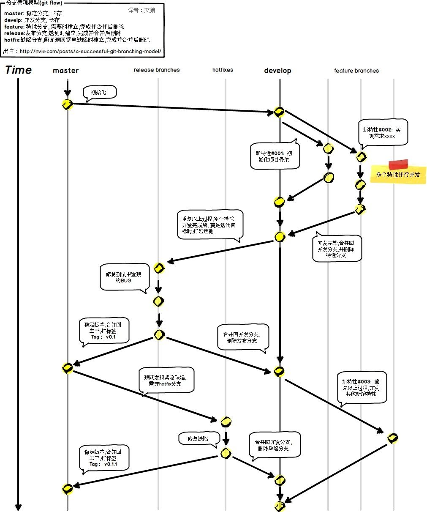

# git 分支管理策略

通常，合并分支时，如果可能，Git 会用`Fast forward`模式，但这种模式下，**删除分支后，会丢掉分支信息**。

如果要强制禁用`Fast forward`模式，**Git 就会在 merge 时生成一个新的 commit**，这样，从分支历史上就可以看出分支信息。

## 使用 `git merge --no-ff` 模式的合并分支流程

以创建 dev 分支为例，步骤如下：

1. 创建并切换到 dev 分支：`git checkout -b dev`

2. 对 dev 分支上的内容进行修改以后，记得要：

   * `git add .` 和 `git commit -m "add merge"`

3. 切换回 master 分支：`git checkout master`

4. 将 dev 分支与 master 分支使用非 Fast forward 模式合并：

   * `git merge --no-ff dev -m "merge with no-ff"`

   * 因为本次合并要创建一个新的 commit，所以加上-m 参数，把 commit 描述写进去。

5. 最后删除 dev 分支：`git branch -d dev`

6. 合并后，我们用 git log 看看分支历史：

```bash
git log --graph --pretty=oneline --abbrev-commit
*   7825a50 merge with no-ff
|\
| * 6224937 add merge
|/
*   59bc1cb conflict fixed
...
```

如图：


合并分支时，加上 `--no-ff` 参数就可以用普通模式合并，合并后的历史有分支，能看出来曾经做过合并，而 fast forward 合并就看不出来曾经做过合并。

---

## git 分支管理  最佳实践

git 分支管理的最佳实践：

* master 是主分支，用来做正式发布版之后的保留历史

* dev 分支用来做正常开发

* 多个 feature 分支用来做某些特性功能

* release 分支用来做发布版历史，每次发布都是用 release 打包

* hotfix 用来做发布版之后的一些及时迭代修复 bug 的工作

所以，团队合作的分支看起来就像这样：



---

至于远程与本地的问题，先和远程服务器连起来（推上去，或者 clone 过来），这样库就通了（建议一个项目甚至一个分布式服务一个库，而不是一大堆项目共用一个库，git 推荐这么用），然后甭管是什么操作，晚上下班前先拉取（git pull）远程仓库代码，与本地代码解决冲突且合并后将当前分支推上去（git push）。

在实际开发中，每个开发在公司远程仓库，都有一个对应每个人自己的远程分支，每次提交时教程里面讲 git push 中 master 参数换成对应开发人员的分支就好了，比如 devloper1。控制版本上线的人比如运维人员，在远程仓库的服务器上，再选择性地把某个开发人员的分支合并入真正的 master 主分支，实现上线。

---

## git tag 的用法

```bash
git tag TagName
git push origin TagName
```

打上标签了
