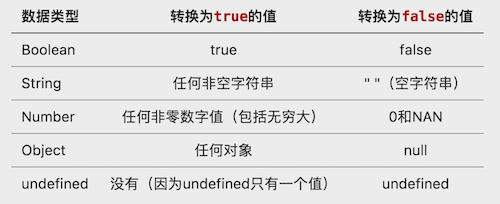
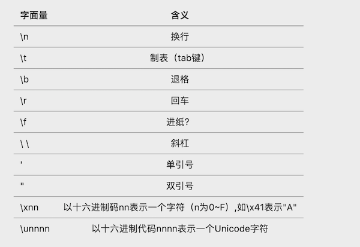

# 3.4 数据类型
-----
>   ECMAScript 有5种**基本数据类型** **Undefined、** **Null、** **Boolean、** **Number、** **String** 。还有一种复杂数据类型 **Oject**，也叫**引用数据类型**。所有值最终都将是上述6中数据类型之一。

## 3.4.1 `typeof` 操作符
`typeof`—— 用来检测变量的数据类型

返回6种结果：对比上面的数据类型而言，少了**null**，多了**function**。
- undefined
- boolean
- string
- number
- object
- function
		
```jsxf
var message = "hello world";
console.log(typeof message);
console.log(typeof(message));
//typeof有两种不同的写法（有无括号的差别，结果都一样）
```

function在ECMAScript中是*对象*，不是一种数据类型。

```js 
console.log(typeof null);
//结果为object
```
***

## 3.4.2 ``Underfined`` 类型
它的值只有一个：undefined。

未经初始化的值默认自动取得undefined值（就是只用var声明而未赋值），对**未初始化**和**未声明**的变量执行``typeof``操作符，都会返回undefinede值；
```js
var message;
//下面这个变量没声明
//var age
console.log(message);
console.log(age);//会报错
```

```js
var message;
//下面这个变量没声明
//var age
console.log(typeof message);
console.log(typeof age);//不报错
//对未初始化和未声明的变量执行typeof操作符，都会返回undefinede值
```
***
 
## 3.4.3 `Null` 类型
Null类型只有一个值：null，表示一个**空对象指针**，使用`typeof`操作检查null值时会返回"object"。
```js
var car = null;
console.log(typeof car);
//返回结果为object
```
undefined值派生自null值 （*null是undefined的爸爸。*）

在严格相等操作符下，返回的是false；在相等操作符下，返回的是true；
```js
//在严格相等操作符下
console.log(null === undefined);//输出 false
//在相等操作符下
console.log(null == undefined);//输出 true
```
只要意在保存对象的变量还没有真正保存对象，就应该明确让该变量保存null值。这体现null作为空对象指针的惯例。

***

## 3.4.4 `Boolean` 类型（布尔类型）
Boolean类型有两个值：`true`和`false`

数据转换Booolean值规则（对于自行执行Boolean转换）



在流控制语句（如if语句）中，自动执行相应的Boolean转换
```js
var message = "hello world";
if (message) {//此条件为true
    console.log("value is true");
}
```
***

## **3.4.5 `Number` 类型**
- Number类型最基本的字面量格式是十进制整数。整数还可以通过**八进制**（以8为基数）和**十六进制**（以16为基数）的字面量格式来表示
	- 八进制字面值的第一位必须是零（0）
	- 十六进制字面值的前两位必须是0x

	- 进行算术计算时，所有以八进制和十六进制表示的数值最终将被转换为十进制数值
 
### 1. 浮点数（带小数点且小数点后面必须至少有一位数字）
- 保存浮点数数字需要的内存空间是保存整数的两倍
- 所有如果浮点数值本身就是整数（如1.0），将自动转换为整数
- 表示极大或极小的值，要使用e（科学计数法）
```js 
var floatNum1 = 3.125e7
//变量floatNum1为值31250000
```
```js 
var floatNum2 = 3e-7
//变量floatNum2为值0.0000003
```	
- ECMAScript将小数点后面带6个零以上的浮点数转换为e表示法
- 浮点数值的最高精度是17位小数，但是浮点数值在进行算术计算时其精确度远不如整数。
	- 如0.1+0.2的结果不是0.3，而是0.30000000000000004；
	```js 
	if(0.1+0.2===0.3) {
		console.log("精度OK")
	}else{
		console.log("精度不OK")
	}
	//打印结果为"精度不OK"
	```	
### 2. 数值范围（原来Javascript数值还有上下限）
- ECMAScript并不能保存世界上所有的数值（最大值和最小值保存在下面），这就是它最大值和最小的范围
	- `Number.MIN_VALUE`
	- `Number.MAX_VALUE`
- 超过Javascript数值范围的值，将自动转换为特殊的Infinity值（有正无穷和负无穷）
	- `Number.POSITIVE_INFINITY` 属性表示正无穷大
	- `Number.NEGATIVE_INFINITY` 属性表示负无穷大
- 某次计算返回了正或负的Infinity，返回的值将不能参加下次运算（因为已经无穷大，再加也没意义了）
- 判断是否无穷，使用`isFinite()`函数
- 这就是它最大值和最小的范围

### 3. `NaN` (Not a Number)
- 任何涉及NaN的操作都会返回NaN
	- 如`NaN`/10
- `NaN`与任何值都不相等，包括NaN本身
```js
console.log(NaN===NaN);
//结果为 false
```
- `isNaN( )`方法
	- 用来检查参数是否”不是数值“
	- 接到参数以后，先试着将参数值转为数值，不能转为数值的为true，能转为数值的返回false。

### 4. **数值转换**
- 3种将非数值转换为数值
	- `Number( )`  //适用于任何数据类型
	- `parseInt( )`   //专门把字符串转换为数值
	- `parseFloat( )`  //专门把字符串转换为数值

- **`Number（）`转换规则（包括6种数据类型）**（很重要，经常用到~）
	- 如果是`Boolean`值，`true`和`false`分别被转换成1和0

	- 如果是数字，只是简单的传入和返回。
	- 如果是`null`值，返回0
	- 如果是`undefined`，返回`NaN`
	
	- 如果是字符串，遵循下列规则：
		- 如果字符串中只包含数字（包括前面带正负号情况），则将其转为十进制数值。"1"会变成1，而"011"会变成11（前导的零被省略了）；
		- 字符串中包含有效的浮动格式，如"1.1"，则将其转换为对应的浮点数值（同样会忽略前导零）
		- 字符串中包含有效的十六进制格式，如"0xF"，将其转换为相同大小的十进制整数值。
		- 如果字符串是空的（不含任何字符 " "），则将其转化为0。
		- 如果字符串种包含除上述格式之外的字符串，则将其转化为`NaN`
	- 如果是对象，则调用对象的`valueof（）`方法，然后依照前面的规则转换返回值。如果转换的结果是`NaN`，则调用对象的`toString()`方法，然后再次依照前面的规则转换返回的字符串值。

- `parseInt（）`转换规则
	- 处理整数时使用`parseInt( )`函数，比Number更好
	- `parseInt( )`转换空字符串会返回NaN
	- parseInt( )能够识别出各种整数格式（十进制、十六进制）
	- 如果字符串以"0x"开头且后面跟数字字符，就会将其当做一个十六进制整数
	- `parseInt( )`可以有两个参数
		- 第一个参数是要转换字符串
		- 第二个参数为转换时使用的基数（即多少进制）
		```js
		//八进制：
		var num1 = parseInt("070",8);
		//变量num1值为56
		```
		```js
		//十六进制：
		var num2 = parseInt("AF",16);
		//变量num2值为175
		```

- `parseFloat( )`转换规则
	- 在该方法下，字符串中只有第一个小数点是有效的，第二个小数点就无效的，后面的字符串将被忽略。
		- 如："3.34.5"会被转换为3.34
	- `parseFloat( )`只解析十进制，十六进制格式的字符串则始终转换为0。
	- 如果字符串包含的是一个可以解析为整数的数（没有小数点，或者小数点后面都是0），`parseFloat()`会返回整数。
		```js
		var num1 = parseInt("1234blue");
		//num1值为1234
		var num2 = parseInt("0xA");
		//num2值为0，parseFloat( )十六进制格式的字符串则始终转换为0
		var num3 = parseInt("23.44.11");
		//num3值为23.44，第二个小数点以后的数值无效
		var num4 = parseInt("0053.41");
		//num4值为53.41，前导零被忽略
		```

***

## 3.4.6 ``String`` 类型
### 1. 字符字面量

String数据类型包含一些特殊的字符字面量，也叫转义序列，具有其他用途的字符。(使用反斜杠\\)



### 2. 字符串的特点

- ECMAScript中字符串是不可变的。
	- 字符串一旦创建，它们的值不能改变。
	- 要改变某个变量保存的字符串，首先要销毁原来的字符串，然后再用另外一个包含新值的字符串填充该变量。
	```js
	var lang = "Java";
	lang = lang + "Script";
	```
	- 实现上面操作的过程：先创建一个能容纳10个字符的新字符串，然后在这个字符串中填充"Java"和"Script"，最后一步就将原来的"Java"和"Script"这两个字符串销毁。（后台发生的过程）

### 3. 转换为字符串（`toString（）`方法）
- 数值、布尔值、对象和字符串值都有`toString（）`方法
- 但null和undefined值没有`toString（）`方法
- 数值调用`toString（）`方法可以传递一个参数：输出数值的基数。
	```js
	var num = 10;
	num.toString(2);//"1010"
	num.toString(8);//"12"
	num.toString(10);//"10"
	num.toString(16);//"a"
	```

- **在不知道要转换的值**是不是`null`或者`undefined`的情况下，可以使用转型函数`String（）`,此函数能将任何类型的值转换为字符串。`String（）`遵循的转换规则：
	- 如果值有`toString（）`方法，则调用该方法（没参数）并返回相应的结果；
	- 如果值是`null`，则返回"null"；
	- 如果值是`undefined`，则返回"undefined";
	```js
	var value1 = 10;
	var value2 = true;
	var value3 = null;
	var value4;
	console.log(String(value1));//"10"
	console.log(String(value2));//"true"
	console.log(String(value3));//"null"
	console.log(String(value4));//"undefined"
	```
***

## 3.4.7 `Object` 类型
- ECMAScript中的对象就是一组数据和功能的集合。（属性和方法）
- 创建自定义对象
```js
var o = new Object();
```
- Object的每一个实例都具有下列的属性和方法
	- `constructor`：保留着创建当前对象的函数。对于前面的例子而言，构造函数（constructor）就是Object（）。

	- `hasOwnProperty（propertyName）`：用于检查给定的属性在当前对象实例中（而不是实例的原型中）是否存在。其中，作为参数的属性名（propertyName）必须以字符串形式指定（例如：o.hasOwnProperty（"name"））。

	- `isPrototypeOf（object）`：用于检查传入的对象是否是当前对象的原型

	- `propertyIsEnumerable（propertyName)`：用于检查给定的属性是否能够使用for-in语句来枚举。与hasOwnProperty（）方法一样，作为参数的属性名必须以字符串形式指定。

	- `toLocaleString（）`：返回对象的字符串表示，该字符串与执行环境的地区相应

	- `toString（）`：返回对象的字符串表示。

	- `valueOf（）`：返回对象的字符串、数值或者布尔值表示。通常与toString（）方法的返回值相同

------
摘抄自《JavaScript高级程序设计》