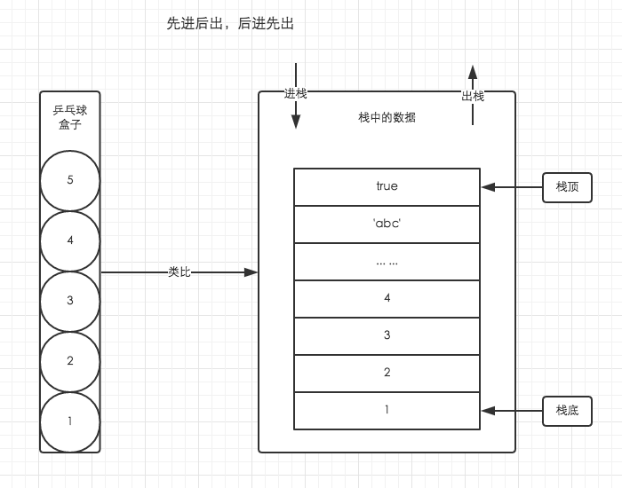
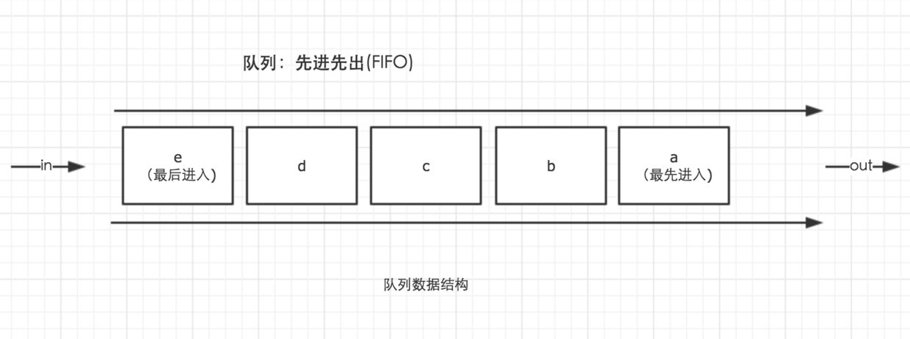
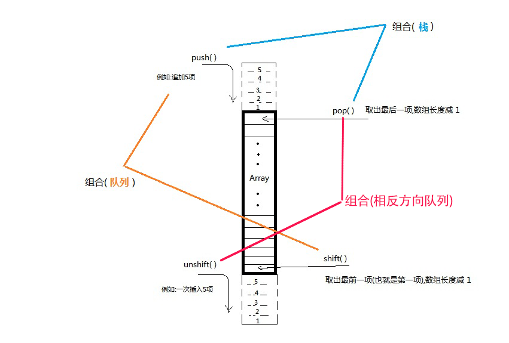

# Array类型 (2)
---
## 5.2.3 栈方法
栈是一种LIFO（Last-In-First-Out，后进先出）的数据结构。栈中项的插入（叫做推入）和移除（叫做弹出），只发生在一个位置——**栈的顶部**。ECMAScript为数组专门提供了`push()`和`pop()方法`，来实现类似栈的行为。

执行上下文的执行顺序借用了栈数据结构的存取方式。(也就是后面我们会经常提到的函数调用栈)。因此理解栈数据结构的原理与特点十分重要。

要简单理解栈的存取方式，我们可以通过类比乒乓球盒子来分析。
 

### `push()`方法和`pop()`方法
`push()`方法可以接收任意数量的参数，把它们逐个添加到数组末尾，并**返回修改后数组的长度**。

`pop()`方法则从数组末尾移除最后一项，减少数组length值，然后**返回移除的项**
```js
var colors = new Array();
var count = colors.push("red", "green");    //推入两项
alert(count);   //2

count = colors.push("black");   //推入一项
alert(count);   //3

var item = colors.pop();    //删除最后一项
alert(item);    //"black";
alert(colors.length);   //2
```

---

## 5.2.4 队列方法
队列数据结构的访问规则是FIFO（First-In-First-Out，先进先出）。队列在列表的末端添加项，从列表的前端移除项。使用`shift()`方法和`push()`方法。好比火车站排队出站一样，排在队伍前面的人一定是最先出站的的人。
### 1. `shift()`方法
 `shift()`方法能够**移除数组中第一项并返回该项**，同时将数组长度减1。
 
```js
var colors = new Array();
var count = colors.push("red", "green");    //推入两项
alert(count);   //2

count = colors.push("black");   //推入一项
alert(count);   //3

var item = colors.shift();    //删除第一项
alert(item);    //"red";
alert(colors.length);   //2
```

### 2. `unshift()`方法
`unshift()`方法与`shift()`方法用途相反。`unshift()`方法用于在**数组前端添加**任意个项，并返回新数组的长度。

因此，同时**使用unshift()和pop()方法，可以从相反的方向来模拟队列**，即在数组的前端添加项，从数组末项移除项。
```js
var colors = new Array();
var count = colors.unshift("red", "green");    //推入两项
alert(count);   //2

count = colors.unshift("black");   //推入一项
alert(count);   //3

var item = colors.pop();    //删除最后一项
alert(item);    //"green";
alert(colors.length);   //2
```
小结：
 

----

## 5.2.5 重排序方法
数组中有两个用来重排序的方法：`reverse()`方法和`sort()`方法。

### 1. `reverse()`方法
`reverse()`方法可以直接反转数组项的顺序。
```js
var values = [1, 2, 3, 4, 5];
values.reverse();
alert(values);      //5,4,3,2,1
```

### 2. `sort()`方法
`sort()`方法按升序排列数组项——即最小的位于最前面，最大的值排在最后面。为了实现排序，`sort()`方法会调用每个数组项的`toString()`转型方法，然后比较得到的字符串，以确定如何排序。**即使数组中的每一项都是数值，`sort()`方法比较的也是字符串**。例子：
```js
var values = [0, 1, 5, 10, 15];
values.sort();
alert(values);      //0,1,10,15,5
```
即使数组中排序是正确的，但是使用了`sort()`方法，就比较的是字符串。因为"10"位于"5"的前面，所以数组的顺序被改变了。

为了解决这种问题，因此`sort()`方法可以接收一个**比较函数作为参数**，以便我们知道哪个值位于哪个值的前面。（通过比较函数的返回值来进行排序）

比较函数接收两个参数：
- 如果第一个参数应该位于第二个参数之前则返回一个负数，
- 如果两个参数相等则返回0
- 如果第一个参数应该位于第二个参数之后则返回一个正数

```js
//比较函数：升序
function compare(value1, value2) {
    if (value1 < value2) {
        return -1;
        //value1会被排列到value2之前
    } else if (value1 > value2) {
        return 1;
        //value2会被排列到value1之前
    } else {
        return 0;
        //value1和value2的相对位置不变
    }
}
//上面的比较函数适用于大多数数据类型，只要将比较函数作为参数传递给sort()方法即可。

var values = [0, 1, 5, 10, 15];
values.sort(compare);       //比较函数作为参数传递给sort()方法
alert(values);      //0,1,5,10,15
```

通过交换比较函数返回的值，即可以由升序变成降序排序。
```js
//比较函数：降序
function compare(value1, value2) {
    if (value1 < value2) {
        return 1;
    } else if (value1 > value2) {
        return -1;
    } else {
        return 0;
    }
}
```
如果只想反转数组原来的排序，使用`reverse()`方法要更快一些。

如果只是数值类型或者valueOf()方法会返回数组类型的对象类型，使用如下更简单的比较函数：
第二参数减第一个参数即可。
```js
function compare(value1, value2) {
    return value2 - value1;
}
```

----
小结：
只要对数组的项进行删减的方法，会返回被删减的数组元素。