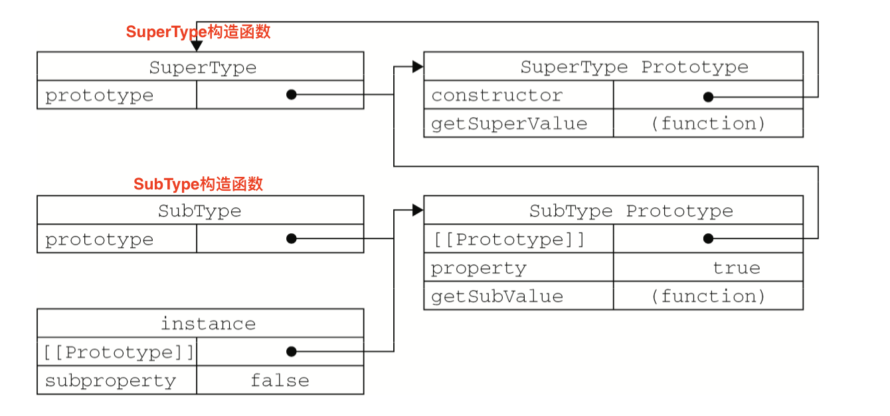

# 6.3 继承(1)

> 由于函数没有签名，在ES中无法实现接口继承。**ES只支持实现继承，而且其实现继承主要是依靠原型链来实现的**。（**接口继承**只继承方法签名，而**实现继承**则继承实际的方法。）

## 6.3.1 **原型链**

ES中描述了原型链的概念，并将原型链作为实现继承的主要方法。其基本思想是利用原型让一个引用类型继承另外一个引用类型的属性和方法。

简单回顾一下**构造函数、原型对象和实例对象**三者的关系：

- 每个构造函数都有一个原型对象（`prototype`）
- 原型对象包含一个指向构造函数的指针（`constructor`）
- 实例都包含一个指向原型对象的内部指针(`_proto_`)


那么，假如我们让原型对象A等于另外一个原型对象B的实例实例对象，结果会怎样？

显然，此时的原型对象A（Foo.prototype）将包含一个指向另一个原型对象B（Object.prototype）的指针( `_proto_` )，相应地，另一个原型对象B中也包含着一个指向另一个构造函数的指针( `constructor` )。

> 假如**原型对象A是原型对象B的实例对象**，也就是说他们存在继承关系，那么上述关系依然成立，如此层层递进，就构成了实例对象与原型对象的链条。这就是所谓**原型链的基本概论**。

**原型链示意图：**


**实现原型链有一种基本模式**，其代码大致如下：
```js
function SuperType() {
    this.property = true;
}

SuperType.prototype.getSuperValue = function() {
    return this.property;
};

function SubType() {
    this.subproperty = false;
}

//继承了SuperType
SubType.prototype = new SuperType();    //此处为重点：一个原型对象是另一个原型对象的实例对象，就存在继承关系

SubType.prototype.getSubValue = function() {
    return this.subproperty;
};

var instance = new SubType();
console.log(instance.getSuperValue());
```

以上代码定义了两个类型：SuperType和SubType。每个类型分别有一个属性和一个方法。它们的主要区别是SubType继承了SuperType，而**继承是通过创建SuperType的实例对象，并将该实例对象赋值给SubType.prototype(SubType的原型对象)实现的**。

**继承实现的本质是重写子类型的原型对象，替换成一个超类型原型对象的实例对象**。

换句话说，原来存在于SuperType的实例对象中的所有属性和方法，现在也存在于SubType.prototype中了。在确立了继承关系之后，我们给SubType.prototype添加了一个方法，这样就在继承了SuperType的属性和方法基础上有添加了一个新方法。

这个例子中的实例对象以及构造函数和原型之间的关系图：



在上面的代码中，我们没有使用SubType默认提供的原型对象，而是给它换了一个新原型；这个新原型就是**SuperType（超类型）的实例对象**。于是，新原型(SubType)不仅具有作为一个SuperType的实例对象拥有的全部属性和方法，而且其内部还有一个指针，指向了SuperType的原型对象。最终结果就是这样的：instance指向SubType的原型，SubType的原型又指向SuperType的原型。

getSuperValue()方法仍然还是SuperType.prototype中，但property则位于SubType中。这是因为property是一个实例对象的属性，而getSuperValue()则是一个原型对象的方法。既然SubType.prototype原型对象现在是SuperType.prototype原型对象的实例对象，那么property当然就位于该实例对象中了。

> 通过实现原型链，本质上拓展了本章前面介绍原型搜索机制。当以读取模式访问一个实例对象的属性时，首先会在实例对象中搜索该属性。如果没有找到该属性，则继续搜索实例对象的原型(对象)。在通过原型链实现继承的情况下，搜索过程就得以沿着原型链继续向上。找不到属性或方法的情况下，搜索过程总是一环一环地前行到原型链末端才会停下来。

拿上面例子来说，调用instance.getSuperValue()，会经历三个搜索步骤：1）搜索实例；2）搜索SubType.prototype;3)搜索SuperType.prototype，最后一步才会找到该方法。

---

### 1. 别忘记默认的原型（Object.prototype）

实际上，前面例子中展示的原型链还少了一环。我们知道，**所有引用类型默认都继承了Object**，而这个继承也是通过原型链实现的。大家要记住，**所有函数的默认原型对象都是Object的实例对象**，因此函数的默认原型对象都会包含一个内部指针(`_proto_`)，指向`Object.prototype`。这也正是所有自定义类型都会继承toString()、valueOf()等默认方法的根本原因。

所以，上面例子展示的原型链中还应该包括另外一个继承层次。下面展示例子中完整的原型链。


一句话，SubType继承了SuperType，而SuperType继承了Object。当调用instance.toString()时，实际上调用的是保存在Object.prototype中的那个方法。

---

### 2. 确定原型和实例的关系

可以通过两种方式来确定原型对象和实例对象之间的关系。

第一种方式是使用 `instanceof` 操作符，只要用这个操作符来测试实例与原型链中出现过得构造函数，结果就会返回true。

```js
//接着上面的例子：
console.log(instance instanceof Object);        //true
console.log(instance instanceof SuperType);     //true
console.log(instance instanceof SubType);       //true
```

由于原型链的关系，我们可以说instance是Object、SuperType或SubType中任何一个类型的实例。因此，测试这三个构造函数的结果都返回true。

第二种凡是是使用 `isPrototypeOf()` 方法。同样，只要是原型链中出现过的原型，都可以说是该原型链派生的实例对象的原型，因此 `isPrototypeOf()` 方法也会返回true，如下所示：

```js
console.log(Object.prototype.isPrototypeOf(instance));
console.log(SuperType.prototype.isPrototypeOf(instance));
console.log(SubType.prototype.isPrototypeOf(instance));
```

---

### 3. 谨慎地定义方法

子类型（SubType）有时候需要覆盖超类型(SuperType)中的某个方法，或者需要添加超类型中不存在的某个方法。不管怎样，给子类型原型对象添加方法的代码，一定要放在超类型的实例对象替换子类型的原型对象的语句之后。(**将一个原型对象替换成另外一个原型对象的实例对象**)

因为放在实例对象替换原型对象语句前面的话，新添加的属性的代码是无效的。依然维持原来原型对象的属性。

例子：

```js
function SuperType() {
    this.property = true;
}

SuperType.prototype.getSuperValue = function() {
    return this.property;
};

function SubType() {
    this.subproperty = false;
}

//继承了SuperType（子类型定义的方法要在后面）
SubType.prototype = new SuperType();        //说的就是这一句

//添加新方法
SubType.prototype.getSubValue = function() {
    return this.subproperty;
};

//重写超类型中的方法
SubType.prototype.getSuperValue = function() {
    return false;
};

var instance = new SubType();
console.log(instance.getSuperValue());
```


在以上代码中，继承SuperType后面部分的代码是两个方法的定义。第一个方法getSuperValue()被添加到了subType中。第二个方法getSuperValue()是原型链中已经存在的一个方法，但重写这个方法将会屏蔽原来的那个方法。

换句话说，当通过SubType的实例对象调用getSuperValue()时，调用的就是这个重新定义的方法；但通过SuperType的实例对象调用getSuperValue()时，还会继续调用原来的那个方法（在SuperType原型对象中的那个方法）。

这里各位要注意的是，必须在SuperType的实例对象替换SubType原型对象之后，再定义这两个方法。

> 还有一点需要注意，即**在通过原型链实现继承时，不能使用对象字面量创建原型对象方法**。因为这样的做的后果会重写原型链。

例子：

```js
function SuperType() {
    this.property = true;
}

SuperType.prototype.getSuperValue = function() {
    return this.property;
};

function SubType() {
    this.subproperty = false;
}

//继承了SuperType（子类型定义的方法要在后面）
SubType.prototype = new SuperType(); 

//使用字面量添加新方法，会导致上一行代码无效
SubType.prototype = {
    getSubValue: function () {
        return this.subproperty;
    },
    
    someOtherMethod: function() {
        return false;
    }
};

var instance = new SubType();
console.log(instance.getSuperValue());  //报错
```

以上代码展示了刚刚用SuperType的实例对象替换掉SubType的原型对象，紧接着又将SubType的原型对象替换成一个对象字面量而导致的问题。由于现在SubType的原型对象(SubType.prototype)是Object原型对象的一个实例，而非SuperType原型对象的实例，因此原型链已经被切断——SubType和SuperType之间已经没有关系了。

---

### 4. 原型链的问题

原型链虽然很强大，可以用它来实现继承，但它也存在一些问题。

其中，**最主要的问题来自包含引用类型值的原型对象**。

前面介绍过包含**引用类型值的原型对象属性会被所有实例对象共享**；而这也正是为什么要在构造函数中，而不是原型对象中定义属性的原因。

**在通过原型对象来实现继承时，子类型的原型对象实际上会变成超类型的原型对象的实例对象**。**于是，原先超类型(SuperType)的实例对象属性也就顺理成章地变成现在的原型对象的属性了（因为对于SubType而言，SuperType构造函数的实例对象变成了它（SubType构造函数）的原型对象）**。

例子：

```js
function SuperType() {
    this.colors = ["red", "blue", "green"];
}

function SubType() {
}

//继承了SuperType
SubType.prototype = new SuperType();

var instance1 = new SubType();
instance1.colors.push("black");
console.log(instance1.colors);  //["red", "blue", "green", "black"]

var instance2 = new SubType();
console.log(instance2.colors);  //["red", "blue", "green", "black"]
```

- 这个例子中SuperType构造函数定义了一个colors属性，该属性包含一个数组(引用类型值)。SuperType的每个实例对象都会有各自包含的数组colors这个属性。

- 当SubType通过原型链继承了SuperType之后，SubType.prototype就变成了SuperType.prototype的一个实例对象，因此它（SubType原型对象）也可以从SuperType原型对象里找到一个的colors属性。

- 结果是SubType的所有实例对象都会共享这个colors属性(属性来自于SuperType原型对象)。而我们对instance1.colors的修改能够通过instance2.colors反应出来，充分证明了这一点。


**原型链的第二个问题是：创建子类型的实例对象时，不能向超类型的构造函数中传递参数**。

实际上，应该说是没办法在不影响所有对象的实例对象的情况下，给超类型的构造函数传递参数。鉴于此，再加上刚刚讨论的由原先中包含引用类型值所带来的问题，**实践中很少单独使用原型链**。

----


