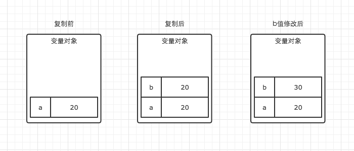

# 4.1 基本类型和引用类型的值（❤）
----
**ECMAScript变量**可能包含两种不同类型的值：**基本类型值**和**引用类型值**。**基本类型值**是指简单的数据类型：`Undefined`、`Null`、`Boolean`、`Number`和`String`。**引用类型值**指那些可能由多个值构成的对象`object`。

### 变量对象与基础数据类型
- JavaScript的执行上下文（execution context）生成之后，会创建一个叫做**变量对象**的特殊对象，JavaScript的**基础数据类型往往都会保存在变量对象中**。

### 引用类型与堆内存
- JS的引用类型，比如数组Array，它们值的大小是不固定的。**引用类型的值是保存在堆内存中的对象**。JavaScript不允许直接访问内存中的位置，也就是说不能直接操作对象的内存空间。在**操作对象**时，实际上是在**操作对象的引用**而不是实际的对象。因此，引用类型的值都是按引用访问的。这里的引用，我们可以理解为保存在变量对象中的一个地址，该地址与堆内存的实际值相关联。

-----
## 4.1.1 动态的属性（就是变量~）
定义基本类型值和引用类型值的的方式类似：创建一个变量并为该变量赋值。可以为**引用类型值添加属性和方法**，也可以改变和删除其属性和方法。但是**不能给基本类型值添加属性**，因为基础数据类型不是对象。
```js
var person = new Object();
person.name = "Nicolas"; //为person对象新增了name属性和属性值
```
-----
## 4.1.2 复制变量
在变量对象中的数据发生复制行为时:
- 基本类型：从一个变量向另一个变量复制**基本类型**的值，会在变量对象上创建一个新值，然后把该值复制到**为新变量分配的位置**上。
```js
var a = 20;
var b = a;
b = 30;

// 这时a的值是多少？
```
 


- 引用类型：引用类型的复制同样也会为新的变量自动分配一个新的值保存在变量对象中，但不同的是，这个新的值，仅仅只是引用类型的一个地址指针。当地址指针相同时，尽管他们相互独立，但是在变量对象中访问到的具体对象实际上是同一个。因此当我们要访问堆内存中的引用类型时，实际上我们首先是从变量对象中获取了该对象的地址引用（或者地址指针），然后再从堆内存中取得我们需要的数据。
```js
var m = { a: 10, b: 20 }
var n = m;
n.a = 15;

// 这时m.a的值是多少
```
 

----
## 4.1.3 传递参数（arguments）
**ECMAScript中所有函数的参数都是按值传递的。**

- 也就是说把函数外部的值复制给函数内部的参数：就和把一个值从一个变量复制到另一个变量一样。
- 基本类型值的传递如同基本类型变量的复制一样。
- 引用类型的值传递，则如同引用类型变量的复制一样。

访问变量有按值和按引用两种方式，而**参数只能按值传递**。
- 在向参数传递基本类型的值时，被传递的值会被复制给一个局部变量(即命名参数，或者用ECMScript的概念来说，就是arguments对象中的一个元素)。

- 在向参数传递引用类型的值时，会把这个值再内存中的地址复制给一个局部变量，因此这个局部变量的变化会反应在函数的外部。

- 在ECMScript中，参数实际上是函数的局部变量。

---
## 4.1.4 检测类型
**检测一个变量是不是基本类型，使用typeof。**

**检测引用类型的值时，使用instanceof**
```js
result = variable instanceof constructor
```
如果变量是给定引用类型的实例，那么`instanceof`就会返回true。
- 根据规定，所有引用类型的值都是Object的实例。因此检测一个引用类型值和Object构造函数时，`instanceof`操作符始终返回true。

- 如果使用instanceof检测基本类型的值，则该操作符始终会返回false，因为**基本类型**不是对象。

---