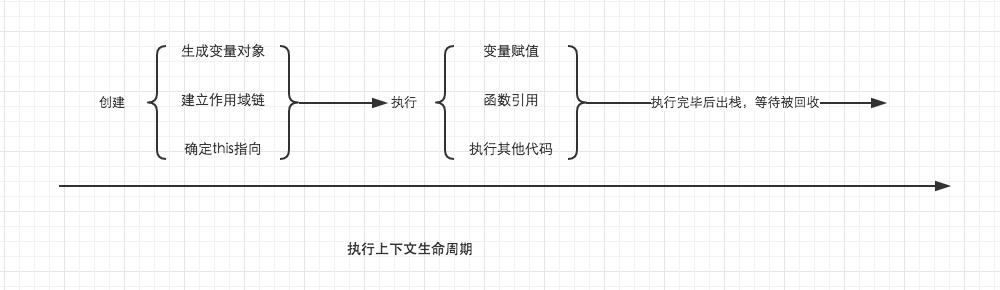
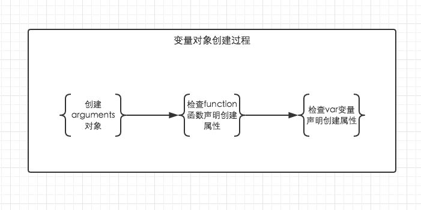

# 4.2 执行环境及作用域
-----
## 执行环境
**执行环境**（Execution Context,也叫**执行上下文**，执行上下文可以理解为函数执行的环境，每一个函数执行时，都会给对应的函数创建这样一个执行环境。简称**环境**）是JavaScript中最为重要的一个概念。

**执行环境定义了变量和函数有权访问的其他数据**，决定了他们各自的行为。每个执行环境都有一个与之关联的**变量对象**（variable object），环境中定义的所有变量和函数都保存在这个对象中。

- **全局执行环境**是最外围的一个执行环境，有时候被叫**全局环境**。在Web浏览器中，全局执行环境被认为是window对象，因此所有全局变量和函数都是作为window对象的属性和方法创建的。某个执行环境中的所有代码执行完毕后，该环境被销毁，保存其中的所有变量和函数定义也随之销毁。（全局执行环境直至应用程序退出时才会被销毁——例如关闭网页或者浏览器）

- **函数执行环境**，每个函数都有自己的执行环境。当执行流进入一个函数时（也就是函数被执行时），函数的环境就会被推入一个**环境栈**中。而在函数执行完毕之后，栈将其环境弹出，把控制权返回给之前的执行环境。(有的时候，函数执行环境叫**局部环境**)。

- 当代码在一个环境(上下文）中执行，会创建变量对象的一个**作用域链**（scope chain）。作用域链的用途，是保证对执行环境有权访问的所有变量和函数的有序访问。
```js
var color = 'blue';

function changeColor() {
    var anotherColor = 'red';

    function swapColors() {
        var tempColor = anotherColor;
        anotherColor = color;
        color = tempColor;
    }

    swapColors();
}

changeColor();
```
 
例子来源：[前端基础进阶（二）：执行上下文详细图解](http://www.jianshu.com/p/a6d37c77e8db)

详细了解了这个过程之后，我们就可以对执行上下文总结一些结论了:
- 单线程
- 同步执行，只有栈顶的上下文处于执行中，其他上下文需要等待
- 全局上下文只有唯一的一个，它在浏览器关闭时出栈
- 函数的执行上下文的个数没有限制
- 每次某个函数被调用，就会有个新的执行上下文为其创建，即使是调用的自身函数，也是如此。

----

## 创建执行环境
> 当调用一个函数时（激活），一个新的执行环境（上下文）就会被创建。创建执行环境的两个阶段：

英文版解释：
- Execution Context in Detail
So we now know that everytime a function is called, a new execution context is created. However, inside the JavaScript interpreter, **every call to an execution context has 2 stages:**（每次调用函数，执行环境（上下文）都会被创造出来，然后创造过程有2阶段：**创建阶段**和执行阶段）

    - **Creation Stage** [when the function is called, but before it executes any code inside(这阶段是指**当函数已经被开始被调用call**，但**函数里面的代码还没开始执行之前**，发生以下事情)]:
        - Create the Scope Chain. 
          创建作用域链

        - Create variables, functions and arguments. 
          创建变量、函数和参数（也叫创建变量对象？？）

        - Determine the value of `this`. 
          确定this的指向

    - **Activation / Code Execution Stage**:
        - Assign values, references to functions and interpret / execute code.

It is possible to represent each execution context conceptually as an object with 3 properties:

```js
executionContextObj = {
    'scopeChain': { /* variableObject + all parent execution context's variableObject */ },
    'variableObject': { /* function arguments / parameters, inner variable and function declarations */ },
    'this': {}
}
```

---

### **Here is a pseudo-overview of how the interpreter evaluates the code:**
how the JavaScript interpreter is evaluating your code?**这里解释浏览器解析代码的过程4步走，后面两步至关重要**
- Find some code to invoke a function.

- Before executing the function code, create the  execution context.

- **Enter the creation stage:** **创建阶段**
    - Initialize the Scope Chain. **建立作用域链**

    - Create the variable object: **创建变量对象**
        - Create the arguments object, check the context for parameters, initialize the name and value and create a reference copy.
        建立arguments对象。检查当前执行环境中的参数，并建立参数对象的属性与属性值。

        - Scan the context for function declarations:
        检查当前执行环境的函数声明
            - For each function found, create a property in the  variable object that is the exact function name, which has a reference pointer to the function in memory.
            每找到一个以function关键字声明的函数名。就在变量对象中，用函数名建立一个变量对象的属性，属性值为指向该函数所在堆内存地址的引用。
            
            - If the function name exists already, the reference pointer value will be overwritten.
            如果函数名的属性已经存在，那么该属性将会被新的引用所覆盖。

        - Scan the context for variable declarations:
        检查当前上下文中的变量声明
            - For each variable declaration found, create a property in the variable object that is the variable name, and initialize the value as undefined.
            每找到一个变量声明，就在变量对象中以变量名建立一个属性，属性值为undefined。

            - If the variable name already exists in the  variable object, do nothing and continue scanning.
            如果该变量名的属性已经存在，为了防止同名的函数被修改为undefined，则会直接跳过，原属性值不会被修改，继续查找其他变量声明。

    - Determine the value of "this" inside the context. **确定this的指向**

- **Activation / Code Execution Stage:** **代码执行阶段**
    - Run / interpret the function code in the context and assign variable values as the code is executed line by line.

----

### Let’s look at an **example**:
```js
function foo(i) {
    var a = 'hello';
    var b = function privateB() {
        //注意，这里变量b不是函数，而只会得到函数的值，因此是基本类型变量
        //除非使用new object()，才成为引用数据类型变量（对象类型变量）
    };
    function c() {

    }
}

foo(22);
```
On calling `foo(22)`, the `creation stage` looks as follows:
调用函数foo(22)时，创建阶段下JS引擎：

- As you can see, the `creation stage` handles defining the names of the properties, not assigning a value to them, with the exception of formal arguments / parameters. 
**创建阶段**用于定义参数对象，**变量对象**定义属性名，但是不赋值给它们。而参数则除外，因此参数会在创建阶段被赋值。——（能理解成为搭建变量对象框架？）

```js
fooExecutionContext = {   //foo函数的执行环境

    scopeChain: { ... }, //作用域链

    variableObject: {   //变量对象
        arguments: {
            0: 22,
            length: 1
        },
        i: 22,
        c: pointer to function c()
        a: undefined,
        b: undefined
    },

    this: { ... }//确定this的指向
}
```

- Once the `creation stage` has finished, the flow of execution enters the function and the activation / code `execution stage` looks like this after the function has finished execution:
一旦创建阶段完成，执行流则进入 **代码执行阶段** ，如下例子代码中，函数已经完成的**执行阶段**。完成了对**变量对象**的属性值赋值（变量赋值的过程）。

```js
fooExecutionContext = {
    scopeChain: { ... },
    variableObject: {
        arguments: {
            0: 22,
            length: 1
        },
        i: 22,
        c: pointer to function c()
        a: 'hello',
        b: pointer to function privateB()
    },
    this: { ... }
}
```

[What is the Execution Context & Stack in JavaScript?](http://davidshariff.com/blog/what-is-the-execution-context-in-javascript/) 

----

## 中文版解释:创建执行环境
- **创建阶段**：(理解这阶段很重要)
    - **创建变量对象**
    - **建立作用域链**
    - **确定this的指向**

- **代码执行阶段**：创建完成之后，就会开始执行代码，这个时候，会完成：
    - **变量赋值**
    - **函数引用**
    - **执行其他代码**

 
来源：[前端基础进阶（三）：变量对象详解](http://www.jianshu.com/p/330b1505e41d)

### 变量对象（variable object）
每个执行环境都有一个表示变量的对象——变量对象。全局执行环境的变量对象始终存在。

**变量对象的创建**，依次经历了以下几个过程。这里是全篇理解的关键！
- 建立arguments对象。检查当前**函数执行环境**中的参数，建立该对象下的属性与属性值。

- 检查当前上下文的函数声明，也就是使用**function关键字声明的函数**。在变量对象中以函数名建立一个属性，属性值为指向该函数所在内存地址的引用。如果函数名的属性已经存在，那么该属性将会被新的引用所覆盖。

- 检查当前上下文中的变量声明，每找到一个变量声明，就在变量对象中以变量名建立一个属性，属性值为undefined。如果该变量名的属性已经存在，为了防止同名的函数被修改为undefined，则会直接跳过，原属性值不会被修改。

这篇文章就是我所看到最详细的有关执行环境和变量对象讲解的文章,反复多看。

 
来源：[前端基础进阶（三）：变量对象详解](http://www.jianshu.com/p/330b1505e41d)

上面的三条规则**仅仅适用于变量对象的创建过程**。也就是执行环境的创建过程。

```js
function foo() { 
    console.log('function foo') 
}
var foo = 20;

console.log(foo); // 20
```
而foo = 20是在执行上下文的执行过程中运行的，输出结果自然会是20。

---
## 变量提升(Hoisting)

