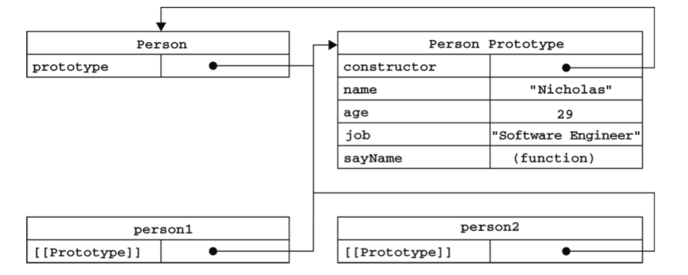

# 6.2 创建对象(2)-原型模式

## 6.2.3 原型模式

我们创建的每个函数都有一个 `prototype` （原型）属性，**这个属性是个指针，指向一个对象**，而这个对象（指的是被 `prototype` 指向的对象）的用途是包含可以由特定类型的所有实例共享的属性和方法。

按照字面意思理解，那么 `prototype` 就是通过调用构造函数而创建的那个对象实例的原型对象。**使用原型对象的好处是可以让所有对象实例共享它（对象原型）包含的属性和方法**。

换句话说，不必再构造函数中定义对象实例的信息，而是可以将这些信息直接添加到**原型对象**中，如下栗子：
```javascript
function Person() {
}

Person.prototype.name = "Nicholas";
Person.prototype.age = 29;
Person.prototype.job = "Software Engineer";
Person.prototype.sayName = function() {
    console.log(this.name);
};

var person1 = new Person(); 
person1.sayName();//"Nicholas"

var person2 = new Person();
person2.sayName();//"Nicholas"

console.log(person1.sayName === person2.sayName);//true
```
在此，我们将sayName()方法和所有属性直接添加到了Person的 `prototype` 属性中，构造函数变成了空函数。
即使如此，也仍然可以通过调用构造函数来创建新对象，而且新对象还具有相同的属性和方法。
但与构造函数模式不同的是，新对象的这些属性和方法都由所有实例共享的。换句话说，person1和person2访问的都是同一组属性和同一个sayName()函数。

---

## 一、理解原型对象

### 1. 认识`prototype`属性、`constructor`属性与`_proto_`属性

**无论什么时候，只要创建了一个新函数（function），就会根据一组特定的规则为该函数创建一个 `prototype` 属性，这个属性指向函数的原型对象**。(`prototype` 属性属于函数的)

- （下图中表示为：function Foo() 的 prototype 指向原型对象 Foo.prototype ）

**在默认情况下，所有原型对象都会自动获得一个 `constructor` (构造函数)属性**，这个属性是一个指针。它指向 `prototype` 属性所在函数。（`constructor` 属性属于原型对象的）

- 拿前面的例子来说，Person.prototype.constructor 指向Person构造函数。而通过Person构造函数，我们可以继续为原型对象添加其他属性和方法。

- 创建了自定义的构造函数之后，其原型对象默认只会取得 `constructor` 属性；至于其他方法，则都是从 `Object` 继承而来。

- （下图中表示为：原型对象的 constructor 指向 function Foo()）

**当调用构造函数创建一个新实例后，该实例的内部将包含一个指针(内部属性 `_proto_` )**，`_proto_` 指向构造函数的原型对象。（内部属性 `_proto_` 属于实例的）

- ES5中 `_proto_` 这个指针叫做 `[[Prototype]]` ，大部分浏览器中，每个对象都支持属性 `_proto_`。

- 要明确的真正重要的一点就是， `_proto_` 连接存在于实例与构造函数的原型对象之间，而不是存在于实例于构造函数之间。

- （下图中表示为：实例 `f1` 的 内部属性 `_proto_` 指向 构造函数的原型对象  `Foo.prototype`  ）


ps：在这`f1` 和 `f2` 分别是函数 `Foo()` 的实例；`Foo.prototype`  代表原型对象。

---
### 2. 对象之间的关系(举例说明)
用前面使用 Person 构造函数和 `Person.prototype` 创建实例的代码为例，展示各个对象之间的关系。



上图展示了Person构造函数、Person的原型属性以及Person现有的两个实例之间的关系。
- `Person.prototype` 指向了原型对象。

- `Person.prototype.constructor` 又指向构造函数Person。

- 原型对象中除了包含 `constructor` 属性之外，还包括后来添加的其他属性。

- Person的每个实例person1和person2都包含一个内部属性 `_proto_` (又名`[[Prototype]]`)，换句话说，实例与构造函数没有直接的关系。

- 注意，虽然两个实例都不包含属性和方法，但是我们可以调用person1.sayName()。这是通过查找对象属性的过程来实现的。

---
### 3. `isPrototypeOf()` 方法与`Object.getPrototypeOf()`方法
虽然在所有实现中都无法访问到 `_proto_` ,但可以通过 `isPrototypeOf()` 方法来确定对象之间是否存在某种关系。

本质上讲，如果实例中的 `_proto_` 属性指向那个调用 `isPrototypeOf()` 方法的对象（Person.prototype），那么这个方法就会返回`true`，如下：
```js
console.log(Person.prototype.isPrototypeOf(person1));   //true
console.log(Person.prototype.isPrototypeOf(person2));   //true
```
我们用原型对象的 `isPrototypeOf()` 方法测试了person1和person2。返回true表示两个实例的 `_proto_` 是指向原型对象 `Person.prototype` 的指针。


EC5中新增了一个新方法 `Object.getPrototypeOf()`，用来返回某个实例的原型对象。
```js
console.log(Object.getPrototypeOf(person1) == Person.prototype);   //true
console.log(Object.getPrototypeOf(person1).name); //
```
第二行代码取得原型对象中name属性的值，也就是"Nicholas"。

使用`Object.getPrototypeOf()`方法可以方便地取得一个对象的原型，而这在利用原型实现继承的情况是非常重要的。

----
### 4. 代码读取对象属性的过程（查找对象属性的过程）

每当代码读取某个对象的属性时，都会执行一次搜索，目标是具有给定名字的属性。
- 搜索首先从对象实例开始。
- 如果在实例中找到了具有给定名字的属性，则返回该属性的值。
- 如果没有找到，继续搜索指针指向的原型对象，在原型对象中查找具有给定名字的属性。
- 如果在原型对象中找到了这个属性，则返回该属性的值。

也就是说，我们在调用person1.sayName()的时候，会先后执行两次搜索。
首先，解析器会问：“实例 person1 有 sayName 属性吗？”——答：“没有。”然后，它继续搜索，再问：“person1的原型对象有sayName属性吗？——”答：“有。”于是，它就读取保存在原型对象中的函数。这就是**多个对象实例共享原型对象所保存的属性和方法的基本原理**。

**虽然可以通过对象实例访问保存在原型中的值，但不能通过对象实例重写原型中的值。**

- 如果我们在实例中添加了一个属性，而该属性与实例原型中的一个属性同名，那我们就在实例中创建该属性，该属性将会屏蔽原型对象中的那个属性。例子：
```js
function Person() {
}

Person.prototype.name = "Nicholas";
Person.prototype.age = 29;
Person.prototype.job = "Software Engineer";
Person.prototype.sayName = function() {
    console.log(this.name);
};

var person1 = new Person(); 
var person2 = new Person();

person1.name = "Greg";
console.log(person1.name);  //"Greg"——来自实例
console.log(person2.name);  //"Nicholas"——来自原型
```
在这个例子中，person1的name属性被新值给屏蔽了。但无论访问 `person1.name` 还是 `person2.name` 都能正常地返回值，即分别是 "Greg"——来自实例 和 "Nicholas"——来自原型。

当console.log()访问 `person1.name` 时，需要读取它的值，因此就会在这个实例上搜索一个名为name的属性。这个属性确实存在，于是就返回它的值而不必在搜索原型了。

当以同样的方式访问 `person2.name` 时，并没有在实例上发现该属性，因此会继续搜索原型，结果在哪里找到了name属性。

---

### 5. 对象实例添加属性

**当为对象实例添加一个属性时，这个属性会屏蔽原型对象中保存的同名属性；** 换句话说，添加对象实例的属性只会阻止我们访问原型对象中的那个同名属性，但不会修改原型对象中的同名属性。

即使将对象实例属性的值设置为 `null` ,也只会在实例中设置这个属性，而不会恢复其指向原型的链接。不过使用`delete`操作符则可以完全删除实例属性，从而让我们能够重新访问原型对象中的属性，如下所示：
```js
function Person() {
}

Person.prototype.name = "Nicholas";
Person.prototype.age = 29;
Person.prototype.job = "Software Engineer";
Person.prototype.sayName = function() {
    console.log(this.name);
};

var person1 = new Person(); 
var person2 = new Person();

person1.name = "Greg";
console.log(person1.name);  //"Greg"——来自实例
console.log(person2.name);  //"Nicholas"——来自原型

delete person1.name;
console.log(person1.name);   //"Nicholas"——来自原型
```

修改后的例子，我们使用了`delete`操作符删除了`person1.name`，之前它保存的“Greg”值屏蔽了同名的原型属性。把它删除以后，就恢复了对原型中name属性的连接。

---

### 6. `hasOwnProperty()`方法
使用`hasOwnProperty()`方法用于检查一个属性是存在实例中，还是存在原型中。只在给定属性存在于对象实例中时，才会返回true。
```js
function Person() {
}

Person.prototype.name = "Nicholas";
Person.prototype.age = 29;
Person.prototype.job = "Software Engineer";
Person.prototype.sayName = function() {
    console.log(this.name);
};

var person1 = new Person(); 
var person2 = new Person();

console.log(person1.hasOwnProperty("name"));    //false

person1.name = "Greg";
console.log(person1.name);  //"Greg"——来自实例
console.log(person1.hasOwnProperty("name"));    //true

console.log(person2.name);  //"Nicholas"——来自原型
console.log(person2.hasOwnProperty("name"));    //false

delete person1.name;
console.log(person1.name);  //"Nicholas"——来自原型
console.log(person1.hasOwnProperty("name"));    //false
```
通过使用`hasOwnProperty()`方法，什么时候访问的是实例属性，什么时候访问的是原型属性就一清二楚了。图示：


---
