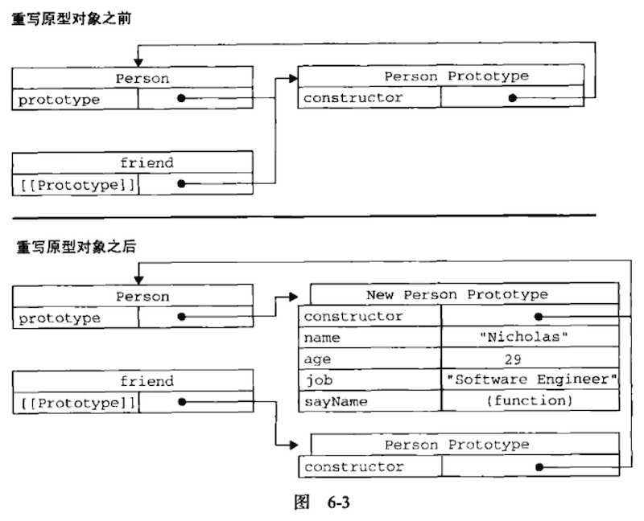

# 6.2 创建对象(3)——原型模式

### 2. 原型与`in`操作符

### 2.1 在单独使用`in`操作符

在单独使用时，`in`操作符会在通过对象能够访问给定属性时返回true，无论改属性存在于实例中还是原型中。

```js
function Person() {
}

Person.prototype.name = "Nicholas";
Person.prototype.age = "29";
Person.prototype.job = "Software Engineer";
Person.prototype.sayName = function() {
    console.log(this.name);
};

var person1 = new Person();
var person2 = new Person();

console.log(person1.hasOwnProperty("name"));
console.log("name" in person1); //true

person1.name = "Greg";
console.log(person1.name);  //Greg来自实例
console.log(person1.hasOwnProperty("name"));
console.log("name" in person1); //true

console.log(person2.name);  //Nicholas来自原型
console.log(person2.hasOwnProperty("name"));
console.log("name" in person2);

delete person1.name;
console.log(person1.name);  //Nicholas来自原型
console.log(person1.hasOwnProperty("name"));
console.log("name" in person1); //true （表示name属性在实例或原型中）
```

在以上代码执行的整个过程中，name属性要么直接在对象的实例上访问到，要么是通过原型访问到的。因此，调用"name" in person1始终都返回true，无论该属性存在于实例中还是存在于原型中。

**同时使用`hasOwnProperty()`方法和`in`操作符，就可以确定该属性到底存在要对象的实例中，还是存在于原型**中：
```js
function hasPrototypeProperty(Object, name) {
    return !object.hasOwnProperty(name) && (name in object);
}
```

由于`in`操作符只要通过对象就能够访问到属性就返回true，hasOwnProperty()只在属性存在于实例中时才返回true，因此只要`in`操作符返回true而hasOwnProperty()返回false（注意，前面加`!`，变true了），就可以确定属性是原型中的属性。

```js
function hasPrototypeProperty(object, name) {
    return !object.hasOwnProperty(name) && (name in object);
}

function Person() {
}

Person.prototype.name = "Nicholas";
Person.prototype.age = "29";
Person.prototype.job = "Software Engineer";
Person.prototype.sayName = function() {
    console.log(this.name);
};

var person = new Person();
console.log(hasPrototypeProperty(person, "name"));  //true，表示属性来自原型中

person.name = "Greg";
console.log(hasPrototypeProperty(person, "name"));  //false
```

在这里，name属性先是存在于原型中，因此hasPrototypeProperty()返回true。当在实例中从谢name属性后，该属性就存在于实例中，因此hasPrototypeProperty()返回false。即使原型中仍然有那么属性，但由于现在实例中也有了这个属性，因此原型中的name属性就用不到，因为优先在实例中寻找属性的。

### 2.2 使用`for-in`循环

在使用`for-in`循环时，返回的是所有能够通过对象访问，可枚举的属性，其中既包括存在于**实例中的属性**，也包括在于**原型中的属性**。

屏蔽了原型中不可枚举属性（就是将[[Enumerable]]特性标记为false的属性）的实例属性也会在`for-in`循环中返回，因为根据规定，所有开发人员定义的属性都是可枚举的。

```js
var o = {
    toString : function(){
        return "My Object" ;
    }
};

for(var prop in o) {
    if (prop === "toString") {
        console.log("Found toString");  //Found toString
    }
}
```

以上代码执行完，控制台会打印出结果，表示找到toString()方法。这里对象o定义了一个名为toString()的方法，该方法屏蔽了原型中(不可枚举)的toString()方法。
注意：在IE8及以前的版本是不会打印出值，因为有bug。


### 2.3 `Object.key()`方法——取得对象上所有可枚举的属性

要取得一个对象上所有可枚举的属性，可以使用ES5的`Object.key()`方法。这个方法接收一个对象作为参数，返回一个包含所有可枚举属性的数组。

```js
function Person() {
}

Person.prototype.name = "Nicholas";
Person.prototype.age = "29";
Person.prototype.job = "Software Engineer";
Person.prototype.sayName = function() {
    console.log(this.name);
};

//通过Person的原型调用Object.keys()，Object.keys()返回原型中的可枚举属性
var keys = Object.keys(Person.prototype);
console.log(keys);  //["name", "age", "job", "sayName"]
console.log(keys[1]);   //age


var p1 = new Person();
p1.name = "Rob";
p1.age = 31;
//通过Person的实例p1调用Object.keys()，Object.keys()返回实例中可枚举的属性
var p1keys = Object.keys(p1);
console.log(p1keys);
```

### 2.4 `Object.getOwnPropertyNames()`方法——获取所有对象属性(无论是否可枚举)

如果想要得到所有实例属性，无论它是否可枚举们可以使用`Object.getOwnPropertyNames()`方法。
注意：结果中包含了不可枚举的`constructor`属性。

```JS
var keys = Object.getOwnPropertyNames(Person.prototype);
console.log(keys);    //["constructor", "name", "age", "job", "sayName"]
```

`Object.key()`方法和`Object.getOwnPropertyNames()`方法可以用来替代`for-in`循环

---

### 3. 更简单的原型语法

前面例子中每添加一个属性和方法就要敲一遍Person.prototype。为了减少不必要的输入，也为了从视觉上更好地封装原型的功能，更常见的做法是用一个包含所有属性和方法的对象字面量来重写整个原型对象，如下：

```js
function Person() {}

Person.prototype = {    //此段重点
    name: "Nicholas",
    age: 29,
    job: "Software Engineer",
    sayName: function() {
        console.log(this.name);
    }
};
```

在上面的代码中，我们将Person.prototype设置为等于一个以对象字面量形式创建的新对象。最终结果相同，但有一个例外：`constructor`属性不再指向Person了。前面曾经介绍过，每创建一个函数，就会同时创建它的`prototype`对象，这个对象也会自动获得`constructor`属性。

而我们这里使用的语法，本质上完全重写了默认的prototype对象（原型对象），因此`constructor`属性也就变成新对象的`constructor`属性（指向Object构造函数），不再指向Person函数。此时，尽管`instanceof`操作符还能返回正确的结果，但通过`constructor`已经无法确定对象的类型了。
```js
function Person() {}

Person.prototype = {    
    name: "Nicholas",
    age: 29,
    job: "Software Engineer",
    sayName: function() {
        console.log(this.name);
    }
};

var friend = new Person();
console.log(friend instanceof Object);  //true
console.log(friend instanceof Person);  //true
console.log(friend.constructor === Person); //false
console.log(friend.constructor === Object); //true
```

在此，用instanceof操作符测试Object和Person仍然返回true，但constructor属性则等于Object构造函数(引用地址)而不等于Person构造函数(引用地址)。

如果constructor的值真的很重要，可以像下面这样特意将它设置回适当的值：
```js
function Person() {}

Person.prototype = {
    constructor: Person,    //此处重点
    name: "Nicholas",
    age: 29,
    job: "Software Engineer",
    sayName: function () {
        console.log(this.name)
    }
};

Object.defineProperty(Person.prototype, "constructor", {
    enumberable: false,
    value: Person
})
```
以上代码特意包含了一个constructor属性，并将它的值设置为Person，从而确保了通过该属性能够访问到适当的值。注意：这种方式重设constructor属性会导致它的[[Enumerable]]特性被设置为true。默认情况下，原生的constructor属性是不可枚举的。

---

### 4. 原型的动态性

由于原型中查找值的过程是一次搜索，因此我们对原型对象所做的任何修改都能够立即从实例中反映出来——即使是先创建了实例后修改原型也照样如此。例子：
```js
function Person() {}

Person.prototype = {
    constructor: Person,
    name: "Nicholas",
    age: 29,
    job: "Software Engineer",
    sayName: function () {
        console.log(this.name)
    }
};

//此处以下为先创建了实例后修改原型，实例依然能够调用后来新增的原型中的方法
var friend = new Person();
Person.prototype.sayHi = function() {
    console.log("hi");
}
friend.sayHi();
```
以上代码先创建了Person的一个实例，并将其保存在friend中。然后，下一条语句在Person.prototype对象（Person的原型对象）中添加了一个方法sayHi()。即使friend实例是在新增方法之前创建的，但它仍然可以访问这个方法。

原因归结为实例与原型之间的松散连接关系。当我们调用friend.sayHi()时，首先会在实例中搜索名为sayHi的属性，在没找到的情况下，会继续搜索原型对象中有没有这个属性。因为**实例与原型对象之间的连接只不过是一个指针，而非一个副本**，因此就可以在原型中找到新的sayHi属性并返回保存在那里的函数。

尽管可以随时为原型添加属性和方法，并且修改能够立即在所有对象实例中反应出来，但如果是**重写整个原型对象**，那么情况就不一样了。

因为调用构造函数时会为实例添加一个指向最初原型的`_proto_`指针，而把原型对象修改为另外一个对象就等于切断了构造函数与最初原型对象之间的联系。请记住：**实例中的指针`_proto_`仅指向原型，而不指向构造函数**。

例子：

```js
function Person() {
}

var friend = new Person();

//重写整个原型对象
Person.prototype = {
    constructor: Person,
    name: "Nicholas",
    age: 29,
    job: "Software Engineer",
    sayName: function () {
        console.log(this.name)
    }
};

friend.sayName();   //error 报错
```
在例子中，我们先创建了Person的一个实例，然后重写了其原型对象。然后在调用friend.sayName()时发生了错误，因为friend指向的是(旧)原型对象中不包含以sayName命名的属性。(P157)



**重写原型对象**切断了现有原型对象与任何之前已经存在的**对象实例**之间的联系；对象实例引用的仍然是最初的原型对象，而不是重写后的原型对象。

---

### 5. 原生对象的原型

原型模式的重要性不仅体现在创建自定义类型方面，就连所有原生的引用类型，都采用这种模式创建的。所有原生引用类型（Object、Array、String等）都在其构造函数的原型上定义了方法。

例如：在`Array.prototype`中可以找到`sort()`方法，在`String.prototype`中找到`substring()`方法。

通过原生对象的原型，不仅可以取得所有默认方法的引用，而且也可以定义新方法。可以像修改自定义对象的原型一样修改原生对象的原型，因此可以随时添加方法。

下面的代码就是给基本包装类型String添加一个名为startsWith()方法：
```js
String.prototype.startsWith = function(text) {
    return this.indexOf(text) === 0;
}

var msg = "Hello world";
console.log(msg.startsWith("Hello"));    //true
```

但是一般推荐修改原生对象的原型。因为会容易出问题。（P158）

---

### 6. 原型对象的问题

原型模式也不是没有缺点。首先，它省略了为构造函数传递初始化参数这一环节，结果所有实例在默认情况下豆浆取得相同的属性值。虽然这会某种程度上带来不便，但是这还不是原型对象的最大问题。

**原型对象的最大问题是由于原型对象共享的本性所导致的**。

原型对象中所有属性是被很多实例共享的，这种共享对于函数非常合适。对于这种包含基本数值类型值的属性到说得过去，然而，对于包含**引用类型值**（比如数组，函数等）的属性来说，问题就比较突出了。例子：
```js
function Person() {
}

Person.prototype = {
    constructor: Person,
    name: "Nicholas",
    age: 29,
    job: "Software Engineer",
    friends: ["Shelby", "Court"],   // 此处为重点
    sayName: function () {
        console.log(this.name)
    }
};

var person1 = new Person();
var person2 = new Person();

person1.friends.push("Van");    //这里相当给原型对象中friends属性数组中直接添加了值

console.log(person1.friends);  //  ["Shelby", "Court", "Van"]
console.log(person2.friends);  //  ["Shelby", "Court", "Van"]
console.log(person1.friends===person2.friends);
```

在此，Person.prototype对象有一个名为friends的属性，该属性包含一个字符串数组。然后创建了Person的两个实例。接着，修改了person1.friends**引用的数组**，向数组中添加了一个字符串。由于friends数组存在于Person.prototype而非person1中，所以刚刚提到的修改也会通过person2.friends(与person1.friends指向同一个对象(数组)反应出来。

假如我们的初衷是像这样在所有实例中共享一个数组，那这个结果就是我们需要的。但是实例一般都要有属于自己的全部属性的，而这个问题真是很少有人单独使用原型模式的原因。

**要结合构造函数模式和原型模式一起用**。

---


