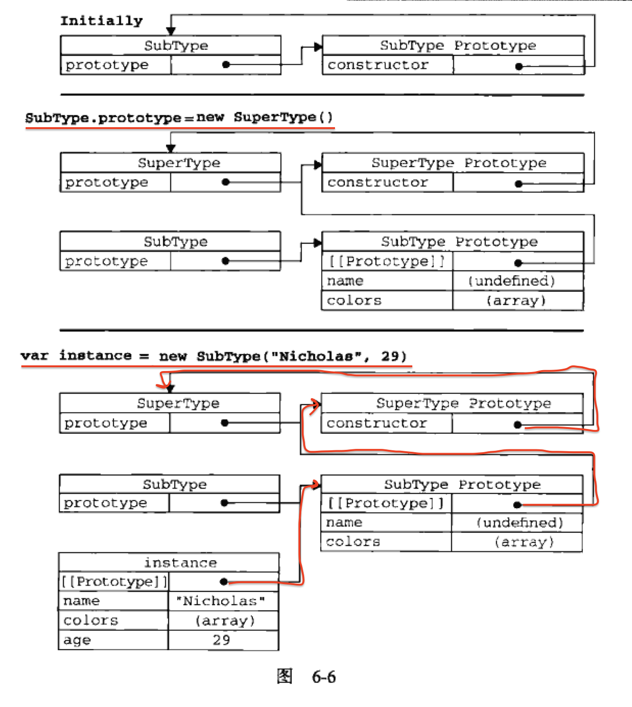

# 6.3 继承(3)——继承模式

## 6.3.4  原型式继承

**借助原型对象可以基于 已有的对象 创建 新对象**，同时还可以不必因此创建自定义类型。为了达到这个目的，如下函数：
```js
function object(o) {    //o参数表示为：已存在的对象
    function F() {}     //创建一个临时性的构造函数
    F.prototype = o;    //将传入的对象作为这个构造函数的原型对象
    return new F();     //返回了这个临时类型的一个新实例对象（new）
}
```

例子中原型式继承的过程：
- 在object()函数内部，先创建了一个临时性的构造函数
- 然后将传入的对象作为这个构造函数的原型对象
- 最后返回了这个临时类型的一个新实例对象。

**从本质上讲，object()对传入其中的对象执行一次浅复制。**

补充知识：浅复制（浅拷贝）和深复制（深拷贝）
- 浅复制：浅复制是复制引用，复制后的引用都是指向同一个实例对象，**彼此之间的操作会互相影响**。

- 深复制：深复制不是简单的复制引用，**而是在堆中重新分配内存**，并且把原对象实例的所有属性都进行新建复制，以保证深复制的对象的引用图不包含任何原有对象或对象图上的任何对象，复制后的对象与原来的对象是完全隔离的。

言归正传，原型式继承例子：
```js
function object(o) {    //原型式继承的标志
    function F() {}
    F.prototype = o;    //将对象o作为原型对象
    return new F();     //返回的新对象
}

var person = {
    name: "Nicholas",
    friends: ["Shelby", "Court", "Van"]
};

var anotherPerson = object(person);
anotherPerson.name = "Greg";
anotherPerson.friends.push("Rob");

var yetAnotherPerson = object(person);
yetAnotherPerson.name = "Linda";
yetAnotherPerson.friends.push("Barbie");

console.log(person.friends);    //["Shelby", "Court", "Van", "Rob", "Barbie"]
```

这种**原型式继承，要求你必须有一个对象可以作为另一个对象的基础**。如果有这么一个对象的话，可以把它传入给object()函数，然后再根据具体需求对得到的对象加以修改即可。

在这个例子中：
- 可以作为另一个对象基础的是person对象，于是我们把它传入object()函数中，然后该函数就会返回一个新对象。

- 这个对象（即object()函数返回的新对象）将person作为原型对象，所以它的原型对象中就包含了一个基本类型值属性（name）和一个引用类型值属性（friends数组）。这意味着person.friends不仅属于person所有，而且也会被anotherPerson以及yetAnotherPerson共享。

- 实际上，这就相当于又创建了person对象的两个副本。

ES5通过新增 `Object.create()` 方法规范了**原型式继承**。这个方法接收两个参数：
- 一个用作新对象原型的对象

- 一个为新对象定义额外属性的对象（可选）

在传入一个参数的情况下，`Object.create()` 与上面的**object()函数**的行为相同。
```js
var person = {
    name: "Nicholas",
    friends: ["Shelby", "Court", "Van"]
};

var anotherPerson = Object.create(person);  //重点处
anotherPerson.name = "Greg";
anotherPerson.friends.push("Rob");

var yetAnotherPerson = Object.create(person);   //重点处
yetAnotherPerson.name = "Linda";
yetAnotherPerson.friends.push("Barbie");

console.log(person.friends);  
```

`Object.create()` 方法的第二个参数与 `Object.defineProperties()` 方法的第二个参数格式相同：每个属性都是通过自己的描述符定义的。以这种方式指定的任何属性都会覆盖原型对象上的同名属性。例如：

```js
var person = {
    name: "Nicholas",
    friends: ["Shelby", "Court", "Van"]
};

var anotherPerson = Object.create(person, {
    name: {
        value: "Greg"
    }
});

console.log(anotherPerson.name);
```

在没有必要兴师动众地创建构造函数，而指向让一个对象与另一个对象保存类似的情况下，原型式继承是完全可以胜任的。不过别忘了，包含引用类型值的属性始终都会共享相应的值，就像使用原型模式一样。

---

## 6.3.5 寄生式继承

寄生式继承是与原型式继承紧密相关的一种思路，也是由原型式继承的提出者提出的。

**寄生式继承的思路**与寄生构造函数和工厂模式类似，**即创建一个仅用于封装继承过程的函数，该函数在内部以某种方式来增强对象，最后再像真的是它做了所有工作一样返回对象**。

以下代码示范了**寄生式继承模式**。
```js
function createAnother(original) {
    var clone = object(original);   //通过调用函数创建一个新对象
    clone.sayHi = function() {      //以某种方式来增强这个对象
        console.log("hi");
    };
    return clone;       // 返回这个对象
}
```

在这个例子中，createAnother()函数接收了一个参数，也就是将要作为新对象基础的对象。然后，把这个新对象(original)传递给`object()`函数，将返回的结果赋值给clone。再为clone对象添加一个新方法sayHi()，最后返回clone对象。

可以像下面这样来使用createAnother()函数：
```js
function object(o) {    //o参数表示为：已存在的对象
    function F() {}     //创建一个临时性的构造函数
    F.prototype = o;    //将传入的对象作为这个构造函数的原型对象
    return new F();     //返回了这个临时类型的一个新实例对象（new）
}

function createAnother(original) {
    var clone = object(original);   //通过调用函数创建一个新对象
    clone.sayHi = function() {  //以某种方式来增强这个对象 —— 就是新增独有的方法
        console.log("hi");
    };
    return clone;       // 返回这个对象
}

var person = {
    name: "Nicholas",
    friends: ["Shelby", "Court", "Van"]
};

var anotherPerson = createAnother(person);
anotherPerson.sayHi();      //hi
```
这个例子中的代码基于person返回了一个新对象——anotherPerson。

新对象（anotherPerson）不仅具有person的所有属性和方法，而且还有自己的sayHi()方法。

在主要考虑对象而不是自定义类型和构造函数的情况下，寄生式继承也是一种有用的模式。前面示范继承模式时使用的object()函数不是必须的；任何能够返回新对象的函数都适用于此模式。

> 使用寄生式继承来为对象添加函数，会由于不能做到函数服用而降低效率；这一点与构造函数模式类似。

---

## 6.3.6 **寄生组合式继承**（最优继承范式）

### 1. 组合式继承回顾

组合继承是Javascript最常用的继承模式；不过，它也存在不足的地方。

组合继承最大的问题是无论什么情况下，都会调用两次超类型构造函数：
- 第一次是在创建子类型原型对象的时候

- 另外一次是子类型构造函数内部

子类型最终会包含超类型对象的全部实例对象属性，但我们不得不在调用子类型构造函数时重写这些属性。

再来复习一下组合继承（原型链+借用构造函数）的例子：
```js
function SuperType(name) {
    this.name = name;
    this.colors = ["red", "blue", "green"];
}

SuperType.prototype.sayName = function() {
    console.log(this.name);
}

function SubType(name, age) {
    SuperType.call(this, name);     //第二次调用SuperType() ——（借用构造函数标志）

    this.age = age;
}

SubType.prototype = new SuperType();    //第一次调用SuperType() ——（原型链标志）
SubType.prototype.constructor =  SubType;
SubType.prototype.sayAge = function() {
    console.log(this.age);
};
```

加注释的两行调用SuperType构造函数的代码。
- 在第一次调用SuperType构造函数时，SubType.prototype会得到两个属性：name和colors；这两个属性都是SuperType的实例对象的属性，只不过现在位于SubType的原型对象中。

- 当调用SubType()构造函数时（比如如：`var instance = new SubType("Nicholas", 29);`），又会调用一次它里面的SuperType()构造函数，这一次又在新SubType实例对象上创建了实例属性name和colors。于是，这两属性就屏蔽了原型对象中的两个同名属性。如下图所展示了上述过程：


如图6-6所示，有两组name和colors属性：一组在实例对象上，一组在SubType原型对象中。这就是调用量词SuperType构造函数的结果。好在我们可以通过寄生组合式继承来解决这个问题

### 2. 寄生组合式继承（本节要点）

所谓寄生组合式继承，**即通过借用构造函数来继承属性，通过原型链的混成形式来继承方法**。

其背后的基本思路是：不必为了指定子类型的原型而调用超类型的构造函数，我们需要的无非是超类型原型对象的一个副本而已。

本质上，就是使用寄生式继承来继承超类型的原型对象，然后再将结果指定给子类型的原型对象。

寄生组合式继承的基本模式如下：
```js
function object(o) {    //o参数表示为：已存在的对象
    function F() {}     //创建一个临时性的构造函数
    F.prototype = o;    //将传入的对象作为这个构造函数的原型对象
    return new F();     //返回了这个临时类型的一个新实例对象（new）
}

//寄生组合式继承的基本模式
function inheritPrototype(subType, superType) {
    var prototype = object(superType.prototype);    //创建对象
    prototype.constructor = subType;                //增强对象
    subType.prototype = prototype;                  //指定对象
}
```
这个示例中的`inheritPrototype()`函数实现了寄生组合式继承的最简单形式。这个函数接收两个参数：子类型构造函数和超类型构造函数。在函数内部：
- 第一步是创建超类型原型对象的一个副本。

- 第二部是为创建的副本添加`constructor`属性，从而弥补应重写原型而失去的默认的`constructor`属性。

- 最后一步，将新创建的对象（即副本）赋值给子类型的原型对象。

这样，我们就可以调用`inheritPrototype()`函数的语句，去替换掉前面例子中为子类型原型对象赋值的语句（即`SubType.prototype = new SuperType();`）。例如：
```js
function object(o) {    //o参数表示为：已存在的对象
    function F() {}     //创建一个临时性的构造函数
    F.prototype = o;    //将传入的对象作为这个构造函数的原型对象
    return new F();     //返回了这个临时类型的一个新实例对象（new）
}

//寄生组合式继承的基本模式
function inheritPrototype(subType, superType) {
    var prototype = object(superType.prototype);    //创建对象
    prototype.constructor = subType;                //增强对象
    subType.prototype = prototype;                  //指定对象
}
//------------------------------------------
function SuperType(name) {
    this.name = name;
    this.colors = ["red", "blue", "green"];
}

SuperType.prototype.sayName = function() {
    console.log(this.name);
};

function SubType(name, age) {
    SuperType.call(this, name);
    this.age = age;
}

inheritPrototype(SubType, SuperType);   //此处为重点，替换掉了为子类型原型对象赋值的语句，（ 即 SubType.prototype = new SuperType(); ）

SubType.prototype.sayAge = function() {
    console.log(this.age);
};

//测试：
var st = new SubType("hb", 18);    //别漏了new，构造函数新建对象必备
st.sayName();
```

这个例子的高效率体现在：
- 整个过程中，只调用了一次SuperType构造函数，并且因此避免了在SubType.prototype上面创建不必要的、多余的属性。
- 与此同时，原型链还能够保存不变；因此们还能正常使用`instanceof`和`isPrototypeOf()`。
- 开发人员普遍认为寄生组合式继承是引用类型最理想的继承范式。

----


