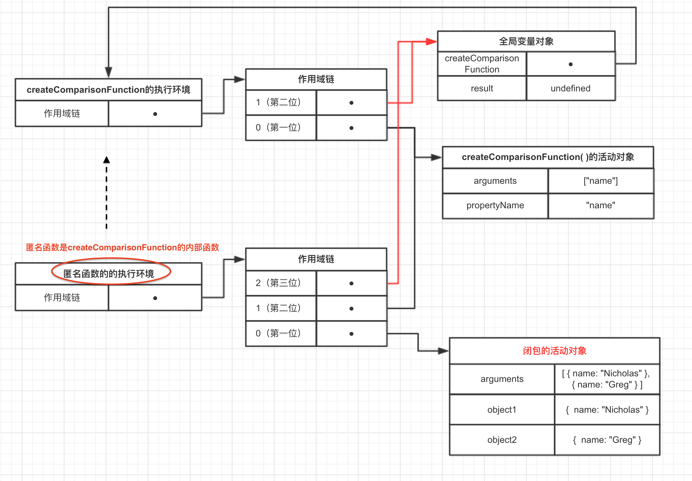

# 7.2 闭包(1)

**闭包是指有权访问另一个函数作用域中的变量的函数。创建闭包的常见方式，就是在一个函数内部创建另一个函数**。

用createCompareFunction()函数为例，注意注释的代码。

```js
//这样就是闭包！
function createComparisonFunction(propertyName) {
    
    return function(object1, object2) {
        var value1 = object1[propertyName];     //此处为重点
        var value2 = object2[propertyName];     //此处为重点

        if (value1 < value2) {
            return -1;
        } else if (value1 > value2) {
            return 1;
        } else {
            return 0
        }
    };
}
```

这个例子中，注释为重点处的两行代码是内部函数(一个匿名函数)中的代码，这两行代码访问了外部函数中的变量propertyName。
- 即使这个内部函数被返回了，而且在其他地方被调用了，但它依然可以访问变量propertyName。

- 之所以还能够访问这个变量，因为内部函数的作用域链中包含createCompareFunction()的作用域。

---

要彻底搞清楚其中的细节，必须从理解函数被调用的时候都会发生什么开始入手。（第4章内容！）

第4章介绍了作用域链的概念。而有关如何创建作用域链以及作用域链有什么作用的细节，对彻底理解闭包至关重要。
- 当某个函数被调用时，会创建一个执行环境(Execution Context)及相应的作用域链。

- 然后，使用arguments和其他命名参数的值来初始化函数的活动对象(activation object)。

- 但在作用域链中，外部函数的活动对象始终处于第二位，外部函数的外部函数的活动对象处于第三位，......直至作为作用域链终点的全局执行环境。(换言之，内部函数的活动对象处于第一位)

在函数执行过程中，为读取和写入变量的值，就需要在作用域中查找变量。

举个栗子：
```js
function compare(value1, value2) {
    if(value1 < value2) {
        return -1;
    } else if (value1 > value2) {
        return 1;
    } else {
        return 0;
    }
}

var result = compare(5, 10);
```

以上代码先定义了compare()函数，然后又在全局作用域中调用了它。当调用compare()时（执行compare()里面的代码时），会创建一个包含arguments、value1和value2的活动对象。全局执行环境的变量对象(包含result和compare)在compare()执行环境的作用域链中则处理第二位。


后台的每个执行环境中都有一个表示变量的对象——**变量对象**。
- 全局环境的变量对象始终存在，而像compare()函数这样的局部环境的变量对象，只有在函数执行的过程中存在。

- 在创建compare()函数时，会创建一个预先包含全局变量对象的作用域链，这个作用域链被保存在内部的[[Scope]]属性中。

- 当调用compare()函数时，会为函数创建一个执行环境，然后通过复制函数的[[Scope]]属性中的对象构建起执行环境的作用域链。

- 此后，又有一个活动对象(在此作为变量对象使用)被创建并被推入执行环境作用域链的前端。

对于这个例子中compare()函数的执行环境而言，其作用域链中包含两个变量对象；本地活动对象(即当前被调用函数的变量对象)和全局变量对象。

### **作用域链本质上是一个指向变量对象的指针列表，它只引用但不实际包含变量对象**。

**无论什么时候在函数中访问一个变量时，就会从作用域中搜索具有相应名字的变量**。

一般来讲，当函数执行完毕后，局部活动对象就会被销毁，内存中仅保存全局作用域（全局执行环境的变量对象）。**但是，闭包的情况又有所不同。**

在另一个函数内部定义的函数将会包含函数(即外部函数)的活动对象添加到它（它是指在函数内部定义的函数）的作用域链中。因此，在createComparisoFunction()函数内部定义的匿名函数的作用域中，实际上将会包含外部函数createComparisoFunction()的活动对象（变量对象）。

下图展示了下列代码执行时，包含函数与内部匿名函数的作用域链。
```js
function createComparisonFunction(propertyName) {
    return function(object1, object2) { //内部匿名函数，这个就是闭包
        var value1 = object1[propertyName];     //此处为重点
        var value2 = object2[propertyName];     //此处为重点

        if (value1 < value2) {
            return -1;
        } else if (value1 > value2) {
            return 1;
        } else {
            return 0
        }
    };
}

var compare = createComparisonFunction("name");
var result = compare({name: "Nicholas"}, {name: "Greg"});
```

在匿名函数从createComparisonFunction()中被返回后，它（匿名函数）的作用域链被初始化为包含createComparisonFunction()函数的活动对象和全局变量对象。（值得思考）

这样，匿名函数就可以访问在createComparisonFunction()定义的所有变量。

更重要的是，createComparisonFunction()函数执行完毕后，它的活动对象也不会被销毁，因为匿名函数的作用域链仍然引用这个活动对象。换句话说，当createComparisonFunction()函数返回后，其执行环境的作用域链会被销毁，但它的活动对象仍然会留在内存中；直到匿名函数被销毁后，createComparisonFunction()的活动对象才会被销毁，例如：

```js
//接着最开头的函数
//创建函数
var compareNames = createComparisonFunction("name");

//调用函数
var result = compareNames({name: "Nicholas"}, {name: "Greg"});

//解除对匿名函数的引用(以便释放内存)
compareNames = null;
```

首先，创建的比较函数保存在变量compareNames中。而通过将compareNames设置为等于null解除该函数的引用，就等于通知垃圾回收来将其清除。随着匿名函数的作用域链被销毁，其他作用域(除了全局作用域)也都可以安全地销毁了。下图展示了调用compareNames()的过程中产生的作用域链之间的关系。



> 由于闭包会携带包含它的函数的作用域(就是自身的作用域)，因此会比其他函数占用更多的内存。过度使用闭包可能会导致内存占用过多，建议只在绝对必要是在考虑使用闭包，总之要慎重使用闭包。


