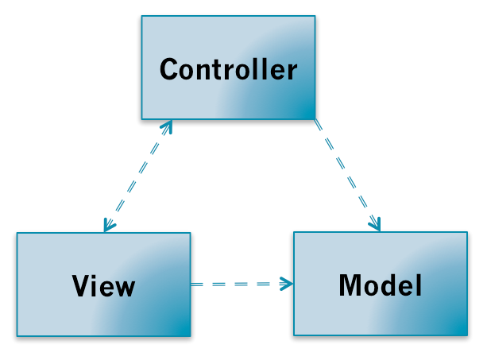
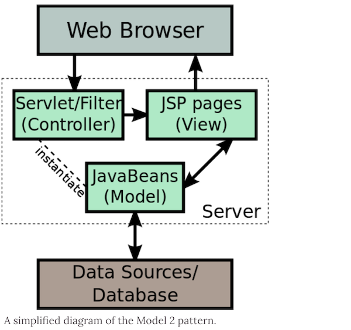
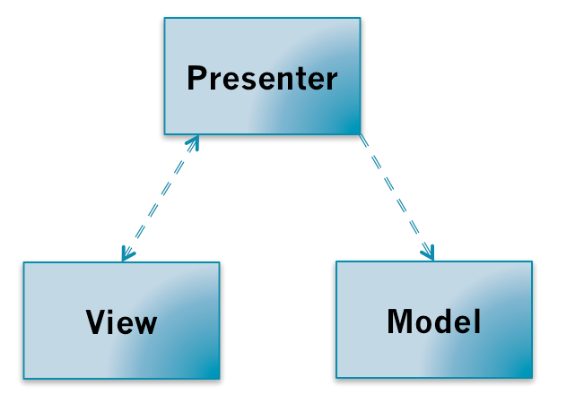
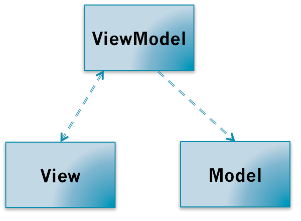
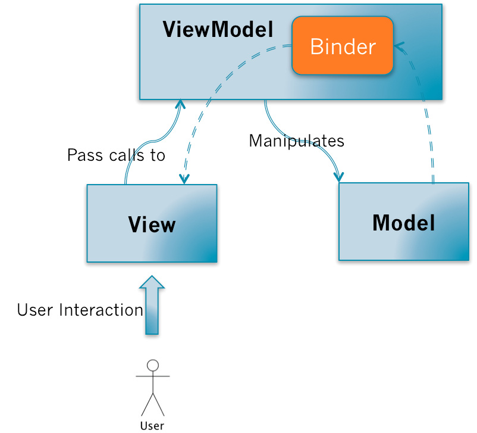

# MV* 模式是什么

## GUI程序所面临的问题

图形界面的应用程序提供给用户可视化的操作界面，这个界面提供给数据和信息。

用户输入行为（键盘，鼠标等）会执行一些应用逻辑，应用逻辑（application logic）可能会触发一定的业务逻辑（business logic）对应用程序数据的变更，数据的变更自然需要用户界面的同步变更以提供最准确的信息。例如用户对一个电子表格重新排序的操作，应用程序需要响应用户操作，对数据进行排序，然后需要同步到界面上。

在开发应用程序的时候，以求更好的管理应用程序的复杂性，基于**职责分离**的思想都会对应用程序进行分层。

- 在开发图形界面应用程序的时候，会把管理用户界面的层次称为 `View`。

- 应用程序的数据为 `Model`。

>（注意这里的 Model 指的是Domain Model，这个应用程序对需要解决的问题的数据抽象，不包含应用的状态，可以简单理解为对象）。Model提供数据操作的接口，执行相应的业务逻辑。

有了View和Model的分层，那么问题就来了：View如何同步Model的变更，View和Model之间如何粘合在一起。

带着这个问题开始探索MV模式，会发现这些模式之间的差异可以归纳为对这个问题处理的方式的不同。

---

## MVC 模式

MVC出了把应用程序分成`View`、`Model`层，还额外的加了一个`Controller`层。

- `Controller`的职责为进行Model和View之间的协作（路由、输入预处理等）的应用逻辑（application logic）；

  - Controller并不执行业务逻辑，它只负责简单的参数验证和指定哪个Model进行业务逻辑的执行，Model则执行相应的业务逻辑

- `Model`进行处理业务逻辑。

- Model、View、Controller三个层次的依赖关系如下：

- Controller和View都依赖Model层，Controller和View可以互相依赖。

### MVC的调用关系

1. 用户的对View操作以后，View捕获到这个操作，会把处理的权利交移给Controller（Pass calls）；

1. Controller会对来自View数据进行预处理、决定调用哪个Model的接口；

1. 然后由Model执行相关的业务逻辑；**当Model变更了以后，会通过观察者模式（Observer Pattern）通知View**；

1. View通过观察者模式收到Model变更的消息以后，会向Model请求最新的数据，然后重新更新界面。如下图：

几个需要特别关注的关键点：

1. View是把控制权交移给Controller，Controller执行应用程序相关的应用逻辑（对来自View数据进行预处理、决定调用哪个Model的接口等等）。

1. Controller操作Model，Model执行业务逻辑对数据进行处理。但不会直接操作View，可以说它是对View无知的。

1. View和Model的同步消息是通过观察者模式进行，而同步操作是由View自己请求Model的数据然后对视图进行更新。

需要特别注意的是MVC模式的精髓在于第三点：

- Model的更新是通过**观察者模式**告知View的，具体表现形式可以是Pub/Sub或者是触发Events。

### MVC的优缺点

优点：

1. 把业务逻辑和展示逻辑分离，模块化程度高。且当应用逻辑需要变更的时候，不需要变更业务逻辑和展示逻辑，只需要Controller换成另外一个Controller就行了（Swappable Controller）。

1. 观察者模式可以做到多视图同时更新。

缺点：

1. Controller测试困难。因为视图同步操作是由View自己执行，而View只能在有UI的环境下运行。在没有UI环境下对Controller进行单元测试的时候，应用逻辑正确性是无法验证的：Model更新的时候，无法对View的更新操作进行断言。

1. View无法组件化。View是强依赖特定的Model的，如果需要把这个View抽出来作为一个另外一个应用程序可复用的组件就困难了。因为不同程序的的Domain Model是不一样的

---

## MVC Model 2

在Web服务端开发的时候也会接触到MVC模式，而这种MVC模式不能严格称为MVC模式。

经典的MVC模式只是解决客户端图形界面应用程序的问题，而对服务端无效。

服务端的MVC模式又自己特定的名字：MVC Model 2，或者叫JSP Model 2，或者直接就是Model 2 。Model 2客户端服务端的交互模式如下：

服务端接收到来自客户端的请求，服务端通过路由规则把这个请求交由给特定的Controller进行处理，Controller执行相应的应用逻辑，对Model进行操作，Model执行业务逻辑以后；然后用数据去渲染特定的模版，返回给客户端。

因为HTTP协议是单工协议并且是无状态的，服务器无法直接给客户端推送数据。除非客户端再次发起请求，否则服务器端的Model的变更就无法告知客户端。所以可以看到经典的Smalltalk-80 MVC中Model通过观察者模式告知View更新这一环被无情地打破，不能称为严格的MVC。

后来这种模式几乎被应用在所有语言的Web开发框架当中。PHP的ThinkPHP，Python的Dijango、Flask，NodeJS的Express，Ruby的RoR，基本都采纳了这种模式。平常所讲的MVC基本是这种服务端的MVC。

---

## MVP 模式

MVP模式有两种：

1. Passive View
1. Supervising Controller

而大多数情况下讨论的都是Passive View模式。本文会对PV模式进行较为详细的介绍，而SC模式则简单提及。

### MVP（Passive View）的依赖关系

MVP模式把MVC模式中的Controller换成了Presenter。MVP层次之间的依赖关系如下：

MVP打破了View原来对于Model的依赖，其余的依赖关系和MVC模式一致。

### MVP（Passive View）的调用关系

MVP模式把MVC模式中的`Controller`换成了`Presenter`。MVP层次之间的依赖关系如下：

MVP关系：

- 用户对View的操作都会从View交移给Presenter。

- Presenter会执行相应的应用程序逻辑，并且对Model进行相应的操作；

- 而这时候Model执行完业务逻辑以后，也是通过观察者模式把自己变更的消息传递出去，但是是传给Presenter而不是View。

- Presenter获取到Model变更的消息以后，**通过View提供的接口更新界面**。

**关键点**：

1. View不再负责同步的逻辑，而是由Presenter负责。Presenter中既有应用程序逻辑也有同步逻辑。

1. View需要提供操作界面的接口给Presenter进行调用。（关键）

对比在MVC中，Controller是不能操作View的，View也没有提供相应的接口；

而在MVP当中，Presenter可以操作View，View需要提供一组对界面操作的接口给Presenter进行调用；Model仍然通过事件广播自己的变更，但由Presenter监听而不是View。

### MVP（Passive View）的优缺点

优点：

1. 便于测试。Presenter对View是通过接口进行，在对Presenter进行不依赖UI环境的单元测试的时候。可以通过Mock一个View对象，这个对象只需要实现了View的接口即可。然后依赖注入到Presenter中，单元测试的时候就可以完整的测试Presenter应用逻辑的正确性。

1. View可以进行组件化。在MVP当中，View不依赖Model。这样就可以让View从特定的业务场景中脱离出来，可以说View可以做到对业务完全无知。它只需要提供一系列接口提供给上层操作。这样就可以做到高度可复用的View组件。

缺点：

1. Presenter中除了应用逻辑以外，还有大量的View->Model，Model->View的手动同步逻辑，造成Presenter比较笨重，维护起来会比较困难。

---

## MVVM 模式

MVVM可以看作是一种特殊的MVP（Passive View）模式，或者说是对MVP模式的一种改良。

### ViewModel

MVVM代表的是Model-View-ViewModel，这里需要解释一下什么是ViewModel。

ViewModel的含义就是 "Model of View"，视图的模型。它的含义包含了领域模型（Domain Model）和视图的状态（State）。

在图形界面应用程序当中，界面所提供的信息可能不仅仅包含应用程序的领域模型。还可能包含一些领域模型不包含的视图状态，例如电子表格程序上需要显示当前排序的状态是顺序的还是逆序的，而这是Domain Model所不包含的，但也是需要显示的信息。？？？

可以简单把ViewModel理解为页面上所显示内容的数据抽象，和Domain Model不一样，ViewModel更适合用来描述View。

### MVVM的依赖

MVVM的依赖关系和MVP依赖，只不过是把P换成了VM。

### MVVM的调用关系

MVVM的调用关系和MVP一样。

但是，在ViewModel当中会有一个叫`Binder`，或者是Data-binding engine的东西。

以前全部由Presenter负责的View和Model之间数据同步操作交由给Binder处理。你只需要在View的模版语法当中，指令式地声明View上的显示的内容是和Model的哪一块数据绑定的。

当ViewModel对进行Model更新的时候，Binder会自动把数据更新到View上去，当用户对View进行操作（例如表单输入），Binder也会自动把数据更新到Model上去。这种方式称为：Two-way data-binding，**双向数据绑定**。

可以简单而不恰当地理解为一个模版引擎，但是会根据数据变更实时渲染。

### MVVM的优缺点

优点：

1. 提高可维护性。解决了MVP大量的手动View和Model同步的问题，提供双向绑定机制。提高了代码的可维护性。

1. 简化测试。因为同步逻辑是交由Binder做的，View跟着Model同时变更，所以只需要保证Model的正确性，View就正确。大大减少了对View同步更新的测试。

缺点：

1. 过于简单的图形界面不适用，或说牛刀杀鸡。
1. 对于大型的图形应用程序，视图状态较多，ViewModel的构建和维护的成本都会比较高。
1. 数据绑定的声明是指令式地写在View的模版当中的，这些内容是没办法去打断点debug的。

参考：[界面之下：还原真实的MV*模式](https://github.com/livoras/blog/issues/11)

