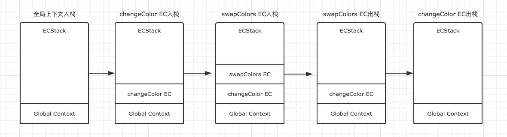

# **this 全面解析**

说明：this和作用域这东西是两个互相独立开来的不同体系。所以，this对象绑定和作用域查询是不一样的工作原理，是不一样的。this绑定对象是根据调用位置（要知道调用栈），而作用域查询是根据作用域链。

# 2.1 调用位置

在理解this的绑定过程之前，首先要理解调用位置：调用位置就是函数在代码中被调用的位置（而不是声明的位置）。

寻找调用位置就是寻找“函数被调用的位置”，但做起来并没有这么简单，因为模型编程模式可能会隐藏真正的调用位置。

最重要的是要分析**调用栈**（调用栈表示：为了到达目前执行位置所调用的**所有函数**）。我们关心的调用位置就是在当前正在执行的函数的前一个调用栈中。

下面我们来看到底什么是调用栈和调用位置：
```js
function baz() {
    // 当前调用栈是：baz
    // 因此，当前调用位置是全局作用域（因为全局作用域是baz的上一个调用栈）
    console.log("baz");
    bar();  //<-- bar 的调用位置
}

function bar() {
    // 当前调用栈 baz -> bar
    //当前调用位置在baz中
    console.log("bar");
    foo();  //<--foo的调用位置
}

function foo() {
    // 当前调用栈是 baz -> bar -> foo
    // 因此，当前调用位置在 bar 中
    console.log("foo");
}

baz();  //<-- baz 的调用位置
```
模拟图


注意我们是如何（从调用栈中）分析出真正的调用位置的，因为它决定this的绑定。


# 2.2 绑定规则

让我们看看函数执行的过程中**调用位置**如何决定this的绑定对象。

你必须找到**调用位置**，然后判断需要应用下面**四条规则**中的哪一条。然后再解释他们的优先级。

## **2.2.1 默认绑定**
首先解释的是最常用的函数调用类型：**独立函数调用**。可以把这条规则看作是无法应用其他规则时的默认规则。

思考下面代码：
```js
function foo() {
    console.log(this.a);
}
var a = 2;
foo();
```
当调用foo()时，this.a被解析成了全局变量a。为什么？因为在本例中，函数调用时应用了this的默认绑定，因此this指向全局对象。

因为foo()的调用位置是全局对象中，因此只能使用默认绑定。

如果使用严格模式，name全局对象将无法使用默认绑定，因此this会绑定undefined。
```js
function foo() {
    "use strict";
    console.log(this.a);
}
var a = 2;
foo();  
```

## **2.2.2 隐式绑定**

另外一条需要考虑的规则是调用位置是否有执行上下文对象，或者说是否被摸个对象拥有或包含，不过这种说法可能造成一些误导。

直白些，隐式绑定时，我们必须在一个对象内部包含一个指向函数的属性，并通过这个属性间接引用函数，从而把this间接（隐式）绑定到这个对象上。

举例：
```js
function foo() {
    console.log(this.a);
}
var obj = {
    a: 2,
    foo: foo
}
obj.foo();
```
首先需要注意的是foo()的声明方式，及其之后是如何被当作引用属性添加到obj中的。

但无论直接在obj中定义还是先定义再添加为引用属性，这个函数严格来说都不属于obj对象。

当函数引用有上下文对象时，隐式绑定规则会把函数调用中的this绑定到这个上下文对象（就是对象）。因为调用foo()时this被绑定到obj，因此this.a就是obj.a。

### **隐式丢失**
隐式丢失是指被隐式绑定的函数丢失绑定对象，因此 `this` 会应用默认绑定规则，从而把this绑定到全局对象或者undefined上，具体是哪个则取决于是否是严格模式。

思考下面代码：
```js
function foo() {
    console.log(this.a);
}

var obj = {
    a: 2,
    foo: foo
}

var bar = obj.foo;  //函数别名

var a = "oops,global"; 

bar();  //"oops, global"  bar()实际就是foo()
```

如果把函数传入内置函数而不是传入自己声明的函数，结果是一样的
```js
function foo() {
    console.log(this.a);
}

var obj = {
    a: 2,
    foo: foo
}

var bar = obj.foo; 

setTimeout(obj.foo, 100);
```
JS环境中内置的setTimeout()函数实现和下面的**伪代码**类似：
```js
function setTimeout(fn, delay) {
    //等待delay毫秒
    fn();   //<--调用位置！
}
```

因此**回调函数丢失this绑定**是非常常见的(丢失以后会绑定全局对象，非严格模式下)。


## **2.2.3 显示绑定（call与apply）**

在分析隐式绑定时，我们必须在一个对象内部包含一个指向函数的属性，并通过这个属性间接引用函数，从而把this间接（隐式）绑定到这个对象上。

我们不想在对象内部包含函数引用，而项在某个对象上强制调用函数，该怎么做呢?

JS中所有函数都包含`call()`和`apply()`方法，它们的第一个参数是一个对象，它们会把这个对象绑定到this上，接着调用函数时指定这个this。因为可以直接指定this的绑定对象，因此我们称之为显式绑定。

思考下面代码：
```js
function foo() {
    console.log(this.a)
}
var obj = {
    a: 2
}
foo.call(obj);  //2
```

如果你传入了一个原始值(字符串类型、布尔类型或数字类型)来当this的绑定对象，这个原始值会被转换为它的对象形式（也就是 new String()、new Boolean()、new Number())。这通常被称为”装箱“。

可惜，显式绑定仍然无法解决我们之前提出的**丢失绑定问题**。

### **1. 硬绑定**

但是显式绑定的一个变种可以解决这个问题。

思考下面代码：
```js
function foo() {
    console.log(this.a);
}
var obj = {
    a: 2
};

var bar = function() {
    foo.call(obj);  //关键
};

var a = 4;

bar();  //2
setTimeout(bar, 100);
//硬绑定的bar不可能再修改它的this
bar.call(window);
```
这种绑定是一种显式的强制绑定，我们称之为”硬绑定“。

步骤：
- 利用函数表达式的方式声明函数bar()

- 并在bar()的内部手动调用了foo.call(obj)，因此强制把foo的this绑定到了obj。

- 无论之后如何调用函数bar，它总会手动在obj对象上调用foo。


### **硬绑定的应用场景**：（2种）

### 1. 创建一个包裹函数，传入所有参数并返回接收到的所有值：
```js
function foo(something) {
    console.log(this.a, something);
    return this.a + something;
}

var obj = {
    a: 2
};

var bar = function() {
    return foo.apply(obj, arguments);
}

bar b = bar(3); //2 3
console.log(b); //5
```

### 2. 创建一个可以重复使用的辅助绑定函数：

**简单的辅助绑定函数**
```js
function bind(fn, obj) {
    return function() {
        return fn.apply(obj, arguments);    //call也行
    };
}
```

**辅助绑定函数要点**：

- 有外部具名函数和内部匿名函数（即硬绑定）
- 外部具名函数接收两个参数，分别是函数(fn)和对象(object)
- 外部具名函数要返回内部匿名函数
- 内部匿名函数要返回显式绑定

例子：
```js
function foo(something) {
    console.log(this.a, something);
    return this.a + something;
}

//简单的辅助绑定函数
function bind(fn, obj) {
    return function() {
        return fn.apply(obj, arguments);
    };
}

var obj = {
    a: 2
};

var bar = bind(foo, obj);

var b = bar(3);
console.log(b);
```


ES5中的Function.prototype.bind方法功能和辅助绑定函数差不多。但是比辅助绑定函数更为复杂。
```js
function bind(fn, obj) {
    return function() {
        return fn.apply(obj, arguments);    //call也行
    };
}
var bar = bind(foo, obj);
```
Function.prototype.bind：
```js
var bar = foo.bind(obj);
```


由于硬绑定是一种非常常用的模式，所以ES5提供了内置的方法Function.prototype.bind，它的用法如下：
```js
function foo(something) {
    console.log(this.a, something);
    return this.a + something;
}

var obj = {
    a: 2
};

var bar = foo.bind(obj);

var b = bar(3);

console.log(b);
```
bind()会返回一个硬编码的新函数，它会把参数设置为this的上下文并调用原始函数。

### **2. API调用的”上下文“**

第三方库的许多函数，以及JS语言和宿主韩静中许多新的内置函数，都提供了一个可选的参数，通常被称为”上下文“，其作用和bind()一样，确保你的回调函数使用指定的this。

## **2.2.4 new 绑定**

这是第四条也是最后一条this的绑定规则。在讲解这条规则之前，先要搞清楚关于JS中函数和对象的误解。

### **构造函数为何物**

在JS中，构造函数知识一些使用new操作符是被调用的函数。实际上构造函数甚至都说不上是一种特殊的函数类型。**构造函数只是被new操作符调用的普通函数而已**。

举个栗子说，思考一下Number()作为构造函数时的行为：

当Number在 new 表达式中被调用时，它是一个构造函数：它会初始化新创建的对象。

包括内置对象函数在内的所有函数都可以用`new`来调用，这种函数被称为构造函数调用。

一个重要但是非常细微的区别：**实际上并不存在所谓的“构造函数”，只有对函数的“构造调用”**。（把`new`当**构造**的意思，这样通过**new调用**函数，就可以理解为**构造调用**函数）

使用 new 来调用函数，或着说发生构造函数调用时，会自动执行下面的操作：
1. 创建（或者说构建）一个全新的对象
2. 这个对象会被执行[[prototype]]的连接
3. 这个对象会绑定到函数调用的this
4. 如果函数没有返回其他对象，那么 new 表达式中的函数调用会自动返回这个新对象

思考下面代码：
```js
function foo(a) {
    this.a = a;
}
var bar = new foo(2);
console.log(bar.a); //2
```
使用new来调用foo()时，我们会构造一个新对象并把它绑定到foo()调用中的this上。new是最有一种可以影响函数调用时this绑定行为的方法，我们称之为 new 绑定。

---


