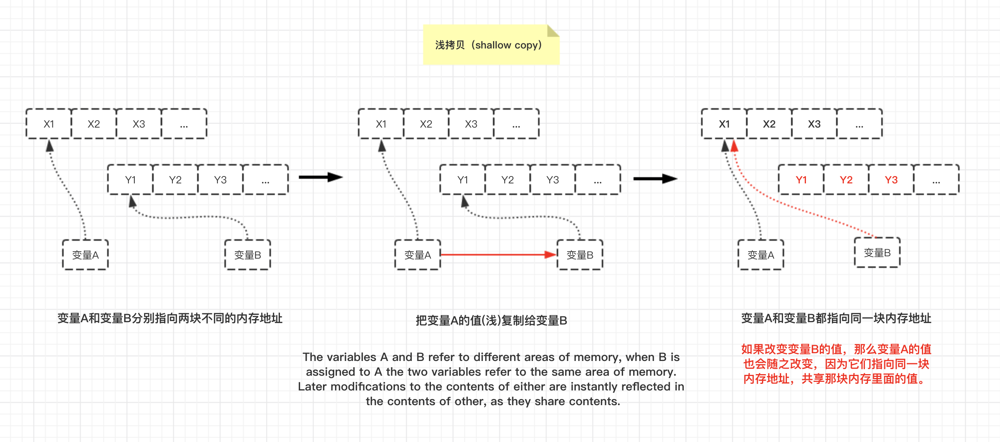
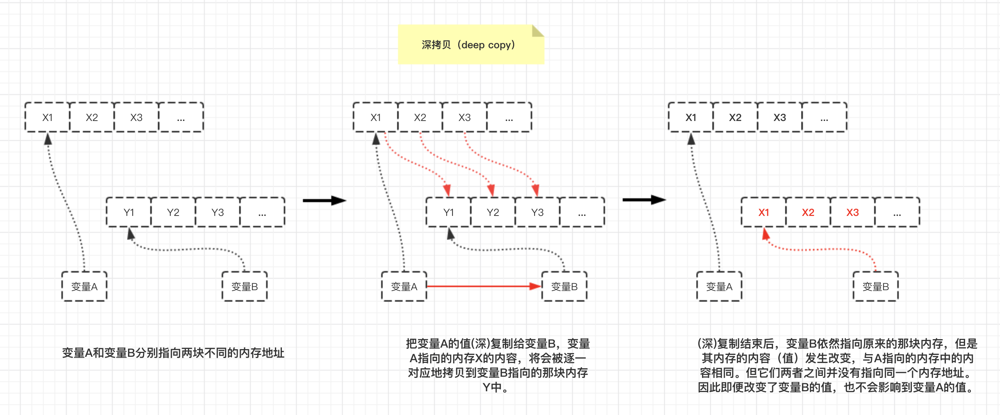

# **对象**

# 3.1 语法

## **创建对象的两种形式**

对象可以通过两种形式定义：对象字面量形式和构造形式。
对象字面量创建对象：
```js
var myObj = {
    key: value  //键值对
    //..
};
```

构造形式创建对象：
```js
var myObj = new Object();
myObj.key = value;
```

对象字面量形式是创建对象的首选模式，绝大多数内置对象也是这样做的。


# 3.2 类型

对象是Javascript的基础。在Javascript中一共有六种主要类型。
- string
- number
- boolean
- undefined
- null
- object

使用typeof可以用来判断数据的类型，返回值就是上面几个。

注意，基本数据类型（简单基本类型：string、boolean、number、null和undefined）本身并不是对象。此时没有大写首字母。

null有时候会被当作一种对象类型，即使用typeof null时会返回字符串object。但这是语言本身的bug（原理是这样的，不同的对象在底层都表示为二进制，在 JavaScript 中二进制前三位都为 0 的话会被判 断为 object 类型， null 的二进制表示是全 0， 自然前三位也是 0， 所以执行 typeof 时会返回“ object ”。）。

所以，实际上null本身是基本类型。

函数就是对象的一个子类型。js中的函数时“一等公民”，因为它们本质上和普通的对象一样，所以可以像操作其他对象一样操作函数。

## **内置对象**

内置对象属于对象子类型。

- String
- Number
- Boolean
- Object
- Function
- Array
- Date
- RegExp
- Error

JavaScript中，它们实际上只是一些内置函数。这些内置函数可以当做构造函数（由new产生的函数调用）来使用，从而可以构造一个对应子类型的新对象。

举例：
```js
var strPrimitive = "I am a string";
typeof strPrimitive;    //“string” 留意：这里的string全小写！表示简单基本数据类型
strPrimitive instanceof String;     //false，因为是简单基本数据类型，所以不是对象。
```
原始值"I am a string"并不是对象，它只是一个字面量，并且是一个不可变的值。

如果要在字面量上执行操作，比如获取长度、访问其中某个字符等，那需要将其转换为String对象。幸好，JS会自动把字符串字面量转换成一个String对象。

思考下面代码：
```js
var strPrimitive = "I am a string";
console.log(strPrimitive.length);   //13
console.log(strPrimitive.charAt(3));    //"m"
```
上面代码使用了两种方法来直接在字符串访问属性或方法，之所以可以这么做，是因为JS引擎自动把字面量转换成String对象，所以可以访问属性和方法，


```js
var strObject = new String("I am a string");
typeof strObject;       //“object”
strObject instanceof String;    // true
```

## **文字（字面量）形式创建对象 VS 构造形式创建对象**

- `null`和`undefined`没有对应的构造形式创建对象（就是使用new的形式），它们只有文字形式来创建对象。

- `Date`只有构造形式来创建Date对象，而没有文字形式（字面量形式）创建对象

- `Object`、`Array`、`Function`和`RegExp`来说，无论是文字形式还是构造形式，它们都是对象，而不是字面量。

由于这两种形式都可以创建对象，所以我们**首选更简单的文字(字面量)形式创建对象**。建议只在那些额外选项时使用构造形式来创建对象。

例如：
```js
//RegExp对象（文字（字面量）形式）
var reg = /\[bc\]at/i;  //这就是文字形式（字面量）来创建的对象~JS引擎自动将其转换成RegExp对象
//RegExp对象（构造形式创建对象）
var reg = new RegExp("\\[bc\\]at", "i");

//Array对象（文字（字面量）形式）
var arr = ["aa", "bb", "cc"]
//Array对象（构造形式创建对象）
var arr1 = new Array();

//Object对象（文字（字面量）形式）
var person1 = {
    name: "fanwy",
    weight: "67kg",
    girlfriend: "nan"
}

//Object对象（构造形式）
var person2 = new Object();
person2.name = "fanwy";
person2.weight = "67kg";
person2.girlfriend = "nan";

```


# 3.3 内容

## **访问对象的值**

思考下面代码：
```js
var myObject = {
    a: 2
};

myObject.a;     //2
myObject["a"];  //2
```

访问对象内部的值，有两种形式，使用 **`.`操作符** 或者 **`[]`操作符** 。

- .a通常被称为”属性访问“。
- ["a"]通常被称为”键访问“。

它们两者实际访问的是同一个位置，并返回相同的值2，所以这两个术语之间可以相互转换。

它们的主要区别：
- .操作符要求属性名满足标识符的命名规范
- [""]操作符可以接受任意UTF-8/Unicode字符串作为属性名。

## **3.3.1 可计算的属性名**

如果你需要通过表达式来计算属性名，可以用到访问属性名的[]操作符。
```js
var prefix = "foo";
var myObject = {
    [prefix + "bar"]: "hello",
    [prefix + "baz"]: "world"
};
myObject["foobar"];
myObject["foobaz"];
```

## **3.3.2 属性与方法**

访问的对象属性是一个函数，有一些开发者喜欢使用不一样的叫法已作区分。函数**很容易被认为**是属于某个对象。（然而并不是如此）

函数和对象的关系最多只能说是间接关系。

无论（访问对象中的属性返回的）返回值是什么类型，每次访问对象的属性就是属性访问。如果属性访问返回的是一个函数，那它也并不是一个”方法“。属性访问返回的函数和其他函数没有任何区别。

举例来说：
```js
function foo() {
    console.log("foo");
}
var someFoo = foo;  //对foo的变量引用

var myObject = {
    someFoo: foo
};

foo;    // function foo(){..}

someFoo;    // function foo(){..}

myObject.someFoo;   // function foo(){..}
```

someFoo和myObject.someFoo 只是对于同一个函数的不同引用，并不能说这个函数时特别的或者”属于“某个对象。如果foo()定义时在内部有一个this引用，那这两个函数引用的唯一区别就是没有Object.someFoo中的this会隐式绑定到一个对象。无论哪种形式引用都不能称之为”方法“。

## **3.3.3 数组**

数组也支持[]访问形式。数组也是对象，所以虽然每个下标都是整数，你仍可以给**数组添加属性**：
```js
var myArray = ["foo", 42, "bar"];
myArray.baz = "baz"; 
myArray.length; //3     数组长度没发生改变
myArray.baz;    //"baz"
```

可以把数组当作一个普通的**键/值**对象来使用，并且不添加任何数值索引，但这不是一个好主意。

例子：
```js
var myArray = ["foo", 42, "bar"];
myArray["arr1"] = "baz";
myArray["arr2"] = "scc";
myArray;    // ["foo", 42, "bar",  arr1: "baz" , arr2: "scc"]
myArray["arr1"];    //"baz"
```

因为引擎都对数组和对象进行优化，所以最好：
- 只用对象存储**键/值**对

- 只用数组来存储**数值下标/值**对

注意：如果你试图向数组添加一个属性”看起来“像一个数字，那它会变成一个数值下标。（因此会修改数组内容而不是添加一个数组对象的属性）：
```js
var myArray = ["foo", 42, "bar"];
myArray["3"] = "baz";
myArray.length; 
my.Array[3];    //"bza"
```

## **复制对象**

JavaScript初学者最常见的问题之一就是如何复制对象。

看起来应该有一个内置的copy()方法，是吧？实际上事情比你想象的更复杂，因为我们无法选择一个默认的复制算法。

举例，思考这个对象：
```js
function anotherFunction() {/*..*/}

var anotherObject = {
    c: true
}

var anotherArray = [];

var myObject = {
    a: 2,
    b: anotherObject,   //引用，不是副本（copy）！
    c: anotherArray,    //另一个引用！
    d: anotherFunction
}

anotherArray.push(anotherObject, myObject);
```

如何准确地表示myObject的复制呢?

首先，我们应该要判断它是浅复制（shallow copy）还是深复制（deep copy）。

## **浅拷贝和深拷贝**
**浅拷贝（shallow copy）**

>The variables A and B refer to different areas of memory, when B is assigned to A the two variables refer to the same area of memory. Later modifications to the contents of either are instantly reflected in the contents of other, as they share contents.

**深拷贝（deep copy）**

>The variables A and B refer to different areas of memory, when B is assigned to A the values in the memory area which A points to are copied into the memory area to which B points. Later modifications to the contents of either remain unique to A or B; the contents are not shared.

**在JavaScript中的深浅拷贝**

首先要搞清楚数据存在哪里：

1. 简单基本类型的值存在于**栈空间(stack)** ，包括undefined, null, boolean, number, or string数据类型值。

2. 复杂基本类型的值存在于**堆空间(heap)** ，对象（内置对象+自定义对象）。

The Basics:（重要理解）

Objects are aggregations of properties. **A property can reference an object or a primitive. Primitives are values, they have no properties**.

对象的属性可以引用**对象**和**简单基本类型值**。而简单基本类型的值就是一个value，没有属性！

-  对于基本数据类型（简单基本类型）来说，进行拷贝时，被赋值的变量的值改变了，也不会影响到原来的赋值变量。因为它存在于栈上。

例子：
```js
var a = 20;
var b = a;
b = 30;

// 这时a的值是多少？
```

- 对于复杂数据类型（复杂基本类型：对象~）来说，如果进行**浅拷贝**的话，被赋值的变量值一旦被改变，将连同原来赋值变量的值也会发生改变。

对象的浅拷贝使用`=`操作运算符。

(由于浅拷贝就是共享相同的内存引用地址，浅复制只会将对象中的各个属性进行依次复制，并不会进行递归复制，而 JavaScript 存储对象都是存地址的，所以浅复制会导致两个对象)
```js
var m = { a: 10, b: 20 }
var n = m;
n.a = 15;
// 这时m.a的值是多少
```

- 对于复杂数据类型（复杂基本类型：对象~）来说，如果进行**浅深拷贝**的话，被赋值的变量值被改变，不会对原来（旧的）赋值变量的值造成任何影响。(由于深拷贝是等同于将原来赋值的那个变量的所有东西都重新


使用jQuery来实现浅拷贝和深拷贝对象
```js
// Shallow copy(浅复制对象)
var newObject = jQuery.extend({}, oldObject);

// Deep copy（深复制对象）
var newObject = jQuery.extend(true, {}, oldObject);
```
- [JS中最有效的深复制对象的方法](https://stackoverflow.com/questions/122102/what-is-the-most-efficient-way-to-deep-clone-an-object-in-javascript)
- [Object copying](https://www.wikiwand.com/en/Object_copying#/Shallow_copy)


---

javascript中深复制对象的方法，可以使用json
```js
var newObj = JSON.parse(JSON.stringify(someObj));
```

JavaScript中浅复制的方法（ES6），可以说使用`Object.assign()`方法来实现。它的第一个参数是目标对象，之后还可以跟一个或多个源对象。它胡遍历一个或多个源对象的所有可枚举的自有键，并把他们复制（使用=操作符赋值）到目标对象，最后返回目标对象。
```js
function anotherFunction() {/*..*/}

var anotherObject = {
    c: true
}

var anotherArray = [];

var myObject = {
    a: 2,
    b: anotherObject,   //引用，不是副本（copy）！
    c: anotherArray,    //另一个引用！
    d: anotherFunction
}
anotherArray.push(anotherObject, myObject);

//下面是重点。
var newObj = Object.assign({}, myObject);

newObj.a;   //2
newObj.b === anotherObject;     //true
newObj.c === anotherArray;
newObj.d === anotherFunction;
```

----