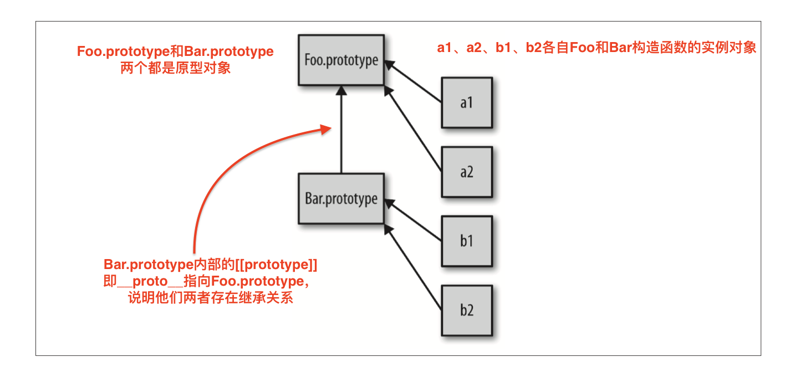

# **原型（1）**

# 5.1 [[Prototype]] （即_proto_）

JavaScript中的对象有一个特殊的[[Prototype]]内置属性（即浏览器中的_proto_），其实就是对于其他对象的引用。

几乎所有对象在创建[[Prototype]]属性都会赋予一个非空的值。
（对象的[[Prototype]]链接为空很少见）。

```js
var myObject = {
    a: 2
};
myObject.a; //2
```

[[Prototype]]引用有什么用呢？第3章中说过，当你试图引用**对象的属性**时会触发[[Get]]操作，比如myObject.a。对于默认的[[Get]]操作来说，第一步是检查对象本身是否有这个属性，如果有的话就使用它。但如果a不在myObject对象上，就需要使用对象的[[Prototype]]链了。

注意：ES6中，如果包含Proxy的话，这里对[[Get]]和[[Put]]的讨论就不适用。

对于默认的[[Get]]操作来说，如果无法在对象本身找到需要的属性，就会继续访问对象的[[Prototype]]链：
```js
var anotherObject = {
    a: 2
};

//创建一个关联到anotherObject的对象
var myObject = Object.create(anotherObject);

myObject.a; //2
```

注意：稍后会介绍Object.create()的原理，现在只需要知道它会创建一个对象并把这个对象的[[Prototype]]关联到指定的对象。

现在myObject的[[Prototype]]关联到了anotherObject。显然 myObject.a 并不存在，但是尽管如此，属性访问仍然成功地(在anotherObject中)找到了值2。

但是，如果anotherObject中找不到a并且[[Prototype]]链接不为空，就会继续查找下去。

这个过程会持续到找到匹配的树下面或者查找完 整条[[Prototype]]链。如果整条链上都没找到相匹配的属性名，[[Get]]操作的返回值是undefined。

使用`for..in`遍历对象时原理和查找[[Prototype]]链类似，任何可以通过原型链访问到（并且是enumerable-可枚举）的属性都会被枚举。使用in操作符来检查属性在对象中是否存在时，同样会查找对象的整条原型链（无论属性是否可枚举）：
```js
var anotherObject = {
    a: 2
};

//创建一个关联到anotherObject的对象（继承于anotherObject）
var myObject = Object.create(anotherObject);

for(var k in myObject) {
    console.log("found: " + k);
}

//found: a

("a" in myObject);  //true
```

## **5.1.1 Object.prototype**

所有普通的[[Prototype]]链最终都会指向内置的Object.prototype。由于所有的“普通”（内置）对象都“源于”（或者说把[[Prototype]]链的顶端设置为）这个Object.prototype对象，所以它包含JS中许多通用的功能。

## **5.1.2 属性设置和屏蔽**

第3章提过，给一个对象设置属性并不仅仅是添加一个新属性或者修改已有的属性值。

现在来完整地讲解这一个过程：
```js
myObject.foo = "bar";   //给对象的foo属性添加一个值为"bar"的属性值
```

如果myObject对象中包含名为foo的普通访问数据属性，这条赋值语句只会修改已有的属性值。

如果foo属性不直接存在于myObject中，[[Prototype]]链就会被遍历，类似[[Get]]操作。如果原型链上找不到与foo同名的属性，foo就会被直接添加到myObject对象上。

然而，如果foo存在于原型链上层，赋值语句`myObject.foo = "bar"`的行为就会有些不同。（而且可能很出人意料，稍后再讲）

如果属性名foo即出现myObject中也出现myObject的[[Prototype]]链上层，那么就会发生屏蔽。myObject中包含的foo属性会屏蔽原型链上层的所有foo属性，因为myObject.foo总会选择原型链中最底层的foo属性。

屏蔽比我们想象中更复杂。

下面我们分析一下如果foo不直接存在于myObject中而是存在于原型链上层时`myObject.foo = "bar"`会出现的三种情况。

1. 如果在[[Prototype]]链上层存在名为foo的普通数据访问属性并且**没有**被标记为只读（writable: false），那就会直接在myObject中添加一个名为foo的新属性，它是屏蔽属性。

2. 如果在[[Prototype]]链上存在foo属性，该属性中的特性被标记为（writable: false）,那么无法修改已有属性或者在myObject上创建屏蔽属性。如果运行在严格模式下，代码会抛出一个错误。否则，这条赋值语句会被忽略。总之，不会发生屏蔽。

3. 如果在[[Prototype]]链上层存在foo属性，并且它是一个访问器属性setter，那就一定会调用这个setter。foo属性不会被添加到（或者说屏蔽于）myObject，也不会重新定义foo这个setter。

如果你希望在第二种和第三种情况下也屏蔽foo，那就不能使用`=`操作符来赋值，而是使用`Object.defineProperty()`来项myObject添加foo。

**如果需要对屏蔽方法进行委托的话**就不得不进行丑陋的显式伪多态。通常来说，使用屏蔽得不偿失，所以应当尽量避免使用。

有些情况下会隐式产生屏蔽，一定要当心。

```js
var anotherObject = {
    a: 2
};

var myObject = Object.create(anotherObject);

anotherObject.a; //2
myObject.a;     //2

anotherObject.hasOwnProperty("a");  //true
myObject.hasOwnProperty("a");   //false

myObject.a++;       //隐式屏蔽  相当于 myObject.a = myObject.a + 1; 三种情况的第一种

anotherObject.a;    //2
myObject.a;         //3

myObject.hasOwnProperty("a");   //true
```

尽管myObject.a++看起来应该（通过委托）查找并增加anotherObject.a属性，但是别忘了++操作相当于**myObject.a = myObject.a + 1**。

因此++操作符首先会通过[[Prototype]]查找属性a并从anotherObject.a获取当前属性值2，然后给这个值加1，接着用[[Put]]将值3赋给myObject中新建的屏蔽属性a，天呐！

修改委托属性时一定要小心。如果想让anotherObject.a的值增加，唯一的办法是anotherObject.a++。

# 5.2 "类"

现在你可能会好奇，为什么一个对象需要关联到另外一个对象？这么做有什么好处？

JavaScript和面向类的语言不通，它并没有作为对象的抽象模式或者蓝图。JavaScript中只有对象。

实际上，JS才是真正被称为“面向对象”的语言，因为他是少有的可以不通过类，直接创建对象的语言。

再说一遍：JS中只有对象！

## **5.2.1 “类”函数**

多年以来，JS中有一种奇怪的行为一直被无耻地滥用，那就是模仿类。我们会仔细分析这种方法。

这种奇怪的：”类似类“的行为利用了函数的特殊性：**所有的函数默认都会都拥有一个名为prototype的公有并且不可枚举的属性，它会指向另一个对象**：
```js
function Foo() {
    //..
}

Foo.prototype; //{ } 即是原型对象
```
这个通常被称为Foo的原型对象，因为通过名为Foo.prototype的属性引用来访问它，而不幸的是，这个术语给了我们造成极大的误导，稍后会看到。

抛开名字不谈，这个对象到底是什么？

最直接的解释就是，这个对象在调用new Foo()时创建的，最后会被关联到”Foo点prototype“对象上。

我们来验证一下：
```js
function Foo() {
    //..
}

var a = new Foo();

Object.getPrototypeOf(a) === Foo.prototype; //true
```

调用new Foo()时会创建a，其中的一步就是给a一个**内部的[[Prototype]]链接**，关联到Foo.prototype指向的那个对象。

在JS中，并没有类似的复制机制。你不能创建一个类的多个实例，只能创建多个对象，它们[[Prototype]]（即_proto_）关联的是同一个（原型）对象。但在默认情况下并不会进行复制，因此这些对象之间并不会完全失去联系，因为它们是相互关联的。

new Foo()会生成一个新对象（在这里是a），这个新对象的内部链接[[Prototype]]关联的是
Foo.prototype 对象。

最后我们得到了两个对象，它们之间相互关联，就是这样。我们并没有初始化一个类，实际上我们并没有从”类“中赋值任何行为到一个对象中，只是让两个对象（Foo.prototype对象和a对象）互相关联。

实际上，绝大多数JS开发者都不知道的秘密是，new Foo()这个函数调用实际上并没有直接创建关联（与Foo.prototype的），这个关联只是一个意外的副作用。

new Foo()只是间接完成了我们的目标：创建一个关联到其他对象的新对象。有没有更直接的方法，有，就是`Object.create()`，不过暂时不介绍它。


### **关于名称**

在JavaScript中，我们并不会将一个对象（”原型对象“）复制到另外一个对象（”对象实例“），只是将他们关联起来。如图：



继承意味着复制操作，但JavaScript（默认）并不会复制对象属性。（除非你自己硬要复制）相反，JavaScript会在两个对象之间创建一个关联，这样一个对象就可以通过**委托**访问另一个对象的属性和函数。

委托这个术语可以更加准确地描述JS中对象的关联机制。

同于普遍描述的特质。举例来说，描述汽车时你会说汽车时有四个轮子的一种交通工具，但是你不会重复描述交通工具具备的通用特性（比如引擎）。

如果你把JavaScript中对象的所有委托行为都归结到对象本身并且把对象看作是实物的话，那就（差不多）可以理解差异继承了

默认情况下，对象并不会像差异继承暗示的那样通过复制生成。因此，差异继承也不适合用来描述JS的[[prototype]]机制(原型机制)。


## **5.2.2 ”构造函数“**

```js
function Foo() {
    //..
}

var a = new Foo();
```

到底是什么让我们认为Foo是一个”类“呢？

- 其中一个原因是我们看到了关键字`new`，在面向类的语言中构造类实例时会用到它。

- 另外一个原因则是，看起来我们执行了类的构造函数方法，Foo()的调用方式很像初始化类构造函数的调用方式。

除了令人迷惑的”构造函数“语义外，Foo.prototype还有一个绝招。
```js
function Foo() {
    //..
}

Foo.prototype.constructor === Foo;  //true

var a = new Foo();

a.constructor === Foo; //true

```

- Foo.prototype默认有一个公有且不可枚举的属性`.constructor`，这个属性引用的是**对象关联的函数**。（`Foo.prototype.constructor === Foo`）

- 此外，我们可以看到通过”构造函数“调用new Foo()的对象也有一个`.constructor`属性，指向”创建这个对象的函数“。（`a.constructor === Foo`）

注意：实际上a本身并没有 .constructor 属性，虽然a.constructor确实指向Foo函数。（原因是通过原型链查找constructor属性）


### **构造函数还是调用**

实际上，Foo和你程序中的其他函数没有任何区别。函数本身并不是构造函数。

然而，当你在普通的函数调用前加上`new`关键字之后，就会把这个函数调用变成一个”构造函数调用“。实际上，new会劫持所有普通函数并用构造对象的形式来调用它。

举例：
```js
function NothingSpecial() {
    console.log("Don't mind me");
}

var a = new NothingSpecial();
//"Dont't mind me"

a;  //{}
```

NothingSpecial只是一个普通的函数，但是使用new调用时，它就会构造一个对象并赋值给a，这看起来像new的一个副作用（使用了new，无论如何都会创造一个对象）。这个调用时一个**构造函数调用**，但是NothingSpecial本身并不是一个构造函数。

换句话说，在JavaScript中对于”构造函数“最准确的解释是，所有带new的函数调用。

函数不是构造函数，但是当且仅当使用new调用函数时，函数调用会变成”构造函数调用“。


## **5.2.3 技术**

我们是不是已经介绍完JavaScript中所有和”类“相关的问题了？

不是。JavaScript开发者绞尽脑汁想要模仿类的行为：
```js
function Foo(name) {
    this.name = name;
}

Foo.prototype.myName = function() {
    return this.name;
};

var a = new Foo("a");
var b = new Foo("b");

a.myName();
b.myName();
```

这段代码展示了另外两种”面向类“的技巧：
1. this.name = name 给每个对象（也就是a和b）添加.name属性，有点像实例封装的数据值。
2. Foo.prototype.myName = ... 它会给Foo.prototype对象添加一个属性（函数）。

在本章开头介绍默认[[Get]]算法时我们介绍过[[Prototype]]链(即原型链)，以及当属性不直接存在于对象中时如何通过它来进行查找。

因此，在创建的过程中，a和b的内部[[Prototype]]都会关联到Foo.prototype上。当 a 和 b 中无法找到myName时，它会（通过委托）在Foo.prototype上找到。

举例来说，Foo.prototype的.constructor属性只是Foo函数在声明时的默认属性。如果你创建了一个新对象并替换了函数默认的.prototype对象引用，那么么新对象并不会自动获得.constructor属性。

思考下面例子：
```js
function Foo() {/* .. */}

Foo.prototype = {/* .. */}; //创建一个新原型对象

var a1 = new Foo();

a1.constructor === Foo;   //fasle
a1.constructor === Object;  //true
```

如果你认为”constructor“表示”由...构造“的话，a1.constructor应该是Foo，但是它并不是Foo!

到底怎么回事？

a1并没有.constructor属性，所以它会委托[[prototype]]链（原型链）上的Foo.prototype。但是这个对象没有.constructor属性（默认的Foo.prototype对象是有这个属性！只不过后来被新的原型对象覆盖了），所以a1会继续委托，这次会委托给委托链顶端的Object.prototype。这个对象有.constructor属性，指向内置的Object()函数。

错误观点已被摧毁。（错误的观点——认为”constructor“表示”由...构造“这个）

当然，你可以给Foo.prototype添加一个.constructor属性，不过这需要**手动添加一个符合正常行为的不可枚举属性**。

举例：
```js
function Foo() {/* .. */}
Foo.prototype = {/* .. */}; //创建了一个新原型对象，默认的Foo.prototype将会被重写，导致丢失了.constructor属性

//需要在Foo.prototype上”修复“丢失的.constructor属性
//新对象属性起到Foo.prototype的作用
//通过defineProperty(..)来为Foo.prototype
Object.defineProperty(Foo.prototype, "constructor", {
    enumerable: false,
    writable: true,
    configurable: true,
    value: Foo  // 让.constructor指向Foo
} );
```

修复.constructor需要很多手动操作。所有这些工作都源于把"constructor"错误第理解为”由....构造“，这个误解的代价实在太高了。

实际上，对象的.constructor会默认指向一个函数，这个函数可以通过对象的.prototype引用。

最好的办法是记住一点：”constructor并不表示被构造“。

.constructor并不是一个不可变属性。他只是不可枚举，但是他的值是可写的。你可以给[[Prototype]]链中的任意对象添加一个名为constructor的属性或者对其进行修改，你可以任意对其赋值。

