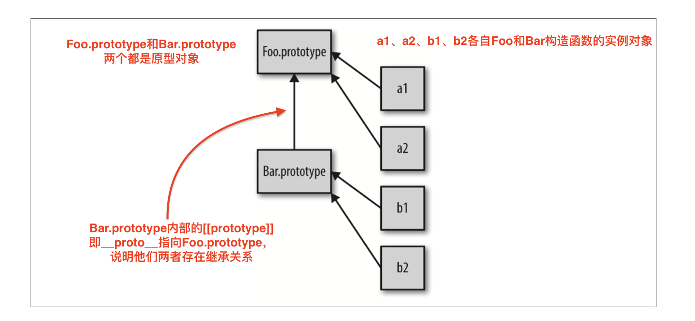

# **原型(2) 多看几遍**

# 5.3 (原型)继承

实际上，我们已经了解了通常被称作原型继承的机制，a可以“继承”Foo.prototype并访问Foo.prototype的myName()函数。但是我们之前只把继承看作是类和类之间的关系，并没有把它看作是类和实例之间的关系：



还记得这张图吗，它不仅展示出对象(实例)a1到Foo.prototype的委托关系，还展示出Bar.prototype到Foo.prototype的委托关系，而后者和类继承相似，指向箭头方向不同。

图中由下到上的箭头表面这是**委托关联**，而不是复制操作。

下面这段代码使用的就是典型的“原型风格”：
```js
function Foo(name) {
    this.name = name;
}

Foo.prototype.myName = function() {
    return this.name;
};

function Bar(name, label) {
    Foo.call(this, name);   //显示绑定,为了关联到Foo的属性
    this.label = label;
}

//我们创建了一个新的Bar.prototype对象并关联到Foo.prototype
Bar.prototype = Object.create(Foo.prototype);

//注意！现在没有了Bar.prototype.constructor了
//如果你需要这个属性的话可能需要手动修复一下它（使用Object.defineProperty()）

Bar.prototype.myLabel = function() {
    return this.label;
};

var a = new Bar("a", "obj a");

a.myName();
a.myLabel();
```

这段代码的核心部分就是语句`Bar.prototype = Object.create(Foo.prototype)`。调用Object.create(..)会凭空创建一个“新”对象并把新对象内部的`[[Prototype]]`(即__proto__)关联到你指定的对象。（本例中是Foo.prototype原型对象）

换句话说，就是“创建了一个新的Bar.prototype对象并把它关联到Foo.prototype”。

声明function Bar(){}时，和其他函数一样，Bar会有一个.prototype关联到默认的对象（即Bar.prototype原型对象上），但是这个对象并不是我们想要的，我们想要的那个对象是Foo.prototype对象。

为此我们创建了一个新对象并把它关联到我们希望的对象上(通过`Object.create()`)，然后直接把原始的关联对象抛弃掉。

注意，下面这两种方式是常见的错误做法，实际上它们都存在一些问题：

```js
// 和你想要的机制不一样(???)
Bar.prototype = Foo.prototype;

// 基本上满足你的需求，但可能会产生一些副作用:(
Bar.prototype = new Foo();
```

`Bar.prototype = Foo.prototype` 并不会创建一个关联到 Bar.prototype 的新对象。它只是让Bar.prototype直接引用Foo.prototype对象。当你执行类似`Bar.prototype.myLabel = ..`的赋值语句时会直接修改Foo.prototype原型对象本身。

显然这不是你想要的结果，否则你根本不需要Bar对象，直接使用Foo就可以了，这样代码会更简单一些。

`Bar.prototype = new Foo()`的确会创建一个关联到Bar.prototype的新对象。但是它使用了Foo()的“**构造函数调用**”，如果函数Foo有一些副作用(比如写日志，修改状态，注册到其他对象、给this添加数据属性，等等)的话，就会影响到bar()的“后代”，后果不堪设想。

因此，**要创建一个适合的关联对象，我们必须使用Object.create()**而不是使用具有副作用的Foo()。这样做唯一缺点就是需要创建一个新对象然后把旧对象抛弃掉，不能直接修改已有的默认对象。

如果能有一个标准且可靠的方法修改对象的[[Prototype]]（即__proto__）关联就好了。

在ES6之前，我们只能通过设置`.__proto__`属性来实现，但这个方法并不是标准且无法兼容所有浏览器。

ES6添加了辅助函数`Object.setPropertyOf()`，可以用标准且可靠的方法来修改关联。

我们来对比一下两种把Bar.prototype关联到Foo.prototype的方法：
```js
// ES6之前需要抛弃默认的Bar.prototype(但是Bar依然有Bar.prototype，只是里面的馅不一样了)

Bar.prototype = Object.create(Foo.prototype);

// ES6开始可以直接修改现有的Bar.prototype
Object.setPrototypeOf(Bar.prototype, Foo.prototype);

```

如果忽略掉Object.create()方法带来的轻微性能损失(抛弃对象需要进行垃圾回收)，实际上比ES6及之后的方法更短而且可读性更高。无论如何如何，这是两种完全不同的语法。


## 检查"类"关系（确认对象之间的关系）

假设有对象a，如何寻找对象 a 委托的对象（如果存在的话）呢？（即 **检查某个对象实例与原型对象有没有关系**）

在传统的面向类环境中，检查(查找)一个实例（Javascript中的对象）的继承祖先（Javascript中的**委托关联**）：通常被称为**内省**（或者**反射**）。

思考下面代码
```js
function Foo() {
    /* .. */
}

Foo.prototype = {..};

var a = new Foo();  //“实例对象”
```

我们如何通过内省找出a的“祖先”（委托关联）呢？

第一种方法是站在“类”的角度来判断：
```js
a instanceof Foo;   //true
```

`instanceof`操作符的左操作数(即a)是一个普通的对象，右操作数是一个函数。`instanceof`回答的问题是：在a的整条[[Prototype]]链（__proto__）中是否有指向Foo.prototype的对象。

可惜，这个方法只能处理对象和函数之间的关系。如果你想判断两个对象(比如a和b)之间是否通过[[Prototype]]链关联，只用instanceof无法实现。

注意：如果使用内置的`.bind()`函数来生成一个硬绑定函数的话，该函数是没有.prototype属性的。在这样的函数上使用instanceof的话，目标函数(你要把this绑定的那个)的.prototype会代替硬绑定函数的.prototype。

通常我们不会在**构造函数调**中使用硬绑定函数。


下面这段**荒谬的代码**试图站在”类“的角度使用instanceof来判断两个对象的关系：
```js
function isRelatedTo(o1, o2) {
    function F(){}
    F.prototype = o2;

    //下面这样是有问题的，荒谬之处
    return o1 instanceof F;
}

var a = {};
var b = Object.create(a);

isRelatedTo(b, a);  //true
```

在isRelatedTo()内部我们声明了一个一次性函数F,把它的.prototype重新赋值并指向对象o2，然后判断o1是否是F的一个”实例“。

显而易见，o1实际上并没有继承F也不是由F构造，所以这种方法非常愚蠢(指isRelatedTo())并且非常容易造成误解。

问题的关键在于思考的角度，强行在Javascript中应用”类的语义“（在本例中就是使用`instanceof`）就会造成这种尴尬的局面。


### `isPrototype(..)`

下面是第二种判断[[Prototype]]反射的方法，它更加简洁：
```js
function Foo() {
    /* .. */
}

//记得下面会丢失了Foo.prototype.constructor，因为默认的Foo.prototype原型对象已经被重写了，所以Foo.prototype.constructor === Foo;结果为false
Foo.prototype = {/*  */};   

var a = new Foo();

//看这~~
Foo.prototype.isPrototypeOf(a); //true
```

注意，在本例中，我们实际不关心(甚至不需要)Foo，我们只需要一个可以用来判断的对象(本例中是Foo.prototype原型对象)就行。

**isPrototypeOf()**回答的问题是：**在a的整条[[Prototype]]链(__proto__)中是否出现过Foo.prototype**?

同样的问题，同样的答案，但是第二种方法并不需要间接引用函数（Foo），它的`.prototype`属性会被自动访问。

我们只需要两个对象就可以判断他们之间的关系。通过使用`isPrototypeOf()`来确认关系：

举例来说明：
```JS
//非常简单： 对象b 是否出现在 对象c 的[[Prototype]]链(原型链)中？
b.isPrototypeOf(c);
```

注意，这个方法并不需要使用函数，它直接使用b和c两个对象的对象引用来判断他们的关系。

换句话说，语言内置的`isPrototype(..)`函数就是我们的`isRelatedTo()`函数。


### **获取对象的[[Prototype]]链(原型链)**

**使用`Object.getPrototypeOf(..)`和`.__proto__`这两种方法**。

首选第一种，因为规范。而第二种方便。

```JS
function Foo() {
    /* .. */
}  

var a = new Foo();

Object.getPrototypeOf(a);

//获取对象[[Prototype]]链(原型链)的方法！作用等价于a.__proto__
Object.getPrototypeOf(a) === Foo.prototype; //true

a.__proto__ === Foo.prototype;  //true

Object.getPrototypeOf(a) === a.__proto__;   //true
```

说明了一个对象的[[Prototype]]链（.__proto__）等于一个原型对象。

绝大多数浏览器也支持一种非标准（ES6之前并不是标准！）的方法来访问[[Prototype]]属性：
```js
a.__proto__ === Foo.prototype;
```

### **__proto__**

这个奇怪的.__proto__属性"神奇地"引用了内部的[[Prototype]]对象(即原型对象)，如果你想直接查找原型链的话（甚至可以通过`.__proto__.__proto__.__proto__...`遍历原型链），这个方法非常有用。

和.constructor一样，.__proto__实际上并不存在与你正在使用的对象中，实际上，存在于内置的Object.prototype中。（它们是不可枚举的）

**此外,.__proto__看起来像一个属性，但是实际上它更像是一个getter/setter**

.__proto__大致的实现时这样的：

```js
Object.defineProperty(Object.prototype, "__proto__", {
    get: function() {
        return Object.getPropertyOf(this);
    },
    set: function(o) {
        //ES6中的setPrototypeOf(..)
        Object.setPropertyOf(this, o);
        return o;
    }
});
```

因此，访问(获取值)a.__proto__实际上是调用了**a.__proto__()**（调用getter函数）。

通常来说，你不需要修改已有对象的[[Prototype]]。

-----