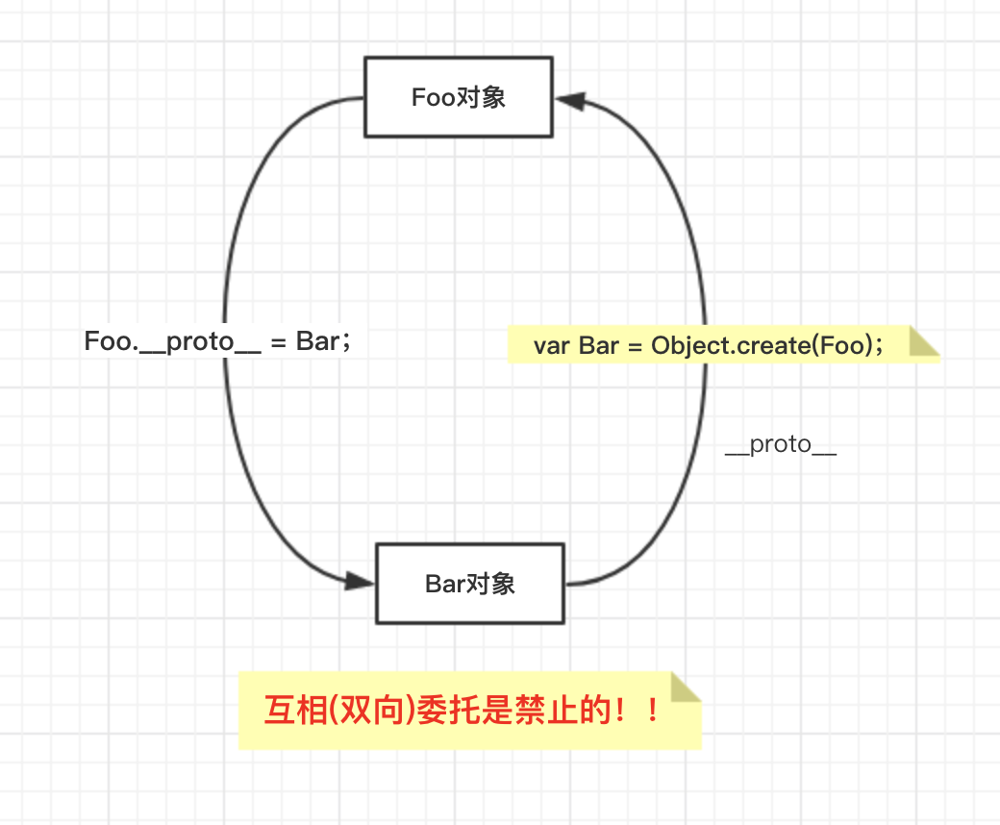
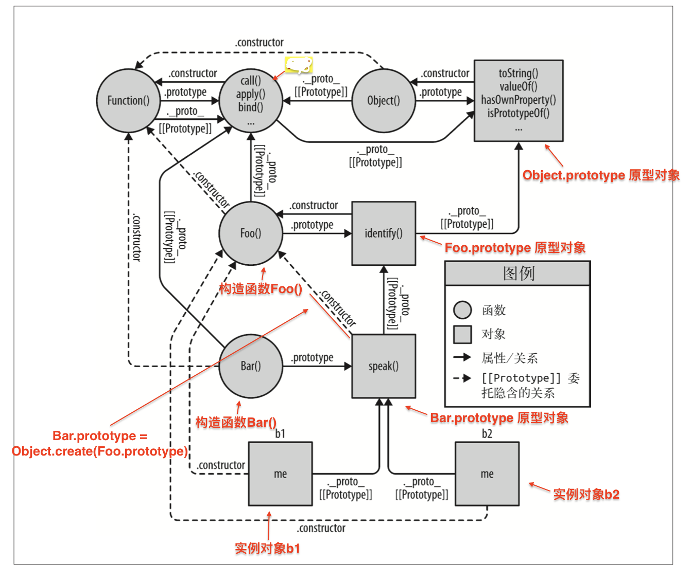
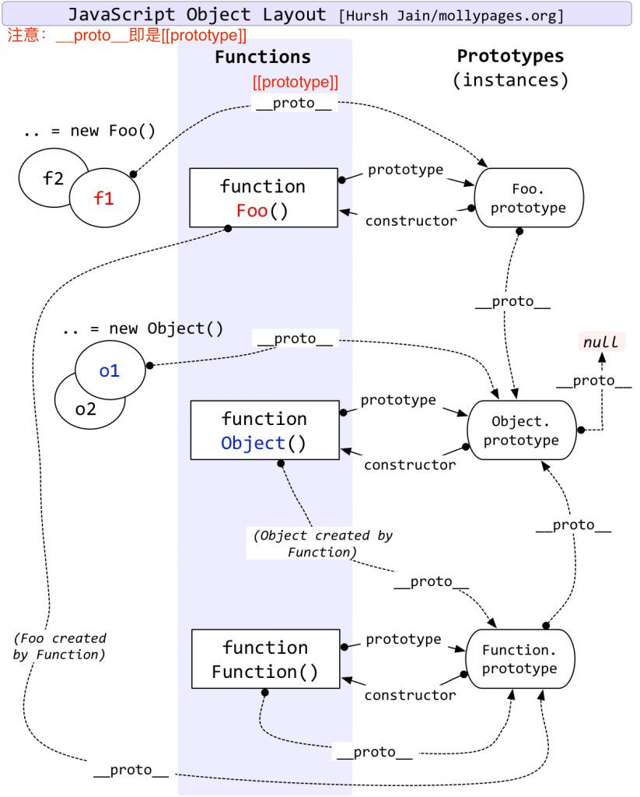
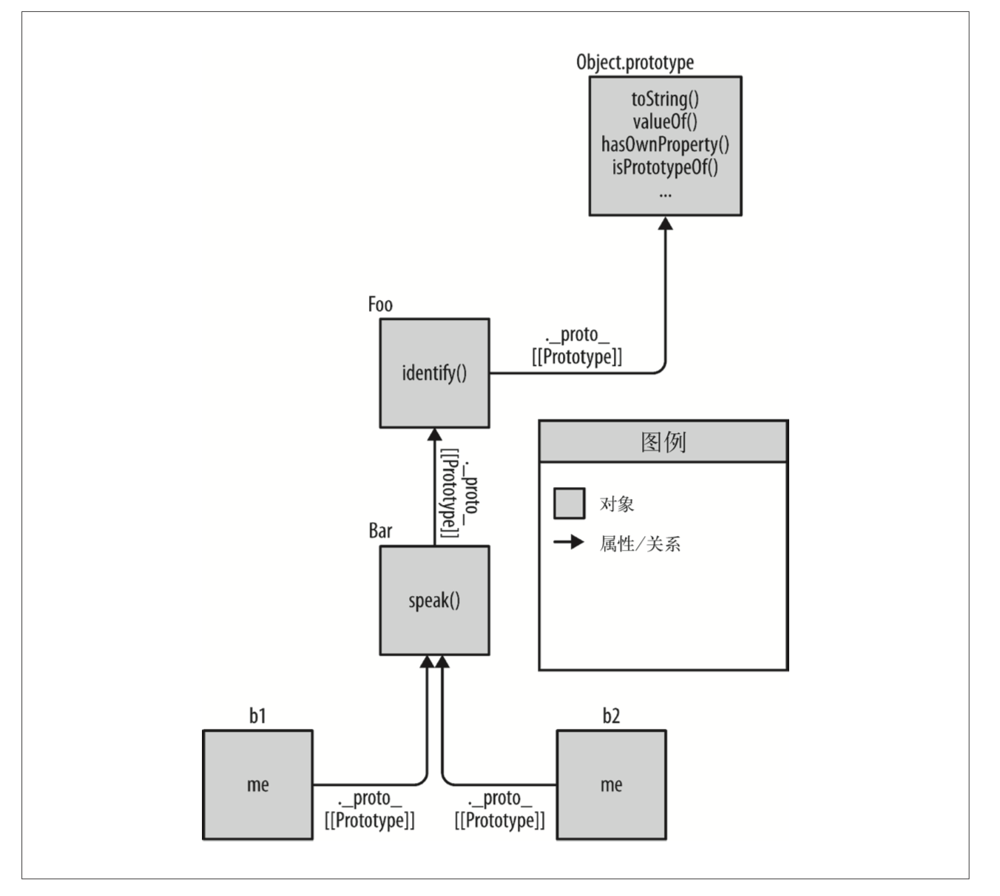

# **行为委托**

[[Prototype]]机制就是对象中的一个内部链接引用（指向）另外一个对象。

如果在第一个对象上没有找到需要的属性或方法引用，引擎就会继续在[[Prototype]]关联的对象上进行查找。同理，如果在后者没找到需要的引用就会继续查找它的[[Prototype]]，以此类推，这一系列对象的链接被称为原型链。

换句话说，JS中的这个机制本质就是**对象之间的关联关系**。

# 6.1 面向委托的设计

我们需要试着把思路从类和继承的设计模式转换到委托行为的设计模式。多重复几次就能熟悉这种思维模式。

首先带你们进行一些理论训练，然后再传授一些能够应用在代码中的具体实例。

## **6.1.1 类理论**

介绍了面向类的理论(比如Java)。

这些类理论你会发现许多的行为可以先”抽象“到父类然后再用子类进行特殊化(重写)。

这部分是面向类的语言的理论。

## **6.1.2 委托理论**

但是现在我们试着使用**委托行为**而不是类来思考同样的问题。（假设我们需要在软件中建模一些类似的任务("XYZ","ABC"等)。）

首先你会定义一个名为Task的对象（和许多JS开发者告诉你的不同，它既不是类也不是函数），它会包含所有任务都可以使用(写作使用，读作委托)
的具体行为。

接着对于每个任务("XYZ"、"ABC")你都会定义一个对象来存储相应的数据和行为。你会把特定的任务对象都**关联**到Task功能对象上，让它们在需要的时候可以进行委托。

基本上你可以想象成，执行任务"XYZ"需要两个兄弟对象(XYZ和Task)协作完成。但是我们并不需要把这些行为放在一起，通过类的复制。我们可以把它们（行为）分别放在各自独立的对象中，需要时可以允许XYZ对象委托Task对象(即进行对象关联)。

下面是推荐的代码形式，非常简单：
```js
Task = {
    setID: function(ID) {this.id = ID;},
    outputID: function() {console.log(this.id)}
};

//让XYZ委托Task
XYZ = Object.create(Task);

XYZ.prepareTask = function(ID, Label) {
    this.setID(ID);//委托以后，可以找到委托目标里面的行为
    this.Label = Label;
};

XYZ.outputTaskDetails = function() {
    this.outputID();//委托以后，可以找到委托目标里面的行为
    console.log(this.Label);
}

//ABC = Object.create(Task);
//ABC = ...
```

在这段代码中，Task和XYZ并不是类(或者函数)，它们是对象。XYZ对象通过Object.create(..)创建，它的[[Prototype]]（即__proto__）委托了Task对象。

这种编码风格称为”对象关联“（OLOO, Objects Link to Other Objects）。我们真正关心的只是XYZ对象委托了Task对象。

在JS中，[[Prototype]]机制会把对象关联到其他对象。无论你多努力地说服自己，JS中就是没有类似”类“的抽象机制。

**对象关联风格的代码**还有一些不同之处。

1. 上面的代码中，id和label**数据成员**都是直接存储在XYZ上（而不是Task）。通常来说，在[[Prototype]]委托中最好把状态保存在委托者(XYZ、ABC)上，而不是委托目标(Task)上。

    - 我理解的原因是：如果把数据成员保存在委托目标(委托被理解为”继承”时候的“父类”)上，会因为[[Prototype]]机制（原型链），委托者会找到委托目标的这些属性。如果某个关联对象(委托者)修改了这些在属性，那么实际上委托目标的这些属性也会变化，因为委托目标的属性是“共享”给所有的关联的对象（委托者）。下面为例子：

```js
//委托目标Person
var Person = {
    setName: function(name) {
        this.name = name;
    },
    //下面是数据成员friends
    friends: ["Shelby", "Court", "Van"]
};

//anotherPerson委托关联到Person
var anotherPerson = Object.create(Person);
anotherPerson.setName("Peter");
anotherPerson.friends.push("Rob"); //4
 
var yetAnotherPerson = Object.create(Person);
yetAnotherPerson.setName("Linda");
yetAnotherPerson.friends.push("Barbie");    //5

console.log(Person.friends);    //["Shelby", "Court", "Van", "Rob", "Barbie"]
```

2. 在类设置模式中，我们故意让父类(Task)和子类(XYZ)中都有outputTask方法，这样就可以利用重写(多态)的优势。在**委托行为中则恰好相反**：我们会尽量避免在[[Prototype]]链的不同级别中使用相同的命名。

    这个设计模式(对象关联模式)要求尽量少使用容易被重写的通用方法名，提倡使用更有描述性的方法名，尤其是要写清楚对应对象行为的类型。这样做实际上可以创建出更容易理解和维护的代码，因为方法名更加清晰。

3. XYZ中的this.setID(ID);语句，首先会检查XYZ对象自身是否存在setID：function(){}这个方法，但是XYZ中并没有这个方法名，因此会通过[[Prototype]]委托关联到Task对象继续查找，这时候可以找到setID(..)方法。

    此外，由于调用位置触发了this的隐式绑定规则(即`XYZ.prepareTask()`)，因此虽然setID(..)方法在Task中，运行时this 仍然会绑定到XYZ对象中，这正是我们想要的。后面的this,outputID()，原理相同。

    换句话说，我们和XYZ对象进行交互的时候可以使用Task对象中的通用方法，因为XYZ对象委托了Task对象。

委托行为意味着某些对象(XYZ)找不到属性或方法引用时会把请求委托给另一个对象(Task)。

这是一种极其强大的设计模式，和父类、子类、继承、多态等概念完全不同。在你脑海中对象是通过任意方向的委托关联并排组织的。

在API接口的设计中，委托最好在内部(委托者对象的某个属性内部)实现，不要直接暴露出去。原因请见5.4.2节。


### **1. 互相委托（禁止）**

你无法在两个或两个以上互相(双向)委托的对象之间创建循环委托，如果你把B关联到A，然后试着把A关联到B，就会出错。（会报错）
```js
var Foo = {
    name: function(){}
};

//将Bar关联（委托）到Foo
var Bar = Object.create(Foo);

//试图将Foo关联到Bar对象
Foo.__proto__ = Bar;    //报错：Uncaught TypeError: Cyclic __proto__ value
```



很遗憾这种方法被禁止的。如果你引用了一个两边都不存在的属性或方法，那就会在[[Prototype]]链上产生一个无限递归的循环(查找)。

但是**如果**所有引用都被严格限制的话，B是可以委托A的，反之亦然(假设...)。因此互相委托**理论上**是可以正常工作的，在某些情况下这是非常有用的。


### **2. 调试**

解释一个让开发者感到迷惑的细节。通常JS规范并不会控制浏览器中开发者工具对于特定值或者结果的表示方式，浏览器和引擎可以自己选择合适的方式进行解析，因此浏览器和工具的解析结果并不一定相同。比如，下面这段代码的结果只能在Chrome的开发者工具中才能看到。

这段传统的“类构造函数”JS代码在Chrome开发者工具的控制台中结果如下：
```js
function Foo() {}

var a1 = new Foo(); //构造函数是类风格的代码

a1;     //  Foo{}
```

而Firefox则是中得到的是Object{}。具体原因请查看本章的169页。

如果你并不是使用“构造函数”来生成对象，比如使用本章介绍的**对象关联风格**来编写代码，那Chrome就无法跟踪对象内部的“构造函数名字”（因为根本有用到new调用），这样的对象输出就是Object{}，意思就是“Object()构造出来的对象”。

当然，这并不是对象关联风格代码的缺点。当你使用对象关联风格编写代码并使用**行为委托**设计模式时，并不需要关注谁“构造了”对象(就是使用new调用的那个函数)。


## **6.1.3 比较思维模式**

现在你已经明白了“类”和“委托”这两种设计模式的理论区别，接下来我们看看他们在思维模型方面的区别。

我们会通过一些示例（Foo、Bar）代码来比较两种设计模式（**面向对象**和**对象关联**）具体的实现方法。这两种设计模式都要熟悉！

下面是典型的（类）面向对象风格：
```js
function Foo(who) {
    this.me = who;
}

Foo.prototype.identify = function() {
    return "I am " + this.me;
};

function Bar(who) {
    Foo.call(this, who);
}

Bar.prototype = Object.create(Foo.prototype);

Bar.prototype.speak = function() {
    alert("Hello, " + this.identify() + ".");
};

var b1 = new Bar("b1");
var b2 = new Bar("b2");

b1.speak();
b2.speak();
```

子类Bar继承了父类Foo，然后生成了b1和b2两个实例对象。b1实例对象委托（关联了）Bar.prototype原型对象。这种风格很常见，你应该很熟悉了。（记住 通过new构造函数调用，实例对象会指向构造函数的原型对象，那张图~）

委托就是关联，关联就是.__proto__将两个对象关联起来。


下面我们看看使用**对象关联风格**来编写功能完全相同的代码：

```js
Foo = {
    init: function(who) {
        this.me = who;
    },
    identify: function() {
        return "I am " + this.me;
    }
};

Bar = Object.create(Foo);

Bar.speak = function() {
    alert("Hello, " + this.identify() + ".");
};

var b1 = Object.create(Bar);

b1.init("b1");

var b2 = Object.create(Bar);

b2.init("b2");

b1.speak();
b2.speak();
```

这段代码中我么同样利用[[Prototype]]把b1委托（关联）给Bar并把Bar对象委托（关联）给Foo对象，和上一段代码一模一样。我们仍然实现了三个对象之间的关联。

但是非常重要的一点是，这段代码简洁了许多，我们只是把对象关联起来，并不需要那些既复杂又令人困惑的模仿类的行为(构造函数以及new)。

下面我们看看这两段代码对应的思维模型。

首先，“类"风格代码的思维模式强调实体与实体间的关系：



如果这张图还不够清晰的话，来张更清晰（讲的内容实质是一样的）。



**你必须理解这两张图其中一张**！

如果你跟着图中的箭头走就会发现，Javascript机制有很强的内部连贯性。

举例来说明，JavaScript中的函数之所以可以访问call(..)、apply(..)和bind(..)，就是因为函数本身是对象。而函数对象同样有[[Prototype]]属性并且关联到Function.prototype对象，因此所有函数对象都可以通过委托(关联)调用这些默认方法。

虚线表示的是Bar.prototype继承Foo.prototype之后丢失的.constructor属性引用，它们没有被修复。

现在我们看看对象关联风格代码的思维模型：



通过比较可以看出，对象关联风格的代码显然更佳简洁，因为这种代码只关注一件事：对象之间的关联关系。