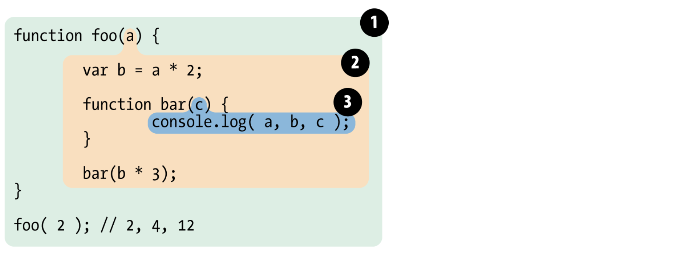

# 第二章 词法作用域（又叫静态作用域）

作用域的工作方式有两种占统治地位的模型。其中的第一种是最最常见，绝对多数的编程语言中被使用的。它称为**词法作用域（lexical scope）**（也叫静态作用域），所谓的**词法作用域其实是指作用域在词法解析阶段既确定了，不会改变**。

另一种仍然被一些语言是使用的模型（比如Bash脚本、Perl等），称为**动态作用域**。

我们这主讲**词法作用域**，因为它就是JavaScript所采用的作用域模型。

## 词法阶段

第 1 章介绍过，大部分标准语言编译器的第一个工作阶段叫作词法化（也叫单词化）。回忆一下，词法化的过程会对源代码中的字符进行检查，如果是有状态的解析过程，还会赋予单词语义。

词法作用域是词法分析时被定义的作用域。换句话说，词法作用域基于你在编写程序时，变量和作用域的块在何处被编写决定的，因此它（词法作用域）在词法分析器处理你的代码时（基本上）是固定不变的。

注意：我们将看一下额方法可以骗过词法作用域，从而在词法分析器处理过后改变它，但这些方法并不好。

事实上，让词法作用 域根据词法关系保持书写时的自然关系不变，是一个非常好的最佳实践。如下代码：
```js
function foo(a) {
    var b = a * 2;
    function bar(c) {
        console.log(a, b, c);
    }
    bar(b * 3);
} 

foo(2);
```
在这个代码实例中有三个固有的嵌套作用域。将这些作用域考虑为套在一起的气泡可能有助于思考。



气泡1 包围着全局作用域，它里面只有一个标识符：foo。

气泡2 包围着作用域`foo`，它含有是哪个标识符：`a`，`bar`和`b`.

气泡3 包围着作用域`bar`，它里面只包含一个标识符：`c`。

作用域气泡是根据作用域的块儿被写在何处定义的，一个嵌套在另一个内部，等等。在下一章中，我们将讨论作用域的不同单位，但是就现在来说，让我们认为每一个函数创建了一个新的作用域气泡。

注意这些嵌套的气泡都是严格嵌套的（一层套一层的）。也就是说，没有哪个函数的气泡可以同时（部分）存在于另外两个外部的作用域中，就像没有函数可以部分地存在于它的两个父类函数中一样。


## 查找

作用域气泡的结构和互相之间的位置关系给引擎提供了足够的位置信息，引擎用这些信息来查找标识符的位置。

在上一个代码片段中， 引擎执行 console.log(..) 声明， 并查找 a 、 b 和 c 三个变量的引用。它首先从最内部的作用域，也就是 bar(..) 函数的作用域气泡开始查找。引擎无法在这里找到 a ，因此会去上一级到所嵌套的 foo(..) 的作用域中继续查找。在这里找到了 a ，因此引擎使用了这个引用。对 b 来讲也是一样的。而对 c 来说，引擎在 bar(..) 中就找到 了它。

**作用域查找会在找到第一个匹配的标识符时停止**。在多层的嵌套作用域中可以定义同名的标识符，这叫作”遮蔽效应“（内部的标识符”遮蔽“了外部的标识符）。抛开遮蔽效应，作用域查找始终从运行时所处的最内部作用域开始，逐级向外或这说向上进行，直到遇到第一个匹配的标识符为止。

注意：全局变量自动成为全局对象的属性（比如浏览器中的window对象），因此可以不直接通过全局对象的词法名称，而是间接地通过将全局对象的引用来其进行访问

```js
window.a
```

通过这种技术给出了访问全局变量的方法，没有它（这种方法window.），全局变量将因为遮蔽而不可访问。另外，被遮蔽的非全局变量是无法访问的。

**不管函数是从 *哪里* 被调用的，也不管函数是 *如何* 被调用的，它的词法作用域只由这个函数被声明时所处的位置决定**。

词法作用域查找只会查找一级标识符，比如 a、b和c （也就是最内层作用域的标识符）。如果代码中引用了 foo.bar.baz，词法作用域查找只会试图查找 foo 标识符，找到这个变量后，对象属性访问规则会分别接管对 bar 和 baz 属性的访问。？？？？？**什么意思**？？？？

原版：The lexical scope look-up process only applies to first-class identifiers, such as the a, b, and c. If you had a reference to foo.bar.baz in a piece of code, the lexical scope look-up would apply to finding the foo identifier, but once it locates that variable, object property-access rules take over to resolve the bar and baz properties, respectively.


## 欺骗词法(`eval`和`with`)

如果词法作用域完全由写代码期间函数所声明的位置来定义的，怎样才能在运行是来”修改“(或者说欺骗)词法作用域呢？

JS中有两种机制（eval()和with）来实现这个目的。但是应该要避免使用，最主要原因是：欺骗词法作用域会导致性能下降。

### 1. eval

JavaScript 中的 eval(..) 函数可以接受一个字符串为参数，并将其中的内容视为好像在书写时就存在于程序中这个位置的代码。换句话说，可以在你写的代码中用程序生成代码并运行，就好像代码是写在那个位置的一样。（eval里面的字符串内容是代码）

根据这个原理来理解 eval(..) ，它是如何通过代码欺骗和假装成书写时（也就是词法期）代码就在那，来实现修改词法作用域环境的，这个原理就变得清晰易懂了。

在执行 `eval()` 之后的代码时，引擎并不”知道“或”在意“前面的代码是以动态形式插入进来，并对词法作用域的环境进行修改的。引擎只会照常进行词法作用域查找。如下例子：
```js
function foo(str, a) {
    eval(str);  //欺骗！ 就好像这行代码是 var b = 3; 一样
    console.log(a, b);
}

var b = 2;

foo("var b = 3;", 1);   //1, 3

```

eval(..)调用中的"var b = 3;"这段代码会被当作本来就在那里一样来处理。由于那段代码声明了一个新变量b，因此它对已经存在的foo(..)的词法作用域进行了修改。事实上，和前面提到的原理一样，这段代码实际上在foo(..)内部创建了一个变量 b ，并遮蔽了外部(这里是全局)作用域中的同名变量。

当 console.log(..) 被执行时，会在 foo(..) 的内部同时找到 a 和 b ，但是永远也无法找到外部的 b 。因此会输出“1, 3”而不是正常情况下会输出的“1, 2” 。

eval(..) 通常被用来执行动态创建的代码。

默认情况下，如果eval(..)中所执行的代码包含一个或多个声明（无论是变量还是函数），就会对eval(..)所处的词法作用域进行修改。技术上，通过一些技巧(超出了我们的讨论范围)可以间接调用eval(..)来使其运行在全局作用域中，并对全局作用域进行修改。

但无论何种情况，eval() 都可以在运行期(代码运行时)修改书写期(创建执行环境时)的词法作用域。

注意：在严格模式中，eval(..)在运行时有其自己的词法作用域，意味着其中的声明无法修改所在的作用域。例子：
```js
function foo(str) {
    "use strict";
    eval(str);
    console.log(a); // ReferenceError: a is not defined }
}

foo("var a = 2;");

```

在程序中动态生成代码的使用场景非常罕见， 因为它所带来的好处无法抵消性能上的损失。不要使用它们！


### 2. with(在严格模式下已经被禁止使用了)

JavaScript 中另一个难以掌握（并且现在也不推荐使用）的用来欺骗词法作用域的功能是 with 关键字。

这里我选择从这个角度来解释 with 关键字：它如何同被它所影响的词法作用域进行交互。

`with` 通常被当作重复引用同一个对象中的多个属性的快捷方式，可以**不需要重复**引用对象本身。

比如：
```js
var obj = {
    a: 1,
    b: 2,
    c: 3
};

//单调乏味的重复"obj"
obj.a = 2;
obj.b = 3;
obj.c = 4;

//简单的快捷方式
with(obj) {
    a = 3;
    b = 4;
    c = 5;
}
```

但实际上这不仅仅是为了方便访问对象属性。考虑如下代码：
```js
function foo(obj) {
    with(obj) {
        a = 2;
    }
}

var o1 = {
    a: 3
};

var o2 = {
    b: 3
};

foo(o1);
console.log(o1.a); //2

foo(o2);
console.log(o2.a);  //undefined
console.log(a);    // 2 —— 糟了，a被泄露到全局作用域上了
```

这个例子中创建了 o1 和 o2 两个对象。 其中一个具有 a 属性， 另外一个没有。 foo(..) 函 数接受一个 obj 参数，该参数是一个对象引用，并对这个对象引用执行了 with(obj) {..} 。 在 with 块内部，我们写的代码看起来只是对变量 a 进行简单的词法引用，实际上就是一个 LHS 引用（查看第 1 章），并将 2 赋值给它。

当我们将 o1 传递进去， a＝2 赋值操作找到了 o1.a 并将 2 赋值给它，这在后面的 console. log(o1.a) 中可以体现。 而当 o2 传递进去， o2 并没有 a 属性， 因此不会创建这个属性， o2.a 保持 undefined 。

但注意到一个奇怪的副作用，实际上 a = 2 赋值操作创建了一个全局的变量 a。这是为什么？

with 可以将一个没有或有多个属性的（属性个数在0-N）对象处理为一个完全隔离的词法作用域，因此这个对象的属性也会被处理为定义在这个作用域中的词法标识符。（对象本应没有词法作用域，只是with自己....）

**注意**：尽管`with`块可以将一个对象处理为词法作用域，但是在这个块内部(对象块)正常使用`var`声明并不会被限制在这个块的作用域中，而是被添加到`with`所处函数的作用域中。

可以这样理解，当我们传递o1给with时，with所声明的作用域是o1，而这个作用域中含有一个同o1.a属性相符的标识符。但当我们见o2作为作用域时，其中并没有a标识符，因此进行了正常的LHS标识符查找。(又因为a在外部没有声明，所以a就会自动被创建到全局作用域下)。

o2 的作用域、foo(..)的作用域和全局作用域中并没有找到标识符a，因此当a = 2执行时，自动创建了一个全局变量（在非严格模式下）。

with 这种将对象及其属性放进一个作用域 **并同时** 分配标识符的行为**很让人费解**。但为了说 明我们所看到的现象，这是我能给出的最直白的解释了。

另一个不推荐使用eval()和with的原因是会被严格模式所影响。with被完全禁止。而在保留核心功能的前提下，间接或非安全地使用eval()也被禁止了。


### 3. 性能

eval() 和 with 会在运行时修改或创建新的作用域，以此来欺骗其他在书写是定义的词法作用域。

你可能会问，那又怎样呢？如果它们能实现更复杂的功能，并且代码更具有扩展性，难道 不是非常 好 的功能吗？答案是 否定 的。

**JavaScript引擎会在编译阶段进行数项的优化**。其中有些优化依赖于能够根据代码的词法进行静态分析，并预先确定所有变量和定义位置，才能在执行过程中快速找到标识符。（好好理解这句）

但是如果引擎在代码中发现 eval() 或 with，它只能简单地假设关于标识符的位置判断都是无效的。
- 因为无法在词法分析阶段明确 eval() 会接受到什么代码，这些代码会如何对作用域进行修改，

- 也无法知道传递给 with 用来创建新词法作用域的对象内容到底是什么。

最悲观的情况是如果出现 eval() 或 with， 所有的优化可能都是无意义的，因此最简单的做法是**完全不做**任何优化。

如果代码中大量使用 eval(..) 或 with ， 那么运行起来一定会变得非常慢。 无论引擎多聪 明，试图将这些悲观情况的副作用限制在最小范围内， 也无法避免如果没有这些优化，代码会运行得更慢这个事实 。

## 小结

**词法作用域意味着作用域是由书写代码是函数声明的位置来决定的。编译的词法分析阶段基本能够知道全部标识符在哪里以及是如何声明的，从而能够预测在执行过程中如何对它们进行查找**。

JavaScript中有两个机制可以“欺骗”词法作用域：eval() 和 with。
- eval()可以对一段包含一个或多个声明的“代码”字符串进行演算，并借此来**修改**已经存在的词法作用域(在运行时)。

- with本质上是通过一个对象的引用当作作用域来处理，将对象的属性当作作用域中的标识符来处理，从而创建了一个新的词法作用域（同样是运行时）。

这两个机制的副作用是引擎无法在编译时对作用域查找进行优化，因此引擎只能谨慎地认为这样的优化是无效的。使用这其中任何一个机制都导致代码运行变慢。**不要使用它们**。

