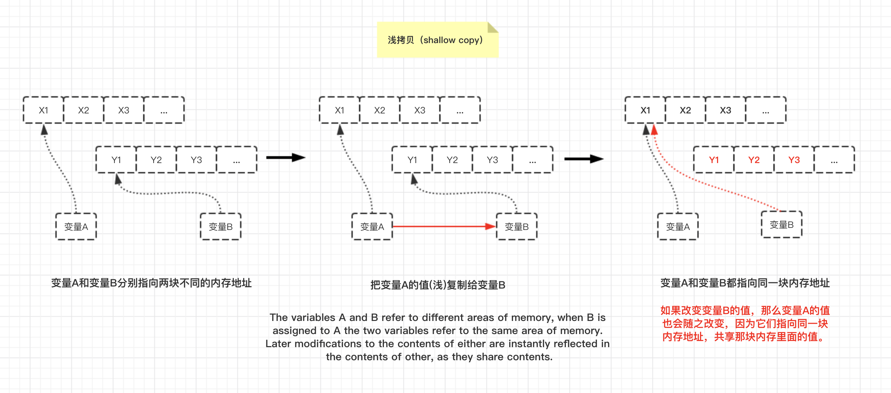

# **JS中浅拷贝和深拷贝**

首先我们先要分别理解浅拷贝和深拷贝是什么，然后再去掌握在JS中实现浅拷贝和深拷贝的方法。

# JavaScript的值的类型和引用

## 1. **值复制** 和 **引用复制**

**赋值和参数传递**可以通过**值复制**（value-copy）或者**引用复制** （reference-copy）来完成。

- **基本类型值**（即标量**基本类型值**， scalar primitive）总是通过**值复制**的方式来赋值/传递。

    - 基本类型值包括 null 、 undefined 、字符串、数字、布尔和 ES6 中的 symbol。

```js
var a = 20;     //基本类型值使用 值复制的方式 来赋值/传递参数
var b = a;
b = 30;

// 这时a的值是多少？
//变量a持有该值（20）的一个复本，b持有它的另一个复本。b更改时，a的值保持不变。
```


- **复合值**（compound value）总是通过**引用复制**的方式来赋值/传递。(复合值就是引用类型值)
    
    - 复合值包括 对象（包括数组和封装/内置对象）和函数。

```js
//例1
var a = [1, 2, 3];
var b = a;
b.push("d","e","f");
a;  //[1, 2, 3, "d", "e", "f"]

//变量a和b是分别指向同一个复合值[1,2,3]的两个不同引用。 
//请注意，a和b仅仅是指向值[1,2,3]，并非持有。
//所以它们更改的是同一个值（如调用.push("d","e","f") ），随后它们都指向更改后的新值[1,2,3,"d","e","f"]。

//例2
var m = { a: 10, b: 20 }
var n = m;
n.a = 15;
// 这时m.a的值是多少

```
    
## **请记住：我们无法自行决定（赋值和参数传递）是使用值复制还是引用复制，一切由值的类型来决定**。
（好好体会这句话）也就是说：

- ### 如果 **值** 为复合值（对象，数组等），就使用**引用复制**（来进行赋值和参数传递）。

    - 引用复制又细分为：**浅拷贝**（复制）和**深拷贝**（复制）。

- ### 如果 **值** 为基本类型值（基本类型值），就使用**值复制**（来进行赋值和参数传递）。

## 2. JavaScript中**变量的引用**指向的是 **值**（复合值），而不是变量。

- JS中，变量只是一个用于保存值的占位符而已，所以变量没有类型，JS中只有值才有类型。

- **值的类型** 最终决定赋值和参数传递究竟使用的是 引用复制 还是 值复制。

- 由于变量引用指向的是值（复合值）本身而非其他变量，所以一个变量的引用指向的发生改变（换句话说，变量被重新赋值），也不会影响另一个变量引用的指向。比如：
```js
var a = [1,2,3];
var b = a;      //变量a和b共同指向一个数组值（即复合值）
a;  //[1,2,3]
b;  //[1,2,3]

//然后
b = [4,5,6];    //变量b被重新赋值，它的引用指向发生改变，指向新数组值：[4,5,6]
a;  //[1,2,3]   变量a的引用指向并没有受到变量b指向的改变的影响，依旧指向原来的[1,2,3]值
b;  //[4,5,6]
```

再次验证了，一个变量不能成为指向另一个变量的引用。


加深印象：JavaScript中**变量的引用**指向的是**复合值**，而不是变量。(以浅拷贝模拟举例)



## 3. 不同类型的值存放在哪？

1. 基本类型值（基本类型的值）存在于**栈空间(stack)**

2. 复合值（复杂类型的值）存在于**堆空间(heap)**

对象的属性可以引用**复合值（对象、数组等）**和**简单基本类型值**。

而简单基本类型的值就是一个value，没有属性！


------------------------


# 在JavaScript中浅拷贝和深拷贝

**浅拷贝和深拷贝**只针对于**复合值**（数组，对象等）而言。

我能理解为这是引用复制的两种形式吗？

## **浅拷贝（shallow copy）**

**复合值的浅拷贝使用 `=` 赋值操作运算符**。

举例：
```js
var a = [1, 2, 3];
var b = a;
b.push("d","e","f");
a;  //[1, 2, 3, "d", "e", "f"]

//例2
var m = { a: 10, b: 20 }
var n = m;
n.a = 15;
```
浅拷贝就是共享相同的内存引用地址。


----


## **深拷贝（deep copy）**


深拷贝就是要迭代赋值复合值中所有的内容。

```js
var arr = [1, true, "str", ["a","b"], {name:"deep"}];


```
如上面例子中的数组（数组中的元素包括基本类型值（字符串、数字、布尔值）和复合值（数组、对象））

要对其进行深拷贝，就要将数组内的复合值元素也进行递归复制（将复合值内的内容复制出来，而不是只复制复合值元素的引用地址）


---


## 如何判断是否实现了深拷贝


----------


# JavaScript实现深拷贝的方式

## 使用jQuery来实现浅拷贝和深拷贝对象
```js
// Shallow copy(浅拷贝对象)
var newObject = jQuery.extend({}, oldObject);

// Deep copy（深拷贝对象）
var newObject = jQuery.extend(true, {}, oldObject);
```
- [JS中最有效的深拷贝对象的方法](https://stackoverflow.com/questions/122102/what-is-the-most-efficient-way-to-deep-clone-an-object-in-javascript)
- [Object copying](https://www.wikiwand.com/en/Object_copying#/Shallow_copy)


## javascript中深拷贝对象的方法，可以使用json
```js
var newObj = JSON.parse(JSON.stringify(someObj));
```

JavaScript中浅拷贝的方法（ES6），可以说使用`Object.assign()`方法来实现。它的第一个参数是目标对象，之后还可以跟一个或多个源对象。它胡遍历一个或多个源对象的所有可枚举的自有键，并把他们复制（使用=操作符赋值）到目标对象，最后返回目标对象。
```js
function anotherFunction() {/*..*/}

var anotherObject = {
    c: true
}

var anotherArray = [];

var myObject = {
    a: 2,
    b: anotherObject,   //引用，不是副本（copy）！
    c: anotherArray,    //另一个引用！
    d: anotherFunction
}
anotherArray.push(anotherObject, myObject);

//下面是重点。
var newObj = Object.assign({}, myObject);

newObj.a;   //2
newObj.b === anotherObject;     //true
newObj.c === anotherArray;
newObj.d === anotherFunction;
```


------


