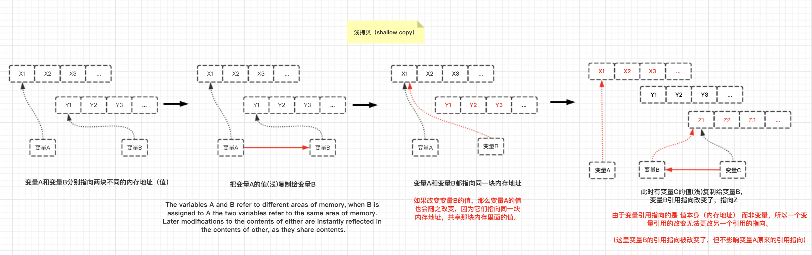

# **值(2)**

# 2.4 特殊数值

JS类型中有几个特殊的值需要特别注意和小心使用。

## **2.4.1 不是值的值**（undefined与null）

undefined类型只有一个值，即undefined。

null类型也只有一个值，即null。

它们的名称既是类型又是值。

undefined和null常被用来表示”空的“值或”不是值“的值。它们之间有一些细微的差别。例如：
- null 指空值（empty value）
- undefined 指没有值（missing value）

或者：

- undefined 指**从来未赋值**。

- null 指曾经赋过值，但目前没有值。

null是一个特殊关键字，不是标识符，我们不能将其当作变量来使用和赋值。

然而**undefined却是一个标识符**，可以被**当作变量**来使用和赋值。

## **2.4.2 undefined**

永远不要重新定义`undefined`！！

比如：
```js
function foo() {
    "use strict";
    var undefined = 2; //永远不要重新定义undefined！！
    console.log(undefined);
}

foo();  //2
```
永远不要重新定义`undefined`！！


### `void`运算符

undefined是一个内置标识符，它的值为undefined，通过**void运算符即可得到该值（undefined）**

表达式 void __ 没有返回值，因此返回结果是undefined。

void并不改变表达式的结果，只是让表达式不返回值：
```js
var a = 42;
console.log(void a, a); //undefined 42
```

按惯例我们用`void 0`来获得undefined。

void 0 、 void 1 和undefined之间没有实质上的区别。
```js
typeof void 0;  //"undefined"
typeof void 1;  //"undefined"
typeof undefined;  //"undefined"
```

void运算符在其他地方也能派上用场，比如**不让表达式返回任何结果**（即使其有副作用）。

```js
function doSomething() {
    //注：APP.ready由程序自己定义
    if(!APP.ready) {
        //稍后再试
        return void setTimeout(doSomething,100);
    }
    var result;

    return result;
}

if(doSomething()) {
    //立即执行下一个任务
}
```

这里setTimeout()函数返回一个数值，但是为了确保if语句不产生误报，我们要void掉它。
```js
if(!APP.ready) {
    //稍后再试
    setTimeout(doSomething, 100);
    return;
}
```

总之，如果要将代码中的值（如表达式的返回值）设为undefined，就可以使用void。这做法并不多见，但是某些情况下却很有用。


## **2.4.3 特殊的数字**

### 1. 不是数字的数字 `NaN`

如果数学运算的操作数不是数字类型（或者无法解析为常规的十进制或十六进制数字），就无法返回一个有效的数字，这种情况下返回值为NaN。

NaN指“不是一个数字”，这个名字容易引起误会。

**将NaN理解为“无效数值”“失败数值”或者“坏数值”**可能更准确些。

例如：
```js
var a = 2/"foo";       //NaN 注意：这里表达式是 2除以“foo” 
typeof a === "number";      //true 证明了NaN值的类型是数字类型。
```

NaN是一个“警戒线”（有特殊用途的常规值），用于指出数字类型中的错误情况。即“执行数学运算没有成功，这是失败后返回的结果”。

NaN是一个特殊值，它和自身不相等，是唯一一个非自反的值。如下：
```js
var a = 2/"foo";

a == NaN;   //false
a === NaN;  //false
```

**注意**：`NaN != NaN;    //true`

既然我们无法对NaN进行比较（结果永远为false），那应该怎样判断它呢？使用`isNaN()`
```js
var a = 2 / "foo";
isNaN(a);   //true
```

可以使用内建的全局工具函数`isNaN()`来判断一个值是否是NaN。

但是全局的`isNaN()`有一个严重的缺陷，就是它的检查方式过于死板：“检查参数是否**不是NaN**，同时**也不是数字**”。但这样做的结果并不太准确：

```js
var a = 2 / "foo";
var b = "foo";

a;  //NaN
b;  //"foo"

window.isNaN(a);  //true
window.isNaN(b);  //true —— 晕！这是个bug，实际上b不是NaN，而是字符串!!!
```
很显然"foo"不是一个数字，但是它也不是NaN。这个bug字JS问世以来就一直存在至今，超过了19年。

ES6开始，我们可以使用`Number.isNaN()`来准确判断一个值是否是`NaN`。

ES6之前的polyfill：
```js
if(!Number.isNaN) {
    Number.isNaN = function(n) {
        return (
            typeof n === "number" &&
            window.isNaN(n)
        );
    }
}

var a = 2 / "foo";
var b = "foo";

Number.isNaN(a);  //true
Number.isNaN(b);  //false ————nice~
```

还有一种`Number.isNaN()`的polyfill方法，更简单:

就是利用NaN不等于自身这个特点。**NaN是JS中唯一一个不等于自身的值！**
```js
if(!Number.isNaN) {
    Number.isNaN = function(n) {
        return n !== n; //NaN是JavaScript中唯一一个不等于自身的值！
    }
}
```

所以`NaN === NaN`必定返回`false`!

我们尽量使用`Number.isNaN(..)`这种可靠的方法。


### 2. 无穷数（Infinity）

JS中”除以0“,结果会为Infinity(即`Number.POSITIVE_INFINITY`)
```js
var a = 1/0;        //  Infinity
var a = -1/0;    // -Infinity
```

很正常，你想一下`1/0.1`和`1/0.01`。分母越小，分子不变的情况下，结果会越大。（小学计算）

JS使用优先的数字表示法，所以JS的结果可能会溢出，此时结果为Infinity或者-Infinity。

例如：
```js
var a = Number.MAX_VALUE;   //1.7976931348623157e+308
a + a;                      //Infinity
a + Math.pow(2, 970);       //Infinity
a + Math.pow(2, 969);       //1.7976931348623157e+308
```

计算结果一旦溢出为无穷数（Infinity）就无法再得到有穷数。

在JS语言的角度来说`Infinity/Infinity`是一个未定义操作，结果为`NaN`。

有穷正数除以Infinity，结果为0。


### 3. 零值（+0与-0）

JavaScript有一个常规的0（也叫作`+0`）和一个`-0`。

`-0`除了可以用作常量以外，也可以是默写数学运算的返回值。
```js
var a = 0 / -3;   //-0
var b = 0 * -3;   //-0
```
**加法和减法运算不会得到负零（negative zero）**。

负零在开发调试控制台中通常显示为-0。

根据JS规范，对**负零进行字符串化**会返回"0":

```js
var a = 0/-3;   //-0

//对负零进行 字符串化 会返回"0"
a.toString();   //"0"
a + "";         //"0"
String(a);      //"0"

//JSON也如此
JSON.stringify(a)   //"0"
```

但是，将 `"-0"` **负零字符串转换为数字**，得到的结果却是准确的-0。

```js
+"-0";              //-0
Number("-0");       //-0
JSON.parse("-0");   //-0
```

**正零与负零之间的比较操作**
```js
var a = 0;
var b = 0/-3;

a === b;    //true
-0 === 0;   //true

0 > -0;     //false
a > b;      //false
```

**通过函数来区分-0和0**：
```js
function isNegZero(n) {
    n = Number(n);
    return (n===0) && (1/n === -Infinity);
}

isNegZero(-0);      //true
isNegZero(0/-3);    //true
isNegZero(0);       //fasle
```

为什么我们需要负零。因为负零的符号位可以用来代表其他信息。比如说移动方向。


## **2.4.4 特殊等式**

由于NaN和自身不相等，必须使用ES6中的Number.isNaN()来判断一个值是否是NaN。

而-0等于0（在===情况下也是相等），所以要判断一个值是否为-0时，必须使用上面的isNegZero()工具函数。

### Object.is(..)可用于判断值是否为-0，以及值是否为NaN

ES6新增了一个工具方法`Object.is(..)`，用于判断两个值是否绝对相等，可以用来处理上述两种特殊情况的比较。（判断值是否为-0，以及是否为NaN）
```js
var a = 2 / "foo";
var a = -3 * 0;

Object.is(a, NaN);  //true
Object.is(b, -0);   //true

Object.is(b, 0);    //false
```

ES6前，Object.is()的polyfill：
```js
if(!Object.is) {
    Object.is = function(v1, v2) {
        //判断是否是-0
        if(v1 === 0 && v2 === 0) {
            return 1/v1 === 1/v2;
        }
        //判断是否是NaN
        if(v1 !== v1) {
            return v2 !== v2;
        }

        //其他情况(正常比较)
        return v1 === v2;
    };
}

```

能使用===时，尽量不要使用`Object.is(..)`,因为前者效率更高，更为通用。

`Object.is(..)`主要用于处理那些特殊的相等比较（就是-0和NaN）。


# 2.5 值和引用 （注意~）

在Javascript中变量不可能成为指向另一个变量的引用。

因为JS中的变量只是一个用于保存值的占位符而已，所以变量没有类型，只有值才有类型。

**JS引用指向的是值**。如果一个值有10个引用，这些引用指向的都是同一个值，它们（变量）互相之间没有引用/指向关系。

JS对**值**和**引用**的赋值/传递在语法上没有区别，完全根据值的类型来决定。

```js
var a = 2;
var b = a;  //b是a的值的一个副本
b++；
a;  //2
b;  //3

var c = [1,2,3];
var d = c;  //d是[1,2,3]的一个引用,这个是浅拷贝的过程
d.push(4);

c;  //[1, 2, 3, 4]
d;  //[1, 2, 3, 4]
```

**基本类型值(即标量基本类型值)总是通过值复制的方式来赋值/传递。包括null、undefined、字符串、数字、布尔和ES6中的symbol**。

**复合值——对象（包括数组和封装对象）和函数，总是通过引用复制（浅拷贝）的方式来赋值/传递**。

上例中2是一个标量基本类型值，所以变量a持有该值的一个复本，b持有它的另一个复本。b更改时，a的值保持不变。（基本数据类型的值都是这样。）

c和d分别指向一个复合值[1,2,3]的两个不同引用。请注意，c和d仅仅是指向值[1,2,3]，并非持有。所以它们更改的是同一个值（如调用.push(4)），随后它们指向都是更改后的新值[1,2,3,4]。

由于引用指向的是指本身而非变量，所以一个引用无法更改另一个引用的指向。

看图：



```js
var a = [1,2,3];
var b = a;
a;  //[1,2,3]
b;  //[1,2,3]

//然后
b = [4,5,6];
a;  //[1,2,3]
b;  //[4,5,6]
```
`b = [4,5,6];`不影响a指向`值[1,2,3]`。除非b不是直线数组的引用，而是指向变量a的指针，但在JavaScript中不存在这种情况！

函数参数就经常会让人产生这样的困惑：
```js
function foo(x) {
    x.push(4);
    x;  //[1,2,3,4]

    //下面这步如果没想清楚，容易犯错
    x = [4,5,6];
    x.push(7);
    x;  //[4,5,6,7]
}

var a = [1,2,3];
foo(a);
a;  // [1,2,3,4]，不是[4,5,6,7]

```

我们向函数传递a的时候，实际是将引用a的一个复本赋值给x（看上图），而a仍然指向[1,2,3]。

在函数中我们可以通过引用x来改变数组的值（push(4）之后变成[1,2,3,4]）。

但当参数x被重新赋值（值是复合值）的时候，参数x的引用指向就被改变（x=[4,5,6]），但并不影响变量a的引用指向，所以a仍然指向[1,2,3,4]。

我们不能通过变量x的引用的指向来更改变量a的引用的指向，只能更改a和x共同指向的值。

如果要将a的值变为[4,5,6,7]，必须更改x指向的数组，而不是为x赋值一个新的数组。

```js
function foo(x) {
    x.push(4);
    x;//[1,2,3,4]

    x.length = 0;   //清空数组
    x.push(4,5,6,7);
    x;//[4,5,6,7]
}

var a = [1,2,3];

foo(a);

a;  //是[4,5,6,7]
```

从上例中可以看出，x.length = 0 和 x.push(4,5,6,7)并没有创建一个新的数组，而是更改了当前数组。于是a指向的值变成了[4,5,6,7]。

## **记住：我们无法自行决定（赋值和参数传递）是使用值复制还是引用复制，一切有值的类型来决定**。

如果想通过值复制的方式来传递复合值（如数组），就要为复合值创建一个复本，这样传递的就不再是原始的复合值。

```js
function foo(x) {
    x.push(4);
    x;//[1,2,3,4]
    x.length = 0;   //清空数组
    x.push(4,5,6,7);
    x;//[4,5,6,7]
}

var a = [1,2,3,[8,5,9]];
foo(a.slice());
a;  
```

不带参数的`slice()`会返回一个新数组对象（新组元素为原数组的元素的复制），该新数组是由原数组中复合值的元素进行**浅拷贝**（shallow copy）和基本类型值的元素进行**值复制**，共同组成。

- `slice( )`的浅拷贝：指针对**数组中存在复合值的元素**进行**浅拷贝**, 而不是对整个数组进行浅拷贝。返回的一个新数组。另外深浅拷贝针对的是复合值（如：数组、对象等，只要不是简单基本类型值）

- **数组中有元素**是**复合值**（即该元素是对象或数组等），当数组中这个元素被复制的新数组改变时，原数组中元素的那个数组也会发生改变。因为数组的元素是复合值，所以这些值将以**引用复制**的方式进行赋值和参数传递。

- **数组中元素有基本类型值**，这些值将以**值复制**的方式赋值和参数传递。

由于传递给函数参数的是指向该复本的引用（新数组对象），所以foo()中的操作不会影响a指向的数组。


### 通过 值复制 的方式来传递 复合值

如果通过值复制的方式来传递复合值（如数组），就需要为复合值创建一个复本，这样传递的就不再是原始值。

例如：
```js
var arr = [1, ["how","are","you"], ["I", "love", "u"]];

//对数组中的（基本类型值）元素进行了值复制。
//对arr数组的中的（复合值）元素进行了浅拷贝。
var copy = arr.slice(); 
copy;   //[1, Array(3), Array(3)]

copy[0] = 0;    //修改copy数组的第一项 
arr;            //[1, Array(3), Array(3)] —— arr数组第一项元素的值没发生改变。

//因为第一项元素的值类型为基本类型值，这里具体是数字，因为copy数组中的基本类型值是通过arr数组中元素的值复制而来，所以两个数组的第一项都有各自的一个复本，互不影响。记住，基本类型值是以值复制的方式进行赋值与参数传递。（每个变量都持有基本类型值的一个复本，其中一个修改简单类型的值，对其他没有影响。）

copy[1].push("I'm", "fine");    //[0, Array(5), Array(3)]
arr;                            //[1, Array(5), Array(3)] —— arr数组第二项也发生改变

//因为arr第二项元素为一个复合值，这里具体是数组，因为copy数组中的复合值是通过arr数组浅拷贝而来，所以他们的引用其实是共同指向同一个值。因此，但copy数组中的复合值发生变化，将会影响到在arr数组中的复合值。
```
这里`arr.slice()`返回了一个新数组对象（其中的元素为原数组的元素的浅拷贝和值复制）。然后将新的数组传递给变量copy。


### 将基本类型值封装到一个复合值（对象、数组等）中，然后通过 引用复制 的方式来传递

```js
function foo(wrapper) {
    wrapper.a = 42;
}

var obj = {
    a: 2    //obj对象中的a属性，值为基本类型值
            //
};

foo(obj);

obj.a;  //42;

```

**如果需要传递一个指向基本类型值的引用，可以将基本类型值封装到一个对象中**。

这里obj是一个封装了基本类型值a的封装对象。obj引用的一个复本作为参数wrapper被传递到foo(..)中。

这样我们可以通过wrapper来访问该对象（obj）并更改它的属性。

函数执行结束后obj.a将变成42。

这样看来，如果需要传递指向基本类型值的引用，可以将基本类型值封装到对应的数字封装对象中。（这是想象中）
```js
function foo(x) {
    x = x + 1;
    x;  //3 
}
var a = 2;
var b = new Number(a);  //内置的Number构造函数

foo(b);
console.log(b); //是2 ， 不是3
```
与预期不同的是，虽然传递的给参数x的是一个指向Number对象的引用复本，但我们并不能通过Number对象来改变其中的基本类型值。

原文解释：

The problem is that the underlying scalar primitive value is not mutable (same goes for String and Boolean). If a Number object holds the scalar primitive value 2, that exact Number object can never be changed to hold another value; you can only create a whole new Number object with a different value.

**原因是，基本类型值是不可更改的**。如果一个Number对象的基本类型值是2，那么该Number对象就不能被改为其他值，除非创建一个包含新值的Number对象。

When x is used in the expression x + 1, the underlying scalar primitive value 2 is unboxed (extracted) from the Number object automatically, so the line x = x + 1 very subtly changes x from being a shared reference to the Number object, to just holding the scalar primitive value 3 as a result of the addition operation 2 + 1. Therefore, b on the outside still references the original unmodified/immutable Number object holding the value 2.

变量b是指向Number对象的一个引用。然后b引用的一个复本作为参数x被传递进foo()中。

此时x = x + 1中，**表达式右边的**`x`为基本类型值2，是从Number对象中提取（拆封）出来。**表达式左边的**`x`悄悄地从原来的一个引用变成了一个Number对象，再到最后变成持有一个基本类型值的参数。它的值为 2+1 等于 3。

然而，函数外的变量b仍然指向原来Number对象（持有基本类型值的值：2）。

我们还可以为Number对象添加属性（只要不更改内部的基本类型值即可），通过这些添加的属性来间接地进行数据交换。但是这种做法不太常见，且很多开发人员绝对不是一个好办法。像下面这样：

```js
function foo(x) {
    x = x + 1;
    x;  //3 
    console.log(typeof x === "number");
}
var a = 2;
var b = new Number(a);  //内置的Number构造函数
b.name = "QQ";          //为Number对象添加属性

foo(b);         // true 说明foo函数的最后，x是基本类型值（number）
console.log(b); //Number {name: "QQ", [[PrimitiveValue]]: 2}
```

相对而言，前面obj作为封装对象的办法可能更好一些。

赋值/参数传递是通过引用赋值还是值复制完全由值的类型决定，所以使用哪种类型也就间接决定了赋值/参数传递的方式。

----