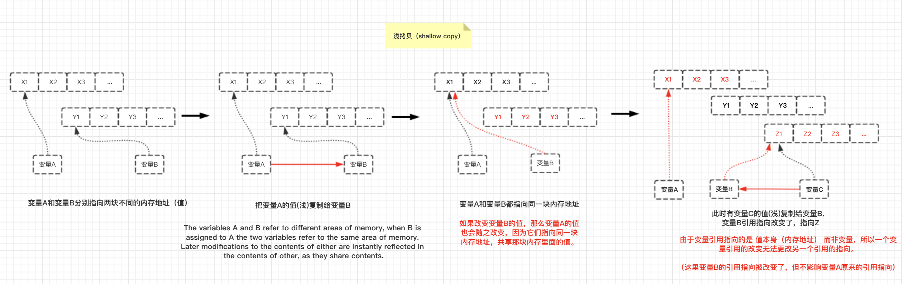

# 2.5 值和引用 （配合高程4.1节一起看，71页）

首先规定好JS值类型的名字，统一下来，以后就按着那样叫，不要改来改去，知道是什么就行。

### **1. 基本类型值**（又称简单值、基本数据类型值）

包括：string、number、boolean、null、undefined 和 symbol（ES6新增）

### **2. 复杂类型值**（又称**复合值**、**引用类型值**、**对象类型**）

包括：Object、Array、Date、String、RegExp等**内置对象** 和 **自定义对象**。

---

## **2.5.1 复制变量值**

### 1. 变量值为**基本类型值**时的赋值与传递

在Javascript中变量不可能成为指向另一个变量的引用。

**因为JS中的变量只是一个用于保存值的占位符而已，所以变量没有类型，只有值才有类型**！！！

**JS引用指向的是值**。如果一个值有10个引用，这些引用指向的都是同一个值，它们（变量）互相之间没有引用/指向关系。

JS对**值**和**引用**的赋值/传递在语法上没有区别，完全根据值的类型来决定。

```js
var a = 2;
var b = a;  //b是a的值的一个副本
b++；
a;  //2
b;  //3
```

**基本类型值总是通过值复制的方式来赋值/传递。包括null、undefined、字符串、数字、布尔和ES6中的symbol**。

### 2. 变量值为**复杂类型值**时的赋值与传递

**复杂类型值——对象（包括数组和封装对象）和函数，总是通过引用复制（浅拷贝）的方式来赋值/传递**。

上例中2是一个标量基本类型值，所以变量a持有该值的一个复本，b持有它的另一个复本。b更改时，a的值保持不变。（基本数据类型的值都是这样。）

c和d分别指向一个复杂类型值[1,2,3]的两个不同引用。请注意，c和d仅仅是指向值[1,2,3]，并非持有。所以它们更改的是同一个值（如调用.push(4)），随后它们指向都是更改后的新值[1,2,3,4]。

由于引用指向的是指本身而非变量，所以一个引用无法更改另一个引用的指向。

看图：



```js
var a = [1,2,3];
var b = a;  //进行了浅拷贝
a;  //[1,2,3]
b;  //[1,2,3]

b.push(4);
a;  //[1, 2, 3, 4]
b;  //[1, 2, 3, 4]

//然后
b = [4,5,6];    //b重新赋值
a;  //[1,2,3,4]
b;  //[4,5,6]
```
`b = [4,5,6];`不影响a指向`值[1,2,3]`。除非b不是直线数组的引用，而是指向变量a的指针，但在JavaScript中不存在这种情况！

### **记住：我们无法自行决定（变量的赋值和传递）是使用值复制还是引用复制，一切由存储在变量中的值的类型来决定**。（专指变量的赋值和传递）

---

## **2.5.2 函数的参数传递**


### 1. **基本类型值**作为参数出入函数时

这个过程不用过多解释，基本类型值是以**值传递（值复制）** 传入函数的参数中。

### 2. **复杂类型值（对象、数组）作为参数出入函数时**

当对象作为函数的参数出入时，这里产生了两个不同的观点（但说的实质都是一样。）

- 在高程71页中，认为JS中所有函数的参数都是按**值传递**的。

- YDKJS中的观点（中卷，31页），认为**参数传递是通过引用复制还是值复制完全由值的类型来决定**，所以使用哪种类型也间接决定了参数传递的方式。

    - 也就是说，如果**值是复杂类型值**（对象、数组），就是**引用复制**（传递）的方式来传入参数中。
    - 实际是引用类型值（对象或数组）的复本传递给函数的参数。

因此前面提到的两本书在**参数传递方式上会有不同表述**。

---

### 原因是，复杂类型值的参数传递方式实际上有3种：

1. 按值传递（passed by value，纯按值传递）

    - 特征：对于传递过来的变量进行修改，不会影响到原变量。
    - 这种方式比较少见，因为对复杂类型的参数进行完全复制，会付出额外的空间与时间代价。


2. **按值传递引用地址**，即引用复制传递（passed-by-reference-copy）
    - 特征：对作为参数传入的对象进行修改时，会直接影响原对象；

    - 而如果对传入的参数进行重新赋值（值为复杂类型值），则不会影响原对象，并且此后再修改参数（对象），也不会对原对象造成影响。）

3. 按引用传递（passed-by-reference）
    - 特征：无论是对于变量成员的修改，还是对变量重新赋值，都会影响到原对象。

**JavaScript中的参数传递属于第2种，既不是纯粹的值传递**，**又不是纯粹的引用传递**。

而是介于两者之间的引用复制传递（reference-copy），或者称为地址值传递。

- **JS中的参数是对象时，实际传入的是对象的引用地址一份复制（创建一个对象复本传入参数）。**

- **因为传递的是引用地址，修改传入参数中的对象成员（对象属性）会直接影响原对象，并且在传递过程中没有将原对象完全复制一份，从这一点上来看像是引用传递；**

- **但是如果将参数重新赋值（值是复杂类型值），然后接着参数进行操作，此时不会影响原对象，因为修改的是复制后的地址值，从这一点上来看是值传递**。


到底是值传递还是引用传递，实际上目前仍有争论。但是与其纠结名称问题，不如把实际机制搞清楚才是正事。

---

还有一种**JS参数传递**的说法：

### **按共享传递**（call by sharing）

- 按共享传递 （call by sharing）
    - 准确的说，JS中的基本类型按值传递，对象类型按共享传递的(call by sharing，也叫按对象传递、按对象共享传递)。

    - 该策略的重点是：调用函数传参时，函数接受对象实参引用的副本(既不是按值传递的对象副本，也不是按引用传递的隐式引用)。 它和按引用传递的不同在于：在共享传递中对函数形参的赋值，不会影响实参（原对象）的值。

        - 形参：函数内的参数（形式参数，比如下面例子中：foo(x)中的 x ）
        - 实参：实际传入函数的参数（即调用函数时传入的内容，比如下例中foo(a)的 a ）

    - 然而，虽然引用是副本，引用的对象是相同的。它们共享相同的对象，所以修改形参对象的属性值，也会影响到实参（原对象）的属性值。

```js
var obj = {x : 1};
function foo(o) {
    o.x = 3;
}
foo(obj);
console.log(obj.x); // 3 ，被修改了
```

总之，无论哪种说法，其实质都是一样的，即当对象作为参数时，传入的参数的是对象的一个引用地址的复本，但当对形参重新赋值以后，再对形参修改时，不再影响原来对象的值。

[参考：call by sharing](http://bosn.me/js/js-call-by-sharing/)

----
**函数参数**就经常会让人产生这样的困惑：
```js
function foo(x) {
    x.push(4);
    x;  //[1,2,3,4]

    //下面这步如果没想清楚，容易犯错
    x = [4,5,6];    //对函数形参的再次赋值，将不会影响实参（原对象）的值。
    x.push(7);
    x;  //[4,5,6,7]
}

var a = [1,2,3];
foo(a); //传入的实参，实际是对象a引用的一个副本
a;  // [1,2,3,4]，不是[4,5,6,7]

```

我们向函数传递a的时候，实际是将引用a的一个**复本**赋值给x（看上图），而a仍然指向[1,2,3]。

在函数中我们可以通过引用x来改变数组的值（push(4）之后变成[1,2,3,4]）。

**但当参数x被重新赋值**的时候，参数x的引用指向就被改变（x=[4,5,6]），但并不影响变量a的引用指向，所以a仍然指向[1,2,3,4]。

我们不能通过变量x的引用的指向来更改变量a的引用的指向，只能更改a和x共同指向的值。

如果要将a的值变为[4,5,6,7]，必须更改x指向的数组，而不是为x赋值一个新的数组。

```js
function foo(x) {
    x.push(4);
    x;//[1,2,3,4]

    x.length = 0;   //清空数组
    x.push(4,5,6,7);
    x;//[4,5,6,7]
}

var a = [1,2,3];

foo(a);

a;  //是[4,5,6,7]
```

从上例中可以看出，x.length = 0 和 x.push(4,5,6,7)并没有创建一个新的数组，而是更改了当前数组。于是a指向的值变成了[4,5,6,7]。

-----

