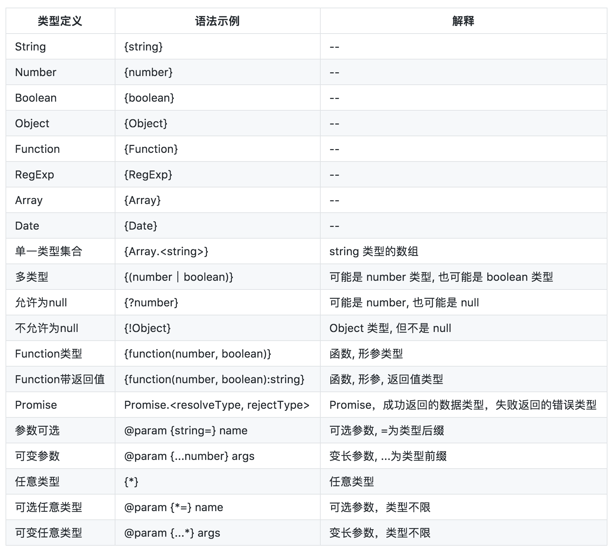

# JavaScript编码规范
----
## 1. 命名
[强制] 变量 使用 Camel命名法。

示例：
```js
var loadingModules = {};
```

[建议] 函数名 使用 动宾短语。

示例：
```js
function getStyle(element) {
}
```

[建议] boolean 类型的变量使用 `is` 或 `has` 开头。
```js
var isReady = false;
var hasMoreCommands = false;
```

---
## 2. 注释
### 2.1 单行注释
[强制] 必须独占一行。`//` 后跟一个空格，缩进与下一行被注释说明的代码一致。

### 2.2 多行注释
[建议] 避免使用 `/*...*/` 这样的多行注释。有多行注释内容时，使用多个单行注释。

### 2.3 文档化注释 ！
[强制] 为了便于代码阅读和自文档化，以下内容必须包含以 `/**...*/` 形式的块注释中。

[强制] 文档注释前必须空一行。

解释：

1. 文件
2. namespace
3. 类
4. 函数或方法
5. 类属性
6. 事件
7. 全局变量
8. 常量
9. AMD 模块

[建议] 自文档化的文档说明 what，而不是 how。

### 2.4 类型定义
**[强制] 类型定义都是以 `{` 开始, 以 `}` 结束。**
解释：

常用类型如：{string}, {number}, {boolean}, {Object}, {Function}, {RegExp}, {Array}, {Date}。

类型不仅局限于内置的类型，也可以是自定义的类型。比如定义了一个类 Developer，就可以使用它来定义一个参数和返回值的类型。

**[强制] 对于基本类型 {string}, {number}, {boolean}，首字母必须小写。**


### 2.5 文件注释
**[强制] 文件顶部必须包含文件注释，用 `@file` 标识文件说明。**

示例：
```js
/**
 * @file Describe the file
 */
```

### 2.6 命名空间注释
命名空间namespace（某些语言中叫package），是一个在静态语言中常见的概念。它可以帮助我们更好地整理代码，并可避免命名冲突。
举一个简单的例子，如果有两个人都叫小明，我们很难区分和引用这两个人。但如果我们在他们前面加上命名空间，比如：北京的小明和上海的小明，那么区分起来就容易的多了，也不会因为重名而找错人了。简单地说，我们可以创建一个简单对象字面量来打包所有的相关函数和变量。这个简单对象字面量模拟了命名空间的作用。
```js
var MYNAMESPACE = {
    person: function(name) {
        this.name = name;
        this.getName = function() {
            return this.name;
        }
    }
};
```
**[建议] 命名空间使用 `@namespace` 标识。**
示例：
```js
/**
 * @namespace
 */
var util = {};
```

### 2.7 类注释
**[建议] 使用 `@class` 标记类或构造函数。**

解释：

对于使用对象 `constructor` 属性来定义的构造函数，可以使用 `@constructor` 来标记。

示例：

```js
/**
 * 描述
 *
 * @class
 */
function Developer() {
    // constructor body
}
```

**[建议] 使用 `@extends` 标记类的继承信息。**

示例：

```js
/**
 * 描述
 *
 * @class
 * @extends Developer
 */
function Fronteer() {
    Developer.call(this);
    // constructor body
}
util.inherits(Fronteer, Developer);
```

## 2.8 函数/方法注释
**[强制] 函数/方法注释必须包含函数说明，有参数和返回值时必须使用注释标识。**

解释：

当 `return` 关键字仅作退出函数/方法使用时，无须对返回值作注释标识。

**[强制] 参数和返回值注释必须包含类型信息，且不允许省略参数的说明。**

**[建议] 当函数是内部函数，外部不可访问时，可以使用 `@inner` 标识。**

示例：
```js
/**
 * 函数描述
 *
 * @param {string} p1 参数1的说明
 * @param {string} p2 参数2的说明，比较长
 *     那就换行了.
 * @param {number=} p3 参数3的说明（可选）
 * @return {Object} 返回值描述
 */
function foo(p1, p2, p3) {
    var p3 = p3 || 10;
    return {
        p1: p1,
        p2: p2,
        p3: p3
    };
}
```

**[强制] 对 Object 中各项的描述， 必须使用 `@param `标识。**

示例：
```js
/**
 * 函数描述
 *
 * @param {Object} option 参数描述
 * @param {string} option.url option项描述
 * @param {string=} option.method option项描述，可选参数
 */
function foo(option) {
    // TODO
}
```

## 2.9 事件注释
**[强制] 必须使用 `@event` 标识事件，事件参数的标识与方法描述的参数标识相同。**

示例：
```js
/**
 * 值变更时触发
 *
 * @event Select#change
 * @param {Object} e e描述
 * @param {string} e.before before描述
 * @param {string} e.after after描述
 */
this.fire(
    'change',
    {
        before: 'foo',
        after: 'bar'
    }
);
```

## 2.10 常量注释
**[强制] 常量必须使用 `@const` 标记，并包含说明和类型信息。**

示例：
```js      
/**
 * 常量说明
 *
 * @const
 * @type {string}
 */
var REQUEST_URL = 'myurl.do';
```
---

## 3. 语言特征
### 3.1 变量
**[强制] 变量、函数在使用前必须先定义。**

解释：

不通过 var 定义变量将导致变量污染全局环境。

示例：

```js
// good
var name = 'MyName';

// bad
name = 'MyName';
```

**[强制] 每个 var 只能声明一个变量。**

解释：

一个 var 声明多个变量，容易导致较长的行长度，并且在修改时容易造成逗号和分号的混淆。

示例：
```js
// good
var hangModules = [];
var missModules = [];
var visited = {};

// bad
var hangModules = [],
    missModules = [],
    visited = {};
```

**[强制] 变量必须 即用即声明，不得在函数或其它形式的代码块起始位置统一声明所有变量。**

解释：

变量声明与使用的距离越远，出现的跨度越大，代码的阅读与维护成本越高。虽然JavaScript的变量是函数作用域，还是应该根据编程中的意图，缩小变量出现的距离空间。

示例：
```js
// good
function kv2List(source) {
    var list = [];

    for (var key in source) {
        if (source.hasOwnProperty(key)) {
            var item = {
                k: key,
                v: source[key]
            };

            list.push(item);
        }
    }

    return list;
}

// bad
function kv2List(source) {
    var list = [];
    var key;
    var item;

    for (key in source) {
        if (source.hasOwnProperty(key)) {
            item = {
                k: key,
                v: source[key]
            };

            list.push(item);
        }
    }
```

## 3.2 条件
   