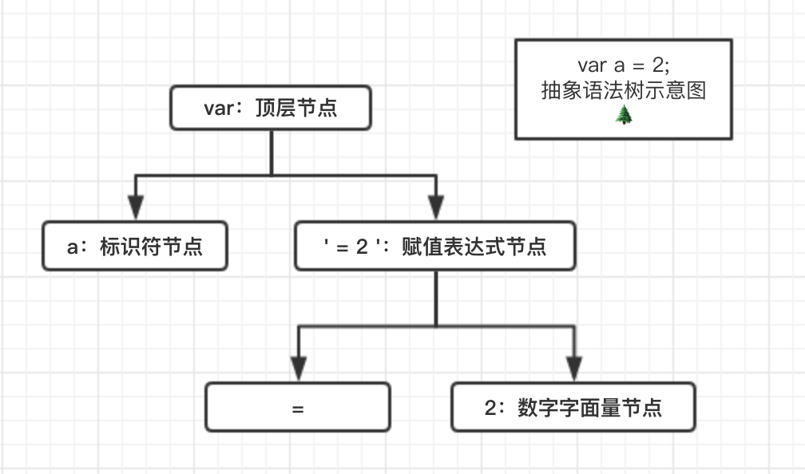
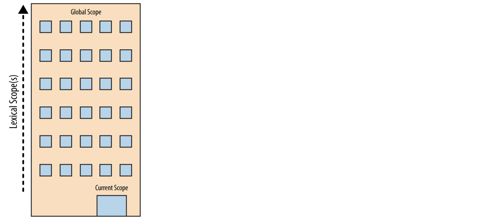

# 第一章 什么是作用域？

## 编译器理论

JavaScript其实是一个编译型语言，JavaScript引擎在实施许多与传统的语言编译器相同的步骤。

在传统的编译型语言处理中，一块儿源代码在被执行之前，通常将会经历**三个步骤**，大致被称为“编译”：

1. **分词/词法分析**：将一连串字符打断成(对于语言，如Javascript)有意义的片段，称为token(记号)。举个栗子，`var a = 2;`。这段代码可能会被打断成如下token：`var`, `a`, `=`, `2`, 和 `;`。空格也许会被保留为一个token，这要看它是否是有意义的。
    
    分词（tokenizing）和词法分析（Lexing）之间区别非常微妙、晦涩。主要差异在于词法单元的识别是通过有状态还是无状态进行的。


2. **解析**：将一个token的流（数组）转换为一个嵌套元素的树，它综合地表示了程序的语法结构。这颗树称为“抽象语法树”。

    `var a = 2;`的树也许开始于称为`VariableDeclaration`(变量声明 `var` )顶层节点，带有一个称为`Identifier`(标识符)的子节点(它的值为 `a` )，和另一个称为`AssignmentExpression`（赋值表达式 `= 2`）的子节点，而这个子节点本身带有一个称为`NumericLiteral`(数字字面量)的子节点(它的值为2)。

    

3. **代码生成**：这个处理将 **抽象语法树** 转换为可以执行的代码。这一部分根据语言，它的目标平台等有很大的不同。

    所以，语气深陷细节，不如笼统地说，有一种方法将我们上面描述的`var a = 2;`的抽象语法树转换为机器指令，来实际上创建一个称为 `a` 的变量（包括分配内存等等），然后在`a`中存入一个值。
    
    （JS将程序代码换成机器指令的方法：比如像V8（Chrome的引擎），它其实为了提高JS的运行性能，在运行之前会先将JS编译为本地的机器码（native machine code），然后再去执行机器码。强调：JavaScript引擎本身也是程序，代码编写而成。比如V8就是用C/C++写的）

    注意：引擎如何管理系统资源的细节远比我们要挖掘的东西深刻，所以我们将理所当然地认为引擎有能力按其需要创建和存储变量。

对 JavaScript 来说，在许多情况下，编译发生在代码被执行前的仅仅几微妙之内（或更少！）。

为了简单起见，任何Javascript代码段在它执行之前（通常是 刚好 在它执行之前！）必须被编译。

所以JS编译器将把程序`var a =2;`拿过来，并首先编译它，然后准备运行它，通常是立即的。

再简单来说，JavaScript 引擎会加载你的源代码，把它分解成字符串（又叫做分词），再解析（转换为抽象语法树） 把这些字符串转换成编译器可以理解的字节码，然后执行这些字节码。

因此得到结论：编译器是引擎的一部分。

---

## 理解作用域

我们将采用的学习作用域的方法，是将这个处理过程想象为一场对话。但是，誰 在进行这场对话呢？

### 演员

让我们见一见处理程序`var a = 2;`时进行互动的演员，这样能让我们理解稍后将要听到的它们的对话：

1. *引擎*（Engine）：负责从始至终的编译和执行我们的JavaScript程序。

2. *编译器*（Compile）：*引擎* 的朋友之一；处理所有解析和代码生成的重活儿。

3. *作用域*（Scope）：引擎的另一位好朋友， 负责收集并维护由所有声明的标识符（变量）组成的一系列查 询，并实施一套非常严格的规则，确定当前执行的代码对这些标识符的访问权限。

### 对话

当你看到程序`var a = 2;`时，你很可能认为它是一个语句。但这不是我们的新朋友 *引擎* 所看到的。事实上， *引擎* 看到两个不同的语句，一个是  *编译器* 将在编译期间处理的，一个是 *引擎* 将在执行期间处理的。

那么，让我们来分析  *引擎* 和它的朋友们建如何处理程序`var a = 2;`。

 *编译器* 将对这段代码做的第一件事，是进行词法分析来将它分解为一系列token，然后第二件事将这些token被解析为一棵树（抽象语法树）。但是当 *编译器* 到了代码生成阶段（第三阶段）时，它会以一种与我们可能想象的不同的方式来对待这段代码。

*编译器* 将会这样处理：（两步）

1. 遇到`var a`， *编译器* 让 *作用域* 去查看对于这个特定的作用域集合（作用域链），变量 `a` 是否已经存在。
    - 如果已经存在， *编译器* 就忽略这个声明并继续编译其他代码。

    - 如果不存在， *编译器* 就让 *作用域* 去为这个作用域集合声明一个称为 `a` 的新变量。

2. 然后 *编译器* 为 *引擎* 生成稍后要执行的代码，来处理赋值`a = 2`。 
    - *引擎* 运行的代码首先让 *作用域* 去查看在当前的作用域集合中是否有一个称为 `a` 的变量可以访问。

    - 如果有，引擎就会使用这个变量。如果没有， *引擎* 就查看 *其他地方*（就是作用域链向上查找）

如果 *引擎* 最终找到一个变量，它就将值`2`赋予它。如果没有，引擎将会举起它的手并喊出一个错误！

总结来说：变量的赋值操作会执行两个动作，首先编译器会在当前作用域中声明一个变量（如 果之前没有声明过），然后在运行时引擎会在作用域中查找该变量，如果能够找到就会对 它赋值。

----

## 编译器术语 `LHS` 和 `RHS`

为了继续深入地理解，我们需要一点儿更多的编译器术语。

当 *引擎* 执行 *编译器* 在第二步为它产生的代码时，它必须查询变量 `a` 来看它是否已经被声明过了，而且这个查询是咨询 *作用域* 的。但是 *引擎* 所实施的查询的类型会影响查询的结果。

### `LHS` 和 `RHS`

在我们这个例子中， *引擎* 将会对变量 `a` 实施一个“LHS”查询。另一种类型的查询称为“RHS”。

`var a = 2;`

这两个术语表示“**Left-hand Side**（左手边）”和“**Right-hand Side**（右手边）” 什么的...边？——**赋值操作的**。

Think of it like this

- **LHS** = Variable assignment, or writing to memory. Think saving a text file to your hard drive.（查询某个变量，然后**将值赋予（写入）到变量中**）

- **RHS** = Variable lookup, or reading from memory. Think opening a text file from your hard drive.(查询某个变量的值，并**读取变量的值**)

实际上，我们可以表述得更准确一点儿。对于我们的目的来说，
- RHS 查询是难以察觉的，因为它简单地查询和读取某个变量的值。
- LHS 查询是试着找到变量容器本身，并将变量赋值。

从这种意义上说，RHS 的含义实质上不是 *真正的* “一个赋值的右边”，更准确地说，它只意味着“不是左手边”。

让我们更深入一些：

```js
//RHS
console.log(a);
```
**这个指向 `a` 的引用是一个 RHS 引用，因为这里没有东西赋值给 `a`。而是我们在查询 `a` 并取得它的值**，这样这个值可以被传递进`console.log(..)`。

作为对比：
```js
//LHS
a = 2;
```
**这里指向`a`的引用是一个LHS引用，因为我们实际上不关心当前的值是什么，我们只想找到这个变量，将它作为 `= 2` 赋值操作的目标**。

**注意:** LHS 和 RHS 意味着“赋值的左/右手边”未必像字面上意味着“ `=` 赋值操作符的左/右边”。

赋值有几种其他的发生形式，所以最好在概念上将它考虑为：**“赋值的目标（LHS）”和“赋值的源（RHS）”**

----

考虑这段代码，它既有 LHS 引用又有 RHS 引用：
```js
function foo(a) {
    console.log(a); //2
}

foo(2);
```
最后一行代码`foo(2);`作为一个函数调用，要求一个指向`foo`的 RHS 引用。意味着，“去查询`foo`的值，并把它交给我”。另外，`(..);`意味 `foo` 的值应当被执行，所以它最好实际上是一个函数！

这里有一个微妙但重要的赋值。你发现了吗？

你可能错过了这段代码隐含的`a = 2`。它发生在当值`2`作为参数传递给foo()函数时，值 2 被赋值个给参数 a。

为了（隐含地）给参数 a 赋值，进行了一个LHS查询。

这里还有一个 a 的值的 RHS 引用，它的结果值被传入`console.log(..)`。`console.log(..)`需要一个引用来执行。它为`console`对象进行一个RHS查询，然后发生一个属性解析来看它是否拥有一个称为`log`的方法。

最后，我们可以将这一过程概念化为，在将值 2 (通过变量a的RHS查询得到的)传入log(..)时发生了一次LHS/RHS的交换。在log(..)的原生实现内部，我们可以假定它拥有参数，其中的第一个（也许被称为arg1）在2倍赋值给它之前，进行了一次LHS引用查询。

**注意**：你可能会试图将函数声明`function foo(a){}`概念化为一个普通的变量声明和赋值（即表示为函数表达式），比如`var foo`和`foo = function(a){}`。这样做会诱使（误导）你认为函数声明涉及了一次LHS查询。

然而，一个微妙重要的不同是，在这种情况下 *编译器* 在代码生成期间同时声明和值的定义，如此当 *引擎* 执行代码时，没有必要将一个函数值“赋予”`foo`。

**因此，将函数声明考虑为一个我们在这里讨论的LHS查询是不太合适的**。

### 引擎与作用域对话
```js
function foo(a) {
    console.log(a);//2
}

foo(2);
```

让我们将上面的（处理这个代码段的）交互想象为一场对话。这场对话将会有点儿像这样进行：

遇到`foo(2);`
> 引擎：嘿 作用域，我有一个 foo 的 RHS 引用。听说过它吗？ （指的是`foo(2);` 要取得它的值，所以是RHS）

> 作用域；啊，是的，听说过。编译器 刚在一秒钟之前声明了它。它是一个函数。给你。

> 引擎：太棒了，谢谢！好的，我要执行 foo 了。

执行`foo(a){}`

>引擎：嘿，作用域，我得到了一个 a 的 LHS 引用，听说过它吗？  （`a=2`是为了将值赋予变量，所以是LHS）

>作用域：啊，是的，听说过。编译器 刚才将它声明为 foo 的一个正式参数了。给你。

>引擎：一如既往的给力，作用域。再次感谢你。现在，该把 2 赋值给 a 了。

执行`console.log(a)`

>引擎：嘿，作用域，很抱歉又一次打扰你。我需要 RHS 查询console。听说过它吗？    （查询console是什么）

>作用域：没关系，引擎，这是我一天到晚的工作。是的，我得到 console 了。它是一个内建对象。给你。

>引擎：完美。查找 log(..)。好的，很好，它是一个函数。

>引擎：嘿，作用域。你能帮我查一下 a 的 RHS 引用吗？我想我记得它，但只是想再次确认一下。

>作用域：你是对的，引擎。同一个家伙，没变。给你。

>引擎：酷。传递 a 的值，也就是 2，给 log(..)。

>...

---

## 作用域嵌套

作用域是通过标识符名称查询变量的一组规则。通常有多个作用域需要考虑。

就像一个代码块或函数嵌套在另一个代码块或函数中，作用域也可以嵌套在其他作用域当中(这样就会形成一个作用域链)。所以如果在直接作用域中找不到变量的话。引擎就会咨询下一个外层作用域，如此继续直到找到这个变量或者到达最外层作用域（也就是全局作用域）。

换言之，就是标识符寻找的过程，见高程4.2作用域链那章。

考虑这段代码：
```js
function foo(a) {
    console.log(a+b);
}

var b = 2;

foo(2); //4
```

遍历嵌套 作用域 的简单规则：引擎 从当前执行的 作用域 开始，在那里查找变量，如果没有找到，就向上走一级继续查找，如此类推。如果到了最外层的全局作用域，那么查找就会停止，无论它是否找到了变量。

b 的 RHS 引用不能在函数 foo 的内部被解析，但是可以在它的外围 作用域（这个例子中是全局作用域）中解析。

所以，在 引擎 和 作用域 的对话中，我们会听到：

> 引擎：“嘿，foo 的 作用域，听说过 b 吗？我得到一个它的 RHS 引用。”

> 作用域：“没有，从没听说过。问问别人吧。”

> 引擎：“嘿，foo 外面的 作用域，哦，你是全局 作用域，好吧，酷。听说过 b 吗？我得到一个它的 RHS 引用。”

>作用域：“是的，当然有。给你。”

--- 

## 建筑的隐喻(用比喻来形容)

为了将嵌套 作用域 解析的过程可视化，我想让你考虑一下这个高层建筑。



这个建筑表示我们嵌套的作用域规则集合。建筑的第一层表示你当前执行的作用域。建筑的顶层表示全局作用域。

通过在你当前楼层中查找来解析LHS（变量赋值）和RHS（变量读取）引用，如果你没找到它，就坐电梯到上一层楼，继续找，如此类推，知道找到你想要的。如果找到顶层(全局作用域)，还没找到，也要停止查询。

---

## 为什么区别LHS和RHS如此重要？

因为在变量没有被声明(在所有被查询的作用域中都没找到)的情况下，这两种类型的查询的行为不同。
```js
//RHS查询
function foo(a) {
    console.log(a+b);   //此处b变量进行了RHS查询
    b = a;
}
foo(2); //ReferenceError。
```

当 b 的RHS查询（变量读取）第一次发生时，b是找不到的。它被说成是一个未声明的变量，因为它在作用域中找不到(找不到有关`var b`)。

如果 RHS 查询在嵌套的 作用域 的任何地方都找不到一个值，这会导致 引擎 抛出一个 ReferenceError。必须要注意的是这个错误的类型是 ReferenceError。

相比之下，如果引擎在进行一个LHS查询，但到达了顶层(全局作用域)都没有找到它，而且如果程序没有运行在"Strict"模式下，那么这个全局作用域将会在全局作用域中创建一个同名的新变量，并把它交给引擎。如：
```js
//LHS查询
function foo(a) {  
    b = a;      //此处b变量进行了LHS查询，全局作用域将会在全局作用域中创建一个同名的新变量（没有找到b声明的情况下，且非严格模式下）
    console.log(a+b);
}
foo(2);         //4
```

在ES5中被加入了严格模式，将不允许自动/隐含的全局变量创建。这种情况下，将不会有全局作用域的变量交回给LHS查询，类似于RHS的情况，引擎会报错ReferenceError。如:
```js
function foo(a) {  
	"use strict"
    b = a;      //此处b变量进行了LHS查询，但是在严格模式下，全局作用域将 不会 在全局作用域中创建一个同名的新变量（b）
    console.log(a+b);
}
foo(2);     //报错 ReferenceError
```

如果，一个RHS查询的变量被找到，但是你试着做一些这个值不可能做到的事，比如将一个非函数的值作为函数运行，或者引用null或者undefined值的属性，那么引擎就会抛出不同类型的错误，称为`TypeError`。
```js
function foo(a) {  
    b = a; //a变量进行了RHS查询
    console.log(a+b);
	a();    //一个RHS查询的变量被找到，但是你试着做一些这个值不可能做到的事，比如将一个非函数的值作为函数运行
}
foo(2);     //报错 TypeError
```

`ReferenceError` 是关于作用域解析失败的，而TypeError暗示作用域解析成功了，但试图对这个结果进行一个非法/不可能的操作。

----

## 复习

作用域是一组规则，它绝对了一个变量（标识符）在哪里和如何被查找。这种查询也许是为了向这个变量赋值，这时变量是一个LHS引用，或者是为了取得它的值，这时变量是一个RHS引用。

LHS引用来自赋值操作。作用域相关的赋值可以：
1. 通过 `=` 操作符发生

2. 也可以通过向**函数参数**传递（赋予）参数值发生。

JavaScript 引擎 在执行代码之前首先会编译代码，因此将`var a =2;`这样的语句分割为两个分离的步骤：
1. 首先，`var a` 在当前作用域中声明。这是在最开始，代码执行之前实施的(创建执行环境阶段)
2. 稍后，`a = 2`查找这个变量(LHS引用)，并且如果找到就向它(a)赋值。

LHS 和 RHS 引用查询都从当前执行中的 作用域 开始，如果有需要（也就是，它们在这里没能找到它们要找的东西），它们会在嵌套的 作用域 中一路向上，一次一个作用域（层）地查找这个标识符，直到它们到达全局作用域（顶层）并停止，既可能找到也可能没找到。

--- 